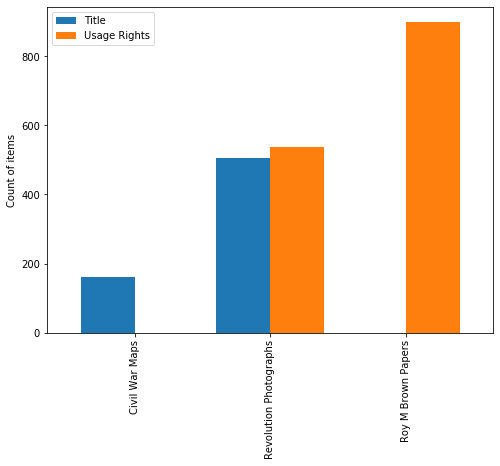
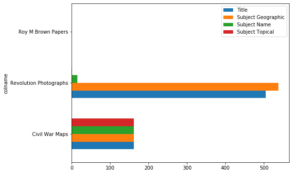
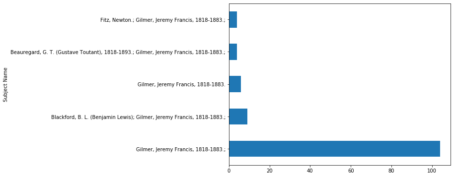
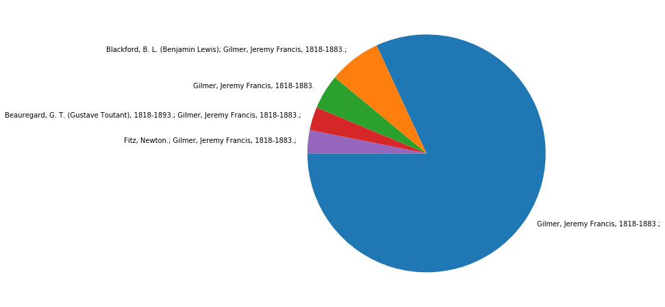
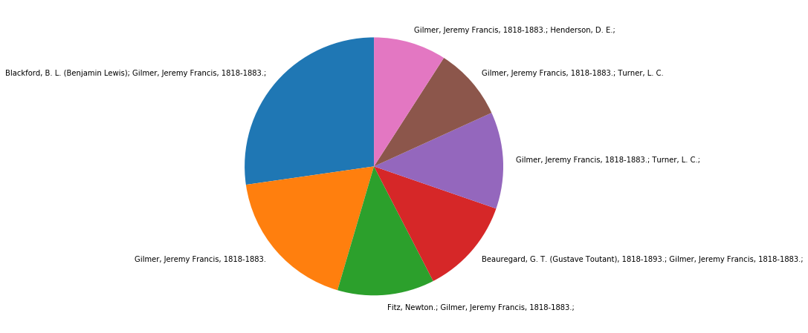

# Practical Python Tools for Metadata Assessment: 55-minute workshop

## Welcome

Welcome to the workshop! This is meant to be a a fun and beginner-friendly introduction to a few useful Python tools, in the context of exploring and manipulating tabular metadata for digital collections.   

In this session, we will focus on some basic functions of Python's pandas data analysis library. We will use pandas for exploring, filtering, reshaping, and merging datasets. 

This notebook provides code that you can execute to see results and generate outputs in the notebook itself, as well as explanations for the examples and exercises we'll be working through together. 

At the end of the notebook, there is a bonus example about dealing with duplicates, and a list of recommended resources for further exploration on your own. 

### Table of Contents

* [Workshop Plan](#wplan)
* [Introduction](#intro)
* [Using this Jupyter Notebook](#usingjn)
    * [Exercise 1: Modify this notebook](#ex1)
    * [Exercise 2: Run code and markdown in cells](#ex2)
* [Example 1: Explore a dataset](#md1)
    * [Exercise 3: Evaluate subjects data in a collection](#ex3)
* [Example 2: Compare a group of metadata files](#md2)
    * [Exercise 4](#ex4)
* [Example 3: Merge information from separate files](#md3)
    * [Exercise 5: Other ways to merge](#ex5)
* [Bonus Example: Find and remove duplicates](#md4)
* [Resources](#res)


## Workshop Plan <a name="wplan"></a>

We will start with a quick demo in using the jupyter notebook and a couple exercises to get familiar with notebook commands. 

Then we will walk through three examples of using Python/pandas with digital collections metadata files.  
After each example there will be an exercise you can try out on your own.  


----
  
**Intro, & using the jupyter notebook (10 mins)**
    * Exercises 1 & 2: modify notebook, run code and markdown 
    
**Example 1: Explore a dataset (12 mins)** 
    * Exercise 3: Evaluate subjects data  
    
**Example 2: compare a group of metadata files (12 mins)**
    * Exercise 4: 
    
**Example 3: Merge info from separate files (12 mins)**
    * Exercise 5 : other merges  
    
**Wrap-up (5 mins)**
    * review resources, and info about installing python

----


## Introduction to Python and pandas<a name="intro"></a>
(basic info about Python)

(basic info about Pandas)

## Using this Jupyter Notebook <a name="usingjn"></a>

You can edit the notebook to run code cells and generate output, and/or to add markdown cells.    
All paths in the notebook refer to locations within the repository, to access example data and/or save output files. 

### Keyboard Shortcuts for Jupyter Notebook :

* `CTRL` + `SHIFT`+ `P` : show 'command palette'
* `esc` : command mode
* `enter` : edit mode
* `a` : insert cell above
* `b` : insert cell below
*  `SHIFT` + `enter`: run a code cell (or render a markdown cell)
* `d d`: delete a cell

###  Exercise 1: Modify this Notebook<a name="ex1"></a>

Follow the instructions below to try out some of the keyboard shortcuts and get familiar with working in this notebook.

1. Press ``CTRL + SHIFT+ P`` to show the command palette. From the command palette, you can search for any command, and run that action directly from the palette, as well as seeing the shortcut for that action if available. 
    * Search for 'command', to find the shortcut for `enter 'command' mode`. Click on this action from the list. This cell will then switch into 'command' mode.  
    
    
2. Double-click in this cell to switch the cell into 'Edit mode.' 
   * When you double click inside the cell, the cell border will change from blue to green, and the markdown will switch from rendered to markup text. 
   * Blue cell border  = 'command mode', used for navigating and modifying cells. 
   * Green cell border = 'edit mode', used for adding/editing content in cells.   
   

3. Once in 'edit mode' in this cell, add a bullet point below this line and type something, for example: ``'DONE'``. Then use `CTRL` + `Enter` to "run" the cell/render the markdown.  
    * for example: `DONE`   
    

4. With this cell in command mode (blue border), add a cell underneath it, then add some cells above the cells you added. 
    * press `b` to add a cell below an existing cell. 
    * You can keep pressing `b` to add more cells; it doesn't hurt anything to have empty cells in the notebook. 
    * press `a` to add a cell above an existing cell. 


```python

```


```python

```


```python

```


```python

```

### Exercise 2: Add and run code and Markdown in cells <a name="ex2"></a>

Try adding code and markdown to the new cells you created in exercise 1. 

1. Add markdown to a cell
    * click on one of the empty cells you created. 
    * the cell border will be green indicating it is in 'edit' mode. 
    * if there's an `In [ ]:` to the left of the cell, this means it's a code cell. Any text you type into the cell will be treated as code. 
    * To convert the cell to a Markdown cell, switch to Command mode by pressing `Esc`. The cell border will turn blue. 
    * From Command mode, press `m` to switch the cell to markdown.  The `In [ ]:` to the left of the cell will disappear, indicating it is now a Markdown cell. Any test you type into the cell will now be treated as markdown. 
    * Switch the cell back to Edit mode by clicking inside it. 
    * In the markdown cell, type a header, and then some regular text. For example: 
    
    ```
    #### here's an example header  
    and some regular paragraph text 
    ```
    
1. Run a markdown cell
    * As you did in exercise 1, press `CTRL` + `Enter` to "run" the markdown cell/render the markdown that you just typed.   
    
1. Add code to a cell
    * click on one of the empty cells you created. 
    * the cell border will be green indicating it is in 'edit' mode. 
    * Look for the `In [ ]:` to the left of the cell, to make sure it's a code cell. 
    * if there's no  `In [ ]:` to the left of the cell, switch into Command mode and convert the cell to Code by pressing `y`. 
    * Switch the cell back to Edit mode by clicking inside it. 
    * type a line of simple python code. For example: 
    
     ```
     print("here's a line of python code output.")
     ```


1. Run the code cell. 

  

#### here's an example header  
and some regular paragraph text 


```python
## note that in a code cell, hashtags indicate a comment, not a header as in a markdown cell

print("here's a line of python code output.")

```

    here's a line of python code output.
    


```python

```

## Example 1: Explore a Dataset with pandas<a name="md1"></a>

The first example script demonstrates importing the pandas library, reading a data file into a dataframe, and using basic pandas functions for exploring the dataset. 

#### Import libraries for Python

Importing the libraries loads them into memory so that Python can use them. 

We are importing: 
* the pandas data analysis library
* `os` for working with files and directories  
* `matplotlib` for generating some basic graphs from data

Lastly, setting `%matplotlib inline` allows plots to render within the notebook. 


```python
# import pandas and os libraries 
import pandas as pd
import os
import matplotlib.pyplot as plt
%matplotlib inline
```

#### Next: check that we are in the right place!!

We'll do a couple quick checks with python methods in the os library to get oriented and make sure that we're in the right directory. 

This is not really necessary, because this jupyter notebook is located in/running from within the 'notebook_exercises' subfolder, so we already know that we will be running commands relative to that location, but it's always nice to take a look around to see where you are. 


```python
# os.getcwd() outputs the current working directory, similar to pwd in bash

os.getcwd()
```


    'C:\\Users\\morganem\\GitlabRepos\\py-workshop-DLF2019\\notebook_exercises'


```python
# os.listdir() with no parameter returns a list of the files and directories in the current working directory

os.listdir()
```


    ['.ipynb_checkpoints',
     'exampleData',
     'filesizes',
     'output',
     'py_workshop_notebook.ipynb']


```python
# use os.listdir() plus a parameter to see what's in the exampleData subfolder

os.listdir('./exampleData/')
```


    ['03823_access_images.csv',
     '03823_masters.csv',
     '03823_metadata.txt',
     '03883.txt',
     '60001.txt',
     'coll_dupes_example.csv',
     'maps.csv',
     'maps_date.csv']


#### Create a dataframe from example datasets

A dataframe is a Python object with rows and columns that is very flexible and powerful for working with data. You can read many different data formats into a dataframe, including csv, tsv, and even excel sheets. 

The command below uses the variable name 'maps' for creating a dataframe using pandas' read_csv function. 


```python
# create a dataframe: 'maps' from the example datasheet 

maps=pd.read_csv("./exampleData/maps_date.csv")
```

#### Inspect a dataframe

Next, we'll explore the maps dataframe with pandas attributes and methods, to get a sense of how large this datset is (how many rows and columns), what the column headers are and how many of them are empty, and what the datatypes are in each column. 

* shape
* columns 
* info() 


```python
# the shape attribute displays the number of rows and columns for the dataframe, to get a sense of its overall size

maps.shape
```


    (161, 36)


```python
# columns attribute displays column labels

maps.columns
```


    Index(['Title', 'Alternative Title', 'Creator', 'Contributor', 'Creation Date',
           'Date', 'Search by Decade', 'Description', 'Subject (tgm)',
           'Subject Topical', 'Subject Name', 'Subject Geographic', 'Title Note',
           'DCMI Type', 'Caption', 'Contributor Note', 'Notes', 'Original Form',
           'Resource Type', 'Geographic Location', 'Language Code', 'Language',
           'Physical Description of Original', 'Medium of Original',
           'Collection in Repository', 'Digital Collection', 'N.C. Ed. Standard',
           'URL', 'Local Identifier', 'Creator Identifier', 'filename',
           'Copyright', 'Usage Rights', 'Raw Scan Filename', 'Date created',
           'Date modified'],
          dtype='object')


```python
# the info method displays datatypes and numbers of values per column, and memory information

maps.info()
```

    <class 'pandas.core.frame.DataFrame'>
    RangeIndex: 161 entries, 0 to 160
    Data columns (total 36 columns):
    Title                               161 non-null object
    Alternative Title                   4 non-null object
    Creator                             161 non-null object
    Contributor                         51 non-null object
    Creation Date                       161 non-null object
    Date                                161 non-null object
    Search by Decade                    161 non-null object
    Description                         161 non-null object
    Subject (tgm)                       161 non-null object
    Subject Topical                     161 non-null object
    Subject Name                        161 non-null object
    Subject Geographic                  161 non-null object
    Title Note                          161 non-null object
    DCMI Type                           161 non-null object
    Caption                             7 non-null object
    Contributor Note                    50 non-null object
    Notes                               67 non-null object
    Original Form                       161 non-null object
    Resource Type                       161 non-null object
    Geographic Location                 150 non-null object
    Language Code                       161 non-null object
    Language                            161 non-null object
    Physical Description of Original    160 non-null object
    Medium of Original                  161 non-null object
    Collection in Repository            161 non-null object
    Digital Collection                  161 non-null object
    N.C. Ed. Standard                   0 non-null float64
    URL                                 0 non-null float64
    Local Identifier                    160 non-null object
    Creator Identifier                  154 non-null object
    filename                            161 non-null object
    Copyright                           161 non-null object
    Usage Rights                        0 non-null float64
    Raw Scan Filename                   158 non-null object
    Date created                        161 non-null object
    Date modified                       161 non-null object
    dtypes: float64(3), object(33)
    memory usage: 45.4+ KB
    


```python
# Make the columns easier to scan by sorting them alphabetically 
# Sort the dataframe to order the output of column labels from info method

maps.sort_index(axis=1).info()
```

    <class 'pandas.core.frame.DataFrame'>
    RangeIndex: 161 entries, 0 to 160
    Data columns (total 36 columns):
    Alternative Title                   4 non-null object
    Caption                             7 non-null object
    Collection in Repository            161 non-null object
    Contributor                         51 non-null object
    Contributor Note                    50 non-null object
    Copyright                           161 non-null object
    Creation Date                       161 non-null object
    Creator                             161 non-null object
    Creator Identifier                  154 non-null object
    DCMI Type                           161 non-null object
    Date                                161 non-null object
    Date created                        161 non-null object
    Date modified                       161 non-null object
    Description                         161 non-null object
    Digital Collection                  161 non-null object
    Geographic Location                 150 non-null object
    Language                            161 non-null object
    Language Code                       161 non-null object
    Local Identifier                    160 non-null object
    Medium of Original                  161 non-null object
    N.C. Ed. Standard                   0 non-null float64
    Notes                               67 non-null object
    Original Form                       161 non-null object
    Physical Description of Original    160 non-null object
    Raw Scan Filename                   158 non-null object
    Resource Type                       161 non-null object
    Search by Decade                    161 non-null object
    Subject (tgm)                       161 non-null object
    Subject Geographic                  161 non-null object
    Subject Name                        161 non-null object
    Subject Topical                     161 non-null object
    Title                               161 non-null object
    Title Note                          161 non-null object
    URL                                 0 non-null float64
    Usage Rights                        0 non-null float64
    filename                            161 non-null object
    dtypes: float64(3), object(33)
    memory usage: 45.4+ KB
    

#### View contents of the dataframe 

The head() and tail() methods in pandas display the first or last n rows of data. 

The default is 5 rows; below we specify 8 to see a bit more data. 

Note that the column headers are no longer sorted alphabetically, because we did not apply the sort persistently.


```python
maps.head(8)
```


<div>
<style scoped>
    .dataframe tbody tr th:only-of-type {
        vertical-align: middle;
    }

    .dataframe tbody tr th {
        vertical-align: top;
    }

    .dataframe thead th {
        text-align: right;
    }
</style>
<table border="1" class="dataframe">
  <thead>
    <tr style="text-align: right;">
      <th></th>
      <th>Title</th>
      <th>Alternative Title</th>
      <th>Creator</th>
      <th>Contributor</th>
      <th>Creation Date</th>
      <th>Date</th>
      <th>Search by Decade</th>
      <th>Description</th>
      <th>Subject (tgm)</th>
      <th>Subject Topical</th>
      <th>...</th>
      <th>N.C. Ed. Standard</th>
      <th>URL</th>
      <th>Local Identifier</th>
      <th>Creator Identifier</th>
      <th>filename</th>
      <th>Copyright</th>
      <th>Usage Rights</th>
      <th>Raw Scan Filename</th>
      <th>Date created</th>
      <th>Date modified</th>
    </tr>
  </thead>
  <tbody>
    <tr>
      <th>0</th>
      <td>Redoubt C</td>
      <td>NaN</td>
      <td>Gilmer, Jeremy Francis, 1818-1883.</td>
      <td>Fitz, Newton.</td>
      <td>1861; 1862; 1863; 1864; 1865</td>
      <td>undated</td>
      <td>1860; 1861; 1862; 1863; 1864; 1865; 1866; 1867...</td>
      <td>A map of Redoubt C drawn under the direction o...</td>
      <td>Maps</td>
      <td>United States--History--Civil War, 1861-1865.;</td>
      <td>...</td>
      <td>NaN</td>
      <td>NaN</td>
      <td>276/182</td>
      <td>Gilmer Map Number 7</td>
      <td>276_182_E.tif</td>
      <td>Public Domain</td>
      <td>NaN</td>
      <td>276_182.tif</td>
      <td>2005-11-23</td>
      <td>2015-09-14</td>
    </tr>
    <tr>
      <th>1</th>
      <td>Plan of Battery McIntosh</td>
      <td>NaN</td>
      <td>Gilmer, Jeremy Francis, 1818-1883.</td>
      <td>Fitz, Newton.</td>
      <td>1861; 1862; 1863; 1864; 1865</td>
      <td>undated</td>
      <td>1860; 1861; 1862; 1863; 1864; 1865; 1866; 1867...</td>
      <td>A map of the plan of Battery McIntosh, drawn u...</td>
      <td>Maps</td>
      <td>United States--History--Civil War, 1861-1865.;</td>
      <td>...</td>
      <td>NaN</td>
      <td>NaN</td>
      <td>276/183</td>
      <td>Gilmer Map Number 8</td>
      <td>276_183_E.tif</td>
      <td>Public Domain</td>
      <td>NaN</td>
      <td>276_183.tif</td>
      <td>2005-11-23</td>
      <td>2015-09-14</td>
    </tr>
    <tr>
      <th>2</th>
      <td>Fort DeRussy on Red River, Louisiana</td>
      <td>NaN</td>
      <td>Gilmer, Jeremy Francis, 1818-1883.</td>
      <td>NaN</td>
      <td>1864</td>
      <td>1864</td>
      <td>1860; 1861; 1862; 1863; 1864; 1865; 1866; 1867...</td>
      <td>The plans of Fort DeRussy and obstructions of ...</td>
      <td>Maps</td>
      <td>United States--History--Civil War, 1861-1865.;</td>
      <td>...</td>
      <td>NaN</td>
      <td>NaN</td>
      <td>276/203</td>
      <td>Gilmer Map Number 196</td>
      <td>276_203_E.tif</td>
      <td>Public Domain</td>
      <td>NaN</td>
      <td>276_203.tif</td>
      <td>2005-12-08</td>
      <td>2015-09-14</td>
    </tr>
    <tr>
      <th>3</th>
      <td>Map of the country adjacent to Smithville</td>
      <td>NaN</td>
      <td>Gilmer, Jeremy Francis, 1818-1883.</td>
      <td>Blackford, B. L. (Benjamin Lewis)</td>
      <td>1864</td>
      <td>1864</td>
      <td>1860; 1861; 1862; 1863; 1864; 1865; 1866; 1867...</td>
      <td>A map of the area adjacent to Smithville, made...</td>
      <td>Maps</td>
      <td>United States--History--Civil War, 1861-1865.;</td>
      <td>...</td>
      <td>NaN</td>
      <td>NaN</td>
      <td>276/241</td>
      <td>Gilmer Map Number 316</td>
      <td>276_241_E.tif</td>
      <td>Public Domain</td>
      <td>NaN</td>
      <td>276_241.tif</td>
      <td>2005-12-08</td>
      <td>2015-09-14</td>
    </tr>
    <tr>
      <th>4</th>
      <td>Fort Fisher and adjoining fortifications</td>
      <td>NaN</td>
      <td>Gilmer, Jeremy Francis, 1818-1883.</td>
      <td>Turner, L. C.</td>
      <td>1863</td>
      <td>1863</td>
      <td>1860; 1861; 1862; 1863; 1864; 1865; 1866; 1867...</td>
      <td>A map of Fort Fisher and adjoining fortificati...</td>
      <td>Maps</td>
      <td>United States--History--Civil War, 1861-1865.;</td>
      <td>...</td>
      <td>NaN</td>
      <td>NaN</td>
      <td>276/245A</td>
      <td>Gilmer Map Number 320A</td>
      <td>276_245a_E.tif</td>
      <td>Public Domain</td>
      <td>NaN</td>
      <td>276_245a.tif</td>
      <td>2005-12-08</td>
      <td>2015-09-14</td>
    </tr>
    <tr>
      <th>5</th>
      <td>Plans of officer and soldier quarters and maga...</td>
      <td>NaN</td>
      <td>Gilmer, Jeremy Francis, 1818-1883.</td>
      <td>NaN</td>
      <td>1861; 1862; 1863; 1864; 1865</td>
      <td>undated</td>
      <td>1860; 1861; 1862; 1863; 1864; 1865; 1866; 1867...</td>
      <td>Sketches of plans of a wharf and of officer an...</td>
      <td>Maps</td>
      <td>United States--History--Civil War, 1861-1865.;</td>
      <td>...</td>
      <td>NaN</td>
      <td>NaN</td>
      <td>276/186</td>
      <td>Gilmer Map Number 11</td>
      <td>276_186_E.tif</td>
      <td>Public Domain</td>
      <td>NaN</td>
      <td>276_186.tif</td>
      <td>2005-12-08</td>
      <td>2015-09-14</td>
    </tr>
    <tr>
      <th>6</th>
      <td>Map of the vicinity of Wilmington</td>
      <td>NaN</td>
      <td>Gilmer, Jeremy Francis, 1818-1883.</td>
      <td>Blackford, B. L. (Benjamin Lewis)</td>
      <td>1861; 1862; 1863; 1864; 1865</td>
      <td>undated</td>
      <td>1860; 1861; 1862; 1863; 1864; 1865; 1866; 1867...</td>
      <td>A map of the vicinity of Wilmington, made unde...</td>
      <td>Maps</td>
      <td>United States--History--Civil War, 1861-1865.;</td>
      <td>...</td>
      <td>NaN</td>
      <td>NaN</td>
      <td>276/238</td>
      <td>Gilmer Map Number 313</td>
      <td>276_238_E.tif</td>
      <td>Public Domain</td>
      <td>NaN</td>
      <td>276_238.tif</td>
      <td>2005-12-08</td>
      <td>2015-09-14</td>
    </tr>
    <tr>
      <th>7</th>
      <td>Environs of Shreveport and its defences</td>
      <td>NaN</td>
      <td>Gilmer, Jeremy Francis, 1818-1883.</td>
      <td>Helferich, P.</td>
      <td>1864</td>
      <td>1864</td>
      <td>1860; 1861; 1862; 1863; 1864; 1865; 1866; 1867...</td>
      <td>A map of the environs of Shreveport and its de...</td>
      <td>Maps</td>
      <td>United States--History--Civil War, 1861-1865.;</td>
      <td>...</td>
      <td>NaN</td>
      <td>NaN</td>
      <td>276/194</td>
      <td>Gilmer Map Number 177</td>
      <td>276_194_E.tif</td>
      <td>Public Domain</td>
      <td>NaN</td>
      <td>276_194.tif</td>
      <td>2005-12-08</td>
      <td>2015-09-14</td>
    </tr>
  </tbody>
</table>
<p>8 rows × 36 columns</p>
</div>


#### Explore a second dataset


```python
# read in a 2nd example dataset as a separate dataframe. 
# use sep parameter to specify tab as delimiter

rev=pd.read_csv("./exampleData/60001.txt", sep='\t')
```


```python
rev.shape
```


    (538, 61)


```python
rev.sort_index(axis=1).info()
```

    <class 'pandas.core.frame.DataFrame'>
    RangeIndex: 538 entries, 0 to 537
    Data columns (total 61 columns):
    Additional Display                         0 non-null float64
    Alternative Title                          0 non-null float64
    Author Chief Source                        0 non-null float64
    Caption                                    0 non-null float64
    Cataloging Agency                          0 non-null float64
    Collection Number                          538 non-null int64
    Collection in Repository                   538 non-null object
    Condition                                  0 non-null float64
    Container type                             538 non-null object
    Contributor                                0 non-null float64
    Contributor Note                           42 non-null object
    Coordinates                                0 non-null float64
    Copyright Holder                           0 non-null float64
    Creation Date                              538 non-null int64
    Creator                                    538 non-null object
    Creator Identifier                         538 non-null object
    Creator Nationality/Culture                0 non-null float64
    Current Location                           0 non-null float64
    Date                                       538 non-null object
    Date created                               538 non-null object
    Date modified                              538 non-null object
    Description                                504 non-null object
    Digital Collection                         538 non-null object
    Finding Aid                                538 non-null object
    Form                                       526 non-null object
    Has Part Of                                0 non-null float64
    HookID                                     538 non-null object
    Is Part Of                                 0 non-null float64
    Language                                   0 non-null float64
    Local Identifier                           0 non-null float64
    Location in Collection                     538 non-null object
    Map Details                                0 non-null float64
    Map Type                                   0 non-null float64
    Medium                                     0 non-null float64
    Notes                                      4 non-null object
    Object                                     538 non-null object
    Pagination                                 0 non-null float64
    Physical Description of Analog Original    0 non-null float64
    Place of Publication                       0 non-null float64
    Projection                                 0 non-null float64
    Publisher                                  0 non-null float64
    Related Resource                           0 non-null float64
    Resource Type                              526 non-null object
    Scale                                      0 non-null float64
    Search by Decade                           0 non-null float64
    Sort Me                                    0 non-null float64
    Sponsor                                    0 non-null float64
    StreamingFile                              0 non-null float64
    Style/Period                               0 non-null float64
    Subject (tgm)                              500 non-null object
    Subject Geographic                         538 non-null object
    Subject Name                               15 non-null object
    Subject Topical                            1 non-null object
    Subject Topical Other                      0 non-null float64
    Title                                      505 non-null object
    Title Note                                 0 non-null float64
    Transcription                              159 non-null object
    Usage Rights                               538 non-null object
    Volume/Issue                               0 non-null float64
    filename                                   538 non-null object
    geonamesid                                 0 non-null float64
    dtypes: float64(34), int64(2), object(25)
    memory usage: 256.5+ KB
    

#### Get rid of empty columns

Many of these columns are empty, so we will exclude them. 

We will use the inplace attribute to apply this change to the dataframe we are currently working with.

Then check the columns again; our data is now more manageable. 


```python
# Drop empty columns. Inplace attribute overwrites the working dataframe. 
rev.dropna(axis = 1, how ='all', inplace = True)

# output updated dataframe
rev.sort_index(axis=1).info()
```

    <class 'pandas.core.frame.DataFrame'>
    RangeIndex: 538 entries, 0 to 537
    Data columns (total 27 columns):
    Collection Number           538 non-null int64
    Collection in Repository    538 non-null object
    Container type              538 non-null object
    Contributor Note            42 non-null object
    Creation Date               538 non-null int64
    Creator                     538 non-null object
    Creator Identifier          538 non-null object
    Date                        538 non-null object
    Date created                538 non-null object
    Date modified               538 non-null object
    Description                 504 non-null object
    Digital Collection          538 non-null object
    Finding Aid                 538 non-null object
    Form                        526 non-null object
    HookID                      538 non-null object
    Location in Collection      538 non-null object
    Notes                       4 non-null object
    Object                      538 non-null object
    Resource Type               526 non-null object
    Subject (tgm)               500 non-null object
    Subject Geographic          538 non-null object
    Subject Name                15 non-null object
    Subject Topical             1 non-null object
    Title                       505 non-null object
    Transcription               159 non-null object
    Usage Rights                538 non-null object
    filename                    538 non-null object
    dtypes: int64(2), object(25)
    memory usage: 113.6+ KB
    

#### Other ways to view and select data

The head() and tail() methods can be applied to series as well as the whole dataframe. 


```python
# View the first 12 rows of the Title column

rev.Title.head(12)
```


    0                                      Young protesters
    1                                 Yanukovych supporters
    2                                       Young protestor
    3                      Information van on a Kyiv street
    4      Protesters mingling outside the Central Terminal
    5                  Marching towards the Supreme Council
    6                                 Crazy orange hair day
    7                                 Young revolutionaries
    8     Yushchenko supporters rallying on Vokzal'na Sq...
    9                  Shevchenko and the Orange Revolution
    10                           Valenki for the protesters
    11         Orthodox procession in support of Yanukovych
    Name: Title, dtype: object


```python
# specify multiple rows and columns by label with loc method 

rev.loc[:,['Title','Date', 'Usage Rights', 'filename']].tail(12)
```


<div>
<style scoped>
    .dataframe tbody tr th:only-of-type {
        vertical-align: middle;
    }

    .dataframe tbody tr th {
        vertical-align: top;
    }

    .dataframe thead th {
        text-align: right;
    }
</style>
<table border="1" class="dataframe">
  <thead>
    <tr style="text-align: right;">
      <th></th>
      <th>Title</th>
      <th>Date</th>
      <th>Usage Rights</th>
      <th>filename</th>
    </tr>
  </thead>
  <tbody>
    <tr>
      <th>526</th>
      <td>Women in the Orange Revolution</td>
      <td>10 December 2004</td>
      <td>For copyright information or permissions quest...</td>
      <td>60001_df0009_17.tif</td>
    </tr>
    <tr>
      <th>527</th>
      <td>Signing a Yushchenko poster</td>
      <td>4 December 2004</td>
      <td>For copyright information or permissions quest...</td>
      <td>60001_df0001_091.tif</td>
    </tr>
    <tr>
      <th>528</th>
      <td>Protesters mingling on Vokzal'na Street</td>
      <td>27 November 2004</td>
      <td>For copyright information or permissions quest...</td>
      <td>60001_df0001_002.tif</td>
    </tr>
    <tr>
      <th>529</th>
      <td>Young protestor</td>
      <td>10 December 2004</td>
      <td>For copyright information or permissions quest...</td>
      <td>60001_df0007_081.tif</td>
    </tr>
    <tr>
      <th>530</th>
      <td>NaN</td>
      <td>29 November 2004</td>
      <td>For copyright information or permissions quest...</td>
      <td>60001_df0005_023.tif</td>
    </tr>
    <tr>
      <th>531</th>
      <td>Maidan crowds</td>
      <td>29 November 2004</td>
      <td>For copyright information or permissions quest...</td>
      <td>60001_df0007_023.tif</td>
    </tr>
    <tr>
      <th>532</th>
      <td>Flags over Maidan</td>
      <td>27 November 2004</td>
      <td>For copyright information or permissions quest...</td>
      <td>60001_df0001_012.tif</td>
    </tr>
    <tr>
      <th>533</th>
      <td>NaN</td>
      <td>30 November 2004</td>
      <td>For copyright information or permissions quest...</td>
      <td>60001_df0005_050.tif</td>
    </tr>
    <tr>
      <th>534</th>
      <td>Women in the Orange Revolution</td>
      <td>29 November 2004</td>
      <td>For copyright information or permissions quest...</td>
      <td>60001_df0009_11.tif</td>
    </tr>
    <tr>
      <th>535</th>
      <td>Young protesters</td>
      <td>27 November 2004</td>
      <td>For copyright information or permissions quest...</td>
      <td>60001_df0003_021.tif</td>
    </tr>
    <tr>
      <th>536</th>
      <td>Protestor Vehicles</td>
      <td>10 December 2004</td>
      <td>For copyright information or permissions quest...</td>
      <td>60001_df0007_092.tif</td>
    </tr>
    <tr>
      <th>537</th>
      <td>NaN</td>
      <td>10 December 2004</td>
      <td>For copyright information or permissions quest...</td>
      <td>60001_df0009_33.tif</td>
    </tr>
  </tbody>
</table>
</div>


```python
rev.Date.describe()
```


    count                  538
    unique                  13
    top       10 December 2004
    freq                   196
    Name: Date, dtype: object


#### Working with dates 

the to_datetime method 


```python
rev['datesformat']=pd.to_datetime(rev['Date'])

rev.datesformat.head()
```


    0   2004-11-27
    1   2004-11-27
    2   2004-12-10
    3   2004-12-05
    4   2004-11-27
    Name: datesformat, dtype: datetime64[ns]


```python
rev.datesformat.describe()

```


    count                     538
    unique                     13
    top       2004-12-10 00:00:00
    freq                      196
    first     2004-11-27 00:00:00
    last      2004-12-11 00:00:00
    Name: datesformat, dtype: object


```python
rev.info()
```

    <class 'pandas.core.frame.DataFrame'>
    RangeIndex: 538 entries, 0 to 537
    Data columns (total 28 columns):
    Title                       505 non-null object
    Description                 504 non-null object
    Transcription               159 non-null object
    Contributor Note            42 non-null object
    Notes                       4 non-null object
    Subject (tgm)               500 non-null object
    Subject Name                15 non-null object
    Subject Geographic          538 non-null object
    Subject Topical             1 non-null object
    Creator                     538 non-null object
    Finding Aid                 538 non-null object
    Collection in Repository    538 non-null object
    Collection Number           538 non-null int64
    Location in Collection      538 non-null object
    Object                      538 non-null object
    Container type              538 non-null object
    HookID                      538 non-null object
    filename                    538 non-null object
    Creation Date               538 non-null int64
    Date                        538 non-null object
    Digital Collection          538 non-null object
    Usage Rights                538 non-null object
    Form                        526 non-null object
    Resource Type               526 non-null object
    Creator Identifier          538 non-null object
    Date created                538 non-null object
    Date modified               538 non-null object
    datesformat                 538 non-null datetime64[ns]
    dtypes: datetime64[ns](1), int64(2), object(25)
    memory usage: 117.8+ KB
    


```python
# examine the same columns in the 'maps' dataframe
# tail method displays the last n rows

maps.loc[:,['Title','Date', 'Usage Rights', 'filename']].tail(8)
```


<div>
<style scoped>
    .dataframe tbody tr th:only-of-type {
        vertical-align: middle;
    }

    .dataframe tbody tr th {
        vertical-align: top;
    }

    .dataframe thead th {
        text-align: right;
    }
</style>
<table border="1" class="dataframe">
  <thead>
    <tr style="text-align: right;">
      <th></th>
      <th>Title</th>
      <th>Date</th>
      <th>Usage Rights</th>
      <th>filename</th>
    </tr>
  </thead>
  <tbody>
    <tr>
      <th>153</th>
      <td>Part of Spotslyvania county</td>
      <td>undated</td>
      <td>NaN</td>
      <td>276_271_E.tif</td>
    </tr>
    <tr>
      <th>154</th>
      <td>Area around Culpepper courthouse, bounded sout...</td>
      <td>undated</td>
      <td>NaN</td>
      <td>276_272_E.tif</td>
    </tr>
    <tr>
      <th>155</th>
      <td>Area around Falmouth east to Potomac river</td>
      <td>undated</td>
      <td>NaN</td>
      <td>276_273_E.tif</td>
    </tr>
    <tr>
      <th>156</th>
      <td>Map of parts of Orange, Spotsylvania, Caroline...</td>
      <td>undated</td>
      <td>NaN</td>
      <td>276_274_E.tif</td>
    </tr>
    <tr>
      <th>157</th>
      <td>Military map of the country in the occupation ...</td>
      <td>undated</td>
      <td>NaN</td>
      <td>276_275_E.tif</td>
    </tr>
    <tr>
      <th>158</th>
      <td>Map of the Rappahannock River from Fredericksb...</td>
      <td>undated</td>
      <td>NaN</td>
      <td>276_276_E.tif</td>
    </tr>
    <tr>
      <th>159</th>
      <td>Incomplete and unidentified sketch of area in ...</td>
      <td>undated</td>
      <td>NaN</td>
      <td>276_330_E.tif</td>
    </tr>
    <tr>
      <th>160</th>
      <td>Pleasant Hill</td>
      <td>1864</td>
      <td>NaN</td>
      <td>276_207_E.tif</td>
    </tr>
  </tbody>
</table>
</div>


### Recap of metadata example 1

this example covered the following: 

* read data of different formats into a dataframe
* explore a dataframe as a whole, series within a dataframe, values in rows and columns
* filter datasets by sorting, selecting, and dropping columns
* work with multiple dataframes at once
* format dates by converting column datatype with to_datetime


## Example 2: Compare a group of metadata files <a name="md2"></a>


```python
# create a variable to store the column labels we want to select from each dataset

coltitles=['Title','Date','Usage Rights', 'Subject Geographic', 'Subject Name' , 'Subject Topical']
```


```python
# read in the same datasheets from the last example
# create a new column in each dataframe that contain a short Collection Name value

maps=pd.read_csv("./exampleData/maps_date.csv", usecols=coltitles)
maps['colname'] ='Civil War Maps'

rev=pd.read_csv("./exampleData/60001.txt", usecols=coltitles, sep='\t')
rev['colname'] ='Revolution Photographs'

rmb=pd.read_csv("./exampleData/03883.txt", sep='\t', usecols=coltitles)
rmb['colname'] ='Roy M Brown Papers'
```


```python
# show info for updated dataframes 

maps.sort_index(axis=1).info()
print('\n')

rev.sort_index(axis=1).info()
print('\n')

rmb.sort_index(axis=1).info()
```

    <class 'pandas.core.frame.DataFrame'>
    RangeIndex: 161 entries, 0 to 160
    Data columns (total 7 columns):
    Date                  161 non-null object
    Subject Geographic    161 non-null object
    Subject Name          161 non-null object
    Subject Topical       161 non-null object
    Title                 161 non-null object
    Usage Rights          0 non-null float64
    colname               161 non-null object
    dtypes: float64(1), object(6)
    memory usage: 8.9+ KB
    
    
    <class 'pandas.core.frame.DataFrame'>
    RangeIndex: 538 entries, 0 to 537
    Data columns (total 7 columns):
    Date                  538 non-null object
    Subject Geographic    538 non-null object
    Subject Name          15 non-null object
    Subject Topical       1 non-null object
    Title                 505 non-null object
    Usage Rights          538 non-null object
    colname               538 non-null object
    dtypes: object(7)
    memory usage: 29.5+ KB
    
    
    <class 'pandas.core.frame.DataFrame'>
    RangeIndex: 899 entries, 0 to 898
    Data columns (total 7 columns):
    Date                  0 non-null float64
    Subject Geographic    0 non-null float64
    Subject Name          0 non-null float64
    Subject Topical       0 non-null float64
    Title                 0 non-null float64
    Usage Rights          899 non-null object
    colname               899 non-null object
    dtypes: float64(5), object(2)
    memory usage: 49.2+ KB
    


```python
# concatenate dataframes into a single dataframe

collstack = pd.concat([maps, rmb, rev], axis=0, sort=True)
```


```python
collstack.shape
```


    (1598, 7)


```python
collstack.info()
```

    <class 'pandas.core.frame.DataFrame'>
    Int64Index: 1598 entries, 0 to 537
    Data columns (total 7 columns):
    Date                  699 non-null object
    Subject Geographic    699 non-null object
    Subject Name          176 non-null object
    Subject Topical       162 non-null object
    Title                 666 non-null object
    Usage Rights          1437 non-null object
    colname               1598 non-null object
    dtypes: object(7)
    memory usage: 99.9+ KB
    


```python
collstack.groupby('colname')['Title', 'Usage Rights'].count()
```


<div>
<style scoped>
    .dataframe tbody tr th:only-of-type {
        vertical-align: middle;
    }

    .dataframe tbody tr th {
        vertical-align: top;
    }

    .dataframe thead th {
        text-align: right;
    }
</style>
<table border="1" class="dataframe">
  <thead>
    <tr style="text-align: right;">
      <th></th>
      <th>Title</th>
      <th>Usage Rights</th>
    </tr>
    <tr>
      <th>colname</th>
      <th></th>
      <th></th>
    </tr>
  </thead>
  <tbody>
    <tr>
      <th>Civil War Maps</th>
      <td>161</td>
      <td>0</td>
    </tr>
    <tr>
      <th>Revolution Photographs</th>
      <td>505</td>
      <td>538</td>
    </tr>
    <tr>
      <th>Roy M Brown Papers</th>
      <td>0</td>
      <td>899</td>
    </tr>
  </tbody>
</table>
</div>


```python
collstack.groupby('colname')['Title', 'Usage Rights'].count().plot(kind='bar', figsize=(8,6),width=0.8, )
plt.ylabel('Count of items')
plt.xlabel('')
```


    Text(0.5, 0, '')





```python
collstack.groupby('colname')['Title', 'Subject Geographic', 'Subject Name', 'Subject Topical'].count()
```


<div>
<style scoped>
    .dataframe tbody tr th:only-of-type {
        vertical-align: middle;
    }

    .dataframe tbody tr th {
        vertical-align: top;
    }

    .dataframe thead th {
        text-align: right;
    }
</style>
<table border="1" class="dataframe">
  <thead>
    <tr style="text-align: right;">
      <th></th>
      <th>Title</th>
      <th>Subject Geographic</th>
      <th>Subject Name</th>
      <th>Subject Topical</th>
    </tr>
    <tr>
      <th>colname</th>
      <th></th>
      <th></th>
      <th></th>
      <th></th>
    </tr>
  </thead>
  <tbody>
    <tr>
      <th>Civil War Maps</th>
      <td>161</td>
      <td>161</td>
      <td>161</td>
      <td>161</td>
    </tr>
    <tr>
      <th>Revolution Photographs</th>
      <td>505</td>
      <td>538</td>
      <td>15</td>
      <td>1</td>
    </tr>
    <tr>
      <th>Roy M Brown Papers</th>
      <td>0</td>
      <td>0</td>
      <td>0</td>
      <td>0</td>
    </tr>
  </tbody>
</table>
</div>


```python
collstack.groupby('colname')['Title', 'Subject Geographic', 'Subject Name', 'Subject Topical'].count().plot(kind='barh', figsize=(8,6), width=0.6)
```


    <matplotlib.axes._subplots.AxesSubplot at 0x1d936731048>





```python
maps.groupby(['Subject Name']).Title.count().sort_values(ascending=False).plot(kind='barh')
```


    <matplotlib.axes._subplots.AxesSubplot at 0x1d9344631d0>


```python
maps.groupby(['Subject Name']).Title.count().sort_values(ascending=False).head().plot(kind='barh', figsize=(8,6))
```


    <matplotlib.axes._subplots.AxesSubplot at 0x1d93589e518>





```python
maps.groupby(['Subject Name']).Title.count().sort_values(ascending=False).head().plot(kind='pie', figsize=(8,8),startangle=180)
plt.ylabel('')
#plt.title("Most Common Subject Names in Maps Collection")
```


    Text(0, 0.5, '')





```python
maps.groupby(['Subject Name']).Title.count().sort_values(ascending=False).head(10)
```


    Subject Name
    Gilmer, Jeremy Francis, 1818-1883.;                                                     104
    Blackford, B. L. (Benjamin Lewis); Gilmer, Jeremy Francis, 1818-1883.;                    9
    Gilmer, Jeremy Francis, 1818-1883.                                                        6
    Beauregard, G. T. (Gustave Toutant), 1818-1893.; Gilmer, Jeremy Francis, 1818-1883.;      4
    Fitz, Newton.; Gilmer, Jeremy Francis, 1818-1883.;                                        4
    Gilmer, Jeremy Francis, 1818-1883.; Turner, L. C.;                                        4
    Gilmer, Jeremy Francis, 1818-1883.; Turner, L. C.                                         3
    Gilmer, Jeremy Francis, 1818-1883.; Henderson, D. E.;                                     3
    Gilmer, Jeremy Francis, 1818-1883.; Liernur, Charles T.                                   2
    Gilmer, Jeremy Francis, 1818-1883.; Grant, John, Captain.;                                2
    Name: Title, dtype: int64


```python
# create a variable that specifies a range to examine
# exclude the most-common heading to focus on the next seven values

subcounts=maps['Subject Name'].value_counts()

totals=subcounts[(subcounts <= 103) & (subcounts>2)]

totals.sort_values(ascending=False).plot(kind='pie', figsize=(8,8),startangle=90)
plt.ylabel('')
```


    Text(0, 0.5, '')





### Recap of Example 2 

* select specific columns from multiple different datasets using a variable to store a list of fields
* concatenate multiple dataframes into a single dataframe
* use groupby to organize datasets for comparison
* create basic graphs to compare datasets
* explore different graph formats to represent data attributes


### Exercise 3: Evaluate Subjects data in a collection<a name="ex3"></a>


In this exercise, you will evaluate data in the 'Subject Topical' field in the Maps collection. 

Based on the output below from maps.info(), it looks like the Subject Topical field is fairly complete in this collection. 

```
maps.info()
```

```
RangeIndex: 161 entries, 0 to 160
Data columns (total 7 columns):
Title                 161 non-null object
Date                  161 non-null object
Subject Topical       161 non-null object
Subject Name          161 non-null object
Subject Geographic    161 non-null object
Usage Rights          0 non-null float64
colname               161 non-null object
```
Try using the describe() method to get more details about the values represented within the 'Subject Topical' field. 

Would plotting the maps titles according to 'Subject Topical' fields assigned to them make an interesting graph? 

To do this exercise, add code cells below this cell (or use the empty cells provided). Use those cells to check the output from describe() for the maps dataframe, and to generate a plot for numbers of maps titles grouped by Subject Topical. 

For reference, the solution is demonstrated in the next cells below. 


```python

```


```python

```

### Solution to Exercise 3


```python
# use describe() to evaluate the contents of the 'Subject Topical' field

maps['Subject Topical'].describe()
```


    count                                                161
    unique                                                 1
    top       United States--History--Civil War, 1861-1865.;
    freq                                                 161
    Name: Subject Topical, dtype: object


The output from 'describe()' shows that although every item in this collection has a Subject Topical field, it is all the same value, which does not make a very interesting plot. 


```python
# generate a plot for the distribution of Subject Topical field across titles

maps.groupby(['Subject Topical']).Title.count().plot(kind='barh',color=['grey'])
plt.xlabel('item count')
```


    Text(0.5, 0, 'item count')


```python

```

## Example 3: Merge information from separate files <a name="md3"></a>

Another useful feature of pandas is that it allows you to do SQL-like joins with plain text files.  

In this exercise, we will create a merged dataframe from descriptive metadata and file sizes information in separate datasets. 

The exercise also includes more basic functions for reshaping dataframes:
* The first dataset has a large number of columns, some of which have no data, so we will remove the empty columns
* Datatypes can be complicated and lead to potential errors; you may need to specify datatypes for columns
* We will rename one of the columns in the descriptive metadata dataframe to merge based on this column. (It's also possible to specify the columns to merge separately for the left and right dataframes if they are not named the same!)
* Write a dataframe to a csv output file or other format 


```python
# uncomment the import statement below and run this cell if your notebook was reset and you need the libraries again

#import pandas as pd
```


```python
# read in collections metadata file as 'metadata' dataframe
metadata=pd.read_csv("./exampleData/03823_metadata.txt", sep='\t')
```

markdown


```python
# use pandas attributes and methods to examine the new dataframe. 
# Start with the shape attribute to summarize rows and columns.

print(metadata.shape)
```

    (5777, 60)
    


```python
# use the info method to see column names and item counts in each column

metadata.info()
```

    <class 'pandas.core.frame.DataFrame'>
    RangeIndex: 5777 entries, 0 to 5776
    Data columns (total 60 columns):
    Collection in Repository                   5777 non-null object
    Collection Number                          5777 non-null int64
    Location in Collection                     5777 non-null object
    Object                                     5777 non-null object
    Container Type                             5777 non-null object
    filename                                   5777 non-null object
    Title                                      0 non-null float64
    Alternative Title                          0 non-null float64
    Creator                                    0 non-null float64
    Contributor                                0 non-null float64
    Creation Date                              0 non-null float64
    Date                                       0 non-null float64
    Description                                0 non-null float64
    Subject (tgm)                              0 non-null float64
    Subject - Name                             0 non-null float64
    Subject - Topical                          0 non-null float64
    Subject - Geographic                       0 non-null float64
    Subject Topical Other                      0 non-null float64
    Coordinates                                0 non-null float64
    geonamesid                                 0 non-null float64
    Digital Collection                         0 non-null float64
    Repository                                 0 non-null float64
    Host                                       0 non-null float64
    Usage Rights                               5777 non-null object
    Copyright Holder                           0 non-null float64
    Additional Display                         0 non-null float64
    Transcription                              0 non-null float64
    Caption                                    0 non-null float64
    Notes                                      0 non-null float64
    Title Note                                 0 non-null float64
    Contributor Note                           0 non-null float64
    Sponsor                                    0 non-null float64
    Related Resource                           0 non-null float64
    Author Chief Source                        0 non-null float64
    Publisher                                  0 non-null float64
    Place of Publication                       0 non-null float64
    Cataloging Agency                          0 non-null float64
    Is Part Of                                 0 non-null float64
    Has Part Of                                0 non-null float64
    Form                                       0 non-null float64
    Resource Type                              0 non-null float64
    Medium                                     0 non-null float64
    Condition                                  0 non-null float64
    Language                                   0 non-null float64
    Physical Description of Analog Original    0 non-null float64
    Creator Nationality/Culture                0 non-null float64
    Style/Period                               0 non-null float64
    Volume/Issue                               0 non-null float64
    Scale                                      0 non-null float64
    Projection                                 0 non-null float64
    Map Type                                   0 non-null float64
    Map Details                                0 non-null float64
    Current Location                           0 non-null float64
    path                                       0 non-null float64
    Local Identifier                           0 non-null float64
    Creator Identifier                         0 non-null float64
    Date created                               5777 non-null object
    Date modified                              5777 non-null object
    Object number                              5777 non-null int64
    Object file name                           5777 non-null object
    dtypes: float64(49), int64(2), object(9)
    memory usage: 2.6+ MB
    

markdown


```python
#Remove the empty columns using dropna
# and re-check the column names and item counts by re-running the info method on the reshaped dataset.

metadata.dropna(axis = 1, how ='all', inplace = True)

metadata.info()
```

    <class 'pandas.core.frame.DataFrame'>
    RangeIndex: 5777 entries, 0 to 5776
    Data columns (total 11 columns):
    Collection in Repository    5777 non-null object
    Collection Number           5777 non-null int64
    Location in Collection      5777 non-null object
    Object                      5777 non-null object
    Container Type              5777 non-null object
    filename                    5777 non-null object
    Usage Rights                5777 non-null object
    Date created                5777 non-null object
    Date modified               5777 non-null object
    Object number               5777 non-null int64
    Object file name            5777 non-null object
    dtypes: int64(2), object(9)
    memory usage: 496.5+ KB
    

markdown


```python
metadata['Collection Number'].head(8)
```


    0    3823
    1    3823
    2    3823
    3    3823
    4    3823
    5    3823
    6    3823
    7    3823
    Name: Collection Number, dtype: int64


```python
metadata=pd.read_csv("./exampleData/03823_metadata.txt", sep='\t', dtype={'Collection Number':object})

metadata['Collection Number'].head(8)
```


    0    03823
    1    03823
    2    03823
    3    03823
    4    03823
    5    03823
    6    03823
    7    03823
    Name: Collection Number, dtype: object


```python
#Remove the empty columns using dropna

metadata.dropna(axis = 1, how ='all', inplace = True)
```

markdown


```python
#Use the head method to see the first n values of a column

metadata.head()
```


<div>
<style scoped>
    .dataframe tbody tr th:only-of-type {
        vertical-align: middle;
    }

    .dataframe tbody tr th {
        vertical-align: top;
    }

    .dataframe thead th {
        text-align: right;
    }
</style>
<table border="1" class="dataframe">
  <thead>
    <tr style="text-align: right;">
      <th></th>
      <th>Collection in Repository</th>
      <th>Collection Number</th>
      <th>Location in Collection</th>
      <th>Object</th>
      <th>Container Type</th>
      <th>filename</th>
      <th>Usage Rights</th>
      <th>Date created</th>
      <th>Date modified</th>
      <th>Object number</th>
      <th>Object file name</th>
    </tr>
  </thead>
  <tbody>
    <tr>
      <th>0</th>
      <td>North Carolina Commission on Interracial Coope...</td>
      <td>03823</td>
      <td>Series 1. Correspondence, 1922-1949. / Subseri...</td>
      <td>Folder 20: Correspondence, 1947-1948: Scan 9</td>
      <td>folder</td>
      <td>03823_0020_0009.tif</td>
      <td>For copyright information or permissions quest...</td>
      <td>2012-01-26</td>
      <td>2012-01-26</td>
      <td>0</td>
      <td>231.jp2</td>
    </tr>
    <tr>
      <th>1</th>
      <td>North Carolina Commission on Interracial Coope...</td>
      <td>03823</td>
      <td>Series 1. Correspondence, 1922-1949. / Subseri...</td>
      <td>Folder 21: Correspondence, 1947-1948: Scan 17</td>
      <td>folder</td>
      <td>03823_0021_0017.tif</td>
      <td>For copyright information or permissions quest...</td>
      <td>2012-01-26</td>
      <td>2012-01-26</td>
      <td>1</td>
      <td>430.jp2</td>
    </tr>
    <tr>
      <th>2</th>
      <td>North Carolina Commission on Interracial Coope...</td>
      <td>03823</td>
      <td>Series 1. Correspondence, 1922-1949. / Subseri...</td>
      <td>Folder 9: Correspondence, 1943: Scan 1</td>
      <td>folder</td>
      <td>03823_0009_0001.tif</td>
      <td>For copyright information or permissions quest...</td>
      <td>2012-01-26</td>
      <td>2012-01-26</td>
      <td>2</td>
      <td>909.jp2</td>
    </tr>
    <tr>
      <th>3</th>
      <td>North Carolina Commission on Interracial Coope...</td>
      <td>03823</td>
      <td>Series 1. Correspondence, 1922-1949. / Subseri...</td>
      <td>Folder 17: Correspondence, 1947-1948: Scan 16</td>
      <td>folder</td>
      <td>03823_0017_0016.tif</td>
      <td>For copyright information or permissions quest...</td>
      <td>2012-01-26</td>
      <td>2012-01-26</td>
      <td>3</td>
      <td>59.jp2</td>
    </tr>
    <tr>
      <th>4</th>
      <td>North Carolina Commission on Interracial Coope...</td>
      <td>03823</td>
      <td>Series 1. Correspondence, 1922-1949. / Subseri...</td>
      <td>Folder 12: Correspondence, 1944-May 1946: Scan 44</td>
      <td>folder</td>
      <td>03823_0012_0044.tif</td>
      <td>For copyright information or permissions quest...</td>
      <td>2012-01-26</td>
      <td>2012-01-26</td>
      <td>4</td>
      <td>152.jp2</td>
    </tr>
  </tbody>
</table>
</div>


markdown


```python
#Create the second dataframe with the filelist datasheet

sizelist=pd.read_csv("./exampleData/03823_access_images.csv")
```


```python
sizelist.info()
```

    <class 'pandas.core.frame.DataFrame'>
    RangeIndex: 11554 entries, 0 to 11553
    Data columns (total 6 columns):
    Name                    11554 non-null object
    Full Path               11554 non-null object
    Size                    11554 non-null object
    Files                   11554 non-null int64
    Dir Level (Relative)    11554 non-null int64
    Extension               11554 non-null object
    dtypes: int64(2), object(4)
    memory usage: 541.7+ KB
    


```python
#Create the second dataframe with the filelist datasheet

sizelist=pd.read_csv("./exampleData/03823_access_images.csv", usecols=['Name','Full Path', 'Size'])

sizelist.rename(columns={'Name':'AccessName', 'Full Path':'AccessFilePath', 'Size' : 'AccessFileSize'}, inplace=True)
```

markdown


```python
# Use shape and info to take a look at the sizelist dataframe.
print(sizelist.shape) 

sizelist.info()
```

    (11554, 3)
    <class 'pandas.core.frame.DataFrame'>
    RangeIndex: 11554 entries, 0 to 11553
    Data columns (total 3 columns):
    AccessName        11554 non-null object
    AccessFilePath    11554 non-null object
    AccessFileSize    11554 non-null object
    dtypes: object(3)
    memory usage: 270.9+ KB
    

markdown


```python
#Use the head method to see the first n rows of a column

sizelist.head()
```


<div>
<style scoped>
    .dataframe tbody tr th:only-of-type {
        vertical-align: middle;
    }

    .dataframe tbody tr th {
        vertical-align: top;
    }

    .dataframe thead th {
        text-align: right;
    }
</style>
<table border="1" class="dataframe">
  <thead>
    <tr style="text-align: right;">
      <th></th>
      <th>AccessName</th>
      <th>AccessFilePath</th>
      <th>AccessFileSize</th>
    </tr>
  </thead>
  <tbody>
    <tr>
      <th>0</th>
      <td>1.jp2</td>
      <td>Content/03823/image/1.jp2</td>
      <td>7207888 Bytes</td>
    </tr>
    <tr>
      <th>1</th>
      <td>2.jp2</td>
      <td>Content/03823/image/2.jp2</td>
      <td>5707680 Bytes</td>
    </tr>
    <tr>
      <th>2</th>
      <td>3.jp2</td>
      <td>Content/03823/image/3.jp2</td>
      <td>1364563 Bytes</td>
    </tr>
    <tr>
      <th>3</th>
      <td>4.jp2</td>
      <td>Content/03823/image/4.jp2</td>
      <td>9339767 Bytes</td>
    </tr>
    <tr>
      <th>4</th>
      <td>5.jp2</td>
      <td>Content/03823/image/5.jp2</td>
      <td>9021190 Bytes</td>
    </tr>
  </tbody>
</table>
</div>


markdown


```python
# Rename a column 

metadata.rename(columns={'Object file name':'AccessName'}, inplace=True)
metadata.columns
```


    Index(['Collection in Repository', 'Collection Number',
           'Location in Collection', 'Object', 'Container Type', 'filename',
           'Usage Rights', 'Date created', 'Date modified', 'Object number',
           'AccessName'],
          dtype='object')


```python
# Join sizelist data onto the metadata dataframe
# and view info for the new, merged dataframe

combined = pd.merge(metadata, sizelist,on='AccessName', how='left')

combined.info()
```

    <class 'pandas.core.frame.DataFrame'>
    Int64Index: 5777 entries, 0 to 5776
    Data columns (total 13 columns):
    Collection in Repository    5777 non-null object
    Collection Number           5777 non-null object
    Location in Collection      5777 non-null object
    Object                      5777 non-null object
    Container Type              5777 non-null object
    filename                    5777 non-null object
    Usage Rights                5777 non-null object
    Date created                5777 non-null object
    Date modified               5777 non-null object
    Object number               5777 non-null int64
    AccessName                  5777 non-null object
    AccessFilePath              5777 non-null object
    AccessFileSize              5777 non-null object
    dtypes: int64(1), object(12)
    memory usage: 631.9+ KB
    


```python
combined.AccessFileSize.head(8)

```


    0     8524803 Bytes
    1    10099338 Bytes
    2     5920711 Bytes
    3     5291542 Bytes
    4     1746399 Bytes
    5     7633196 Bytes
    6     4772963 Bytes
    7    10301523 Bytes
    Name: AccessFileSize, dtype: object


```python
combined['AccessSizeNum'] = combined.AccessFileSize.apply(lambda x: x.replace(' Bytes',''))

combined=combined.astype({'AccessSizeNum':'int64'})

combined.info()
```

    <class 'pandas.core.frame.DataFrame'>
    Int64Index: 5777 entries, 0 to 5776
    Data columns (total 14 columns):
    Collection in Repository    5777 non-null object
    Collection Number           5777 non-null object
    Location in Collection      5777 non-null object
    Object                      5777 non-null object
    Container Type              5777 non-null object
    filename                    5777 non-null object
    Usage Rights                5777 non-null object
    Date created                5777 non-null object
    Date modified               5777 non-null object
    Object number               5777 non-null int64
    AccessName                  5777 non-null object
    AccessFilePath              5777 non-null object
    AccessFileSize              5777 non-null object
    AccessSizeNum               5777 non-null int64
    dtypes: int64(2), object(12)
    memory usage: 677.0+ KB
    


```python

```


```python
# Write the merged dataframe to a new csv

combined.to_csv('./output/accessfilesizes_metadata_03823.csv', index=False,encoding='utf-8-sig')
```


```python
#Create a third dataframe with the masters files datasheet

masters=pd.read_csv("./exampleData/03823_masters.csv", usecols=['Name','Full Path', 'Size'])

masters.rename(columns={'Name':'MastersName', 'Full Path':'MasterFilePath', 'Size' : 'MasterFileSize'}, inplace=True)

masters['MasterSizeNum'] = masters.MasterFileSize.apply(lambda x: x.replace(' Bytes',''))

masters=masters.astype({'MasterSizeNum':'int64'})
```


```python
masters.info()

```

    <class 'pandas.core.frame.DataFrame'>
    RangeIndex: 6044 entries, 0 to 6043
    Data columns (total 4 columns):
    MastersName       6044 non-null object
    MasterFilePath    6044 non-null object
    MasterFileSize    6044 non-null object
    MasterSizeNum     6044 non-null int64
    dtypes: int64(1), object(3)
    memory usage: 189.0+ KB
    


```python
masters.tail()
```


<div>
<style scoped>
    .dataframe tbody tr th:only-of-type {
        vertical-align: middle;
    }

    .dataframe tbody tr th {
        vertical-align: top;
    }

    .dataframe thead th {
        text-align: right;
    }
</style>
<table border="1" class="dataframe">
  <thead>
    <tr style="text-align: right;">
      <th></th>
      <th>MastersName</th>
      <th>MasterFilePath</th>
      <th>MasterFileSize</th>
      <th>MasterSizeNum</th>
    </tr>
  </thead>
  <tbody>
    <tr>
      <th>6039</th>
      <td>03823_0046_0005.tif</td>
      <td>bucket\03823_nccic\03823_0046\03823_0046_0005.tif</td>
      <td>10136638 Bytes</td>
      <td>10136638</td>
    </tr>
    <tr>
      <th>6040</th>
      <td>03823_0046_0006.tif</td>
      <td>bucket\03823_nccic\03823_0046\03823_0046_0006.tif</td>
      <td>9620175 Bytes</td>
      <td>9620175</td>
    </tr>
    <tr>
      <th>6041</th>
      <td>03823_0046_0007.tif</td>
      <td>bucket\03823_nccic\03823_0046\03823_0046_0007.tif</td>
      <td>9280681 Bytes</td>
      <td>9280681</td>
    </tr>
    <tr>
      <th>6042</th>
      <td>03823_0046_0008.tif</td>
      <td>bucket\03823_nccic\03823_0046\03823_0046_0008.tif</td>
      <td>8937930 Bytes</td>
      <td>8937930</td>
    </tr>
    <tr>
      <th>6043</th>
      <td>03823_0046_0009.tif</td>
      <td>bucket\03823_nccic\03823_0046\03823_0046_0009.tif</td>
      <td>8409261 Bytes</td>
      <td>8409261</td>
    </tr>
  </tbody>
</table>
</div>


```python
combined.head()
```


<div>
<style scoped>
    .dataframe tbody tr th:only-of-type {
        vertical-align: middle;
    }

    .dataframe tbody tr th {
        vertical-align: top;
    }

    .dataframe thead th {
        text-align: right;
    }
</style>
<table border="1" class="dataframe">
  <thead>
    <tr style="text-align: right;">
      <th></th>
      <th>Collection in Repository</th>
      <th>Collection Number</th>
      <th>Location in Collection</th>
      <th>Object</th>
      <th>Container Type</th>
      <th>filename</th>
      <th>Usage Rights</th>
      <th>Date created</th>
      <th>Date modified</th>
      <th>Object number</th>
      <th>AccessName</th>
      <th>AccessFilePath</th>
      <th>AccessFileSize</th>
      <th>AccessSizeNum</th>
    </tr>
  </thead>
  <tbody>
    <tr>
      <th>0</th>
      <td>North Carolina Commission on Interracial Coope...</td>
      <td>03823</td>
      <td>Series 1. Correspondence, 1922-1949. / Subseri...</td>
      <td>Folder 20: Correspondence, 1947-1948: Scan 9</td>
      <td>folder</td>
      <td>03823_0020_0009.tif</td>
      <td>For copyright information or permissions quest...</td>
      <td>2012-01-26</td>
      <td>2012-01-26</td>
      <td>0</td>
      <td>231.jp2</td>
      <td>Content/03823/image/231.jp2</td>
      <td>8524803 Bytes</td>
      <td>8524803</td>
    </tr>
    <tr>
      <th>1</th>
      <td>North Carolina Commission on Interracial Coope...</td>
      <td>03823</td>
      <td>Series 1. Correspondence, 1922-1949. / Subseri...</td>
      <td>Folder 21: Correspondence, 1947-1948: Scan 17</td>
      <td>folder</td>
      <td>03823_0021_0017.tif</td>
      <td>For copyright information or permissions quest...</td>
      <td>2012-01-26</td>
      <td>2012-01-26</td>
      <td>1</td>
      <td>430.jp2</td>
      <td>Content/03823/image/430.jp2</td>
      <td>10099338 Bytes</td>
      <td>10099338</td>
    </tr>
    <tr>
      <th>2</th>
      <td>North Carolina Commission on Interracial Coope...</td>
      <td>03823</td>
      <td>Series 1. Correspondence, 1922-1949. / Subseri...</td>
      <td>Folder 9: Correspondence, 1943: Scan 1</td>
      <td>folder</td>
      <td>03823_0009_0001.tif</td>
      <td>For copyright information or permissions quest...</td>
      <td>2012-01-26</td>
      <td>2012-01-26</td>
      <td>2</td>
      <td>909.jp2</td>
      <td>Content/03823/image/909.jp2</td>
      <td>5920711 Bytes</td>
      <td>5920711</td>
    </tr>
    <tr>
      <th>3</th>
      <td>North Carolina Commission on Interracial Coope...</td>
      <td>03823</td>
      <td>Series 1. Correspondence, 1922-1949. / Subseri...</td>
      <td>Folder 17: Correspondence, 1947-1948: Scan 16</td>
      <td>folder</td>
      <td>03823_0017_0016.tif</td>
      <td>For copyright information or permissions quest...</td>
      <td>2012-01-26</td>
      <td>2012-01-26</td>
      <td>3</td>
      <td>59.jp2</td>
      <td>Content/03823/image/59.jp2</td>
      <td>5291542 Bytes</td>
      <td>5291542</td>
    </tr>
    <tr>
      <th>4</th>
      <td>North Carolina Commission on Interracial Coope...</td>
      <td>03823</td>
      <td>Series 1. Correspondence, 1922-1949. / Subseri...</td>
      <td>Folder 12: Correspondence, 1944-May 1946: Scan 44</td>
      <td>folder</td>
      <td>03823_0012_0044.tif</td>
      <td>For copyright information or permissions quest...</td>
      <td>2012-01-26</td>
      <td>2012-01-26</td>
      <td>4</td>
      <td>152.jp2</td>
      <td>Content/03823/image/152.jp2</td>
      <td>1746399 Bytes</td>
      <td>1746399</td>
    </tr>
  </tbody>
</table>
</div>


```python
combined.rename(columns={'filename':'MastersName'}, inplace=True)

combined.info()
```

    <class 'pandas.core.frame.DataFrame'>
    Int64Index: 5777 entries, 0 to 5776
    Data columns (total 14 columns):
    Collection in Repository    5777 non-null object
    Collection Number           5777 non-null object
    Location in Collection      5777 non-null object
    Object                      5777 non-null object
    Container Type              5777 non-null object
    MastersName                 5777 non-null object
    Usage Rights                5777 non-null object
    Date created                5777 non-null object
    Date modified               5777 non-null object
    Object number               5777 non-null int64
    AccessName                  5777 non-null object
    AccessFilePath              5777 non-null object
    AccessFileSize              5777 non-null object
    AccessSizeNum               5777 non-null int64
    dtypes: int64(2), object(12)
    memory usage: 677.0+ KB
    


```python
all3 = pd.merge(combined, masters,on='MastersName', how='left')

all3.info()
```

    <class 'pandas.core.frame.DataFrame'>
    Int64Index: 5777 entries, 0 to 5776
    Data columns (total 17 columns):
    Collection in Repository    5777 non-null object
    Collection Number           5777 non-null object
    Location in Collection      5777 non-null object
    Object                      5777 non-null object
    Container Type              5777 non-null object
    MastersName                 5777 non-null object
    Usage Rights                5777 non-null object
    Date created                5777 non-null object
    Date modified               5777 non-null object
    Object number               5777 non-null int64
    AccessName                  5777 non-null object
    AccessFilePath              5777 non-null object
    AccessFileSize              5777 non-null object
    AccessSizeNum               5777 non-null int64
    MasterFilePath              5777 non-null object
    MasterFileSize              5777 non-null object
    MasterSizeNum               5777 non-null int64
    dtypes: int64(3), object(14)
    memory usage: 812.4+ KB
    


```python
all3.loc[:,['Collection Number','Object', 'MastersName', 'AccessName', 'AccessSizeNum','MasterSizeNum']].head(12)

```


<div>
<style scoped>
    .dataframe tbody tr th:only-of-type {
        vertical-align: middle;
    }

    .dataframe tbody tr th {
        vertical-align: top;
    }

    .dataframe thead th {
        text-align: right;
    }
</style>
<table border="1" class="dataframe">
  <thead>
    <tr style="text-align: right;">
      <th></th>
      <th>Collection Number</th>
      <th>Object</th>
      <th>MastersName</th>
      <th>AccessName</th>
      <th>AccessSizeNum</th>
      <th>MasterSizeNum</th>
    </tr>
  </thead>
  <tbody>
    <tr>
      <th>0</th>
      <td>03823</td>
      <td>Folder 20: Correspondence, 1947-1948: Scan 9</td>
      <td>03823_0020_0009.tif</td>
      <td>231.jp2</td>
      <td>8524803</td>
      <td>23654901</td>
    </tr>
    <tr>
      <th>1</th>
      <td>03823</td>
      <td>Folder 21: Correspondence, 1947-1948: Scan 17</td>
      <td>03823_0021_0017.tif</td>
      <td>430.jp2</td>
      <td>10099338</td>
      <td>20547567</td>
    </tr>
    <tr>
      <th>2</th>
      <td>03823</td>
      <td>Folder 9: Correspondence, 1943: Scan 1</td>
      <td>03823_0009_0001.tif</td>
      <td>909.jp2</td>
      <td>5920711</td>
      <td>20210038</td>
    </tr>
    <tr>
      <th>3</th>
      <td>03823</td>
      <td>Folder 17: Correspondence, 1947-1948: Scan 16</td>
      <td>03823_0017_0016.tif</td>
      <td>59.jp2</td>
      <td>5291542</td>
      <td>19359544</td>
    </tr>
    <tr>
      <th>4</th>
      <td>03823</td>
      <td>Folder 12: Correspondence, 1944-May 1946: Scan 44</td>
      <td>03823_0012_0044.tif</td>
      <td>152.jp2</td>
      <td>1746399</td>
      <td>4526254</td>
    </tr>
    <tr>
      <th>5</th>
      <td>03823</td>
      <td>Folder 16: Correspondence, 1947-1948: Scan 15</td>
      <td>03823_0016_0015.tif</td>
      <td>360.jp2</td>
      <td>7633196</td>
      <td>22851671</td>
    </tr>
    <tr>
      <th>6</th>
      <td>03823</td>
      <td>Folder 9: Correspondence, 1943: Scan 15</td>
      <td>03823_0009_0015.tif</td>
      <td>503.jp2</td>
      <td>4772963</td>
      <td>18935044</td>
    </tr>
    <tr>
      <th>7</th>
      <td>03823</td>
      <td>Folder 19: Correspondence, 1947-1948: Scan 12</td>
      <td>03823_0019_0012.tif</td>
      <td>222.jp2</td>
      <td>10301523</td>
      <td>25278344</td>
    </tr>
    <tr>
      <th>8</th>
      <td>03823</td>
      <td>Folder 13: Correspondence, August-December 194...</td>
      <td>03823_0013_0006.tif</td>
      <td>408.jp2</td>
      <td>4544632</td>
      <td>18302170</td>
    </tr>
    <tr>
      <th>9</th>
      <td>03823</td>
      <td>Folder 7: Correspondence, 1942: Scan 34</td>
      <td>03823_0007_0034.tif</td>
      <td>411.jp2</td>
      <td>5646702</td>
      <td>19838143</td>
    </tr>
    <tr>
      <th>10</th>
      <td>03823</td>
      <td>Folder 7: Correspondence, 1942: Scan 32</td>
      <td>03823_0007_0032.tif</td>
      <td>543.jp2</td>
      <td>6539003</td>
      <td>20964250</td>
    </tr>
    <tr>
      <th>11</th>
      <td>03823</td>
      <td>Folder 18: Correspondence, 1947-1948: Scan 37</td>
      <td>03823_0018_0037.tif</td>
      <td>49.jp2</td>
      <td>4533313</td>
      <td>18280062</td>
    </tr>
  </tbody>
</table>
</div>


###  Exercise 5: Other ways to merge <a name="ex5"></a>


```python

```


```python
# Use the tail method to see the last n rows of a column
sizelist.tail()
```


<div>
<style scoped>
    .dataframe tbody tr th:only-of-type {
        vertical-align: middle;
    }

    .dataframe tbody tr th {
        vertical-align: top;
    }

    .dataframe thead th {
        text-align: right;
    }
</style>
<table border="1" class="dataframe">
  <thead>
    <tr style="text-align: right;">
      <th></th>
      <th>AccessName</th>
      <th>AccessFilePath</th>
      <th>AccessFileSize</th>
    </tr>
  </thead>
  <tbody>
    <tr>
      <th>11549</th>
      <td>icon5773.jpg</td>
      <td>Content/03823/image/icon5773.jpg</td>
      <td>2217 Bytes</td>
    </tr>
    <tr>
      <th>11550</th>
      <td>icon5774.jpg</td>
      <td>Content/03823/image/icon5774.jpg</td>
      <td>2706 Bytes</td>
    </tr>
    <tr>
      <th>11551</th>
      <td>icon5775.jpg</td>
      <td>Content/03823/image/icon5775.jpg</td>
      <td>2648 Bytes</td>
    </tr>
    <tr>
      <th>11552</th>
      <td>icon5776.jpg</td>
      <td>Content/03823/image/icon5776.jpg</td>
      <td>2895 Bytes</td>
    </tr>
    <tr>
      <th>11553</th>
      <td>icon5777.jpg</td>
      <td>Content/03823/image/icon5777.jpg</td>
      <td>3057 Bytes</td>
    </tr>
  </tbody>
</table>
</div>


```python
# Use python string method to count instances of 'icon'

sizelist['AccessName'].str.count("icon").sum()
```


    5777


```python

```


```python

```


```python

```


```python

```

## Bonus Example: Find and remove duplicates <a name="md4"></a>


```python
coll=pd.read_csv('./exampleData/coll_dupes_example.csv')
```


```python
coll.info()
```

    <class 'pandas.core.frame.DataFrame'>
    RangeIndex: 39156 entries, 0 to 39155
    Data columns (total 17 columns):
    Collection Number         33851 non-null object
    Location in Collection    33837 non-null object
    Object                    39156 non-null object
    Container type            33845 non-null object
    filename                  33764 non-null object
    Alternative Title         0 non-null float64
    Creator                   1042 non-null object
    Contributor               0 non-null float64
    Creation Date             0 non-null float64
    Date                      7217 non-null object
    Description               319 non-null object
    Subject Name              20 non-null object
    Subject Geographic        8198 non-null object
    Subject Topical Other     200 non-null object
    Resource Type             6333 non-null object
    Date created              39156 non-null object
    Date modified             39156 non-null object
    dtypes: float64(3), object(14)
    memory usage: 5.1+ MB
    


```python
coll=pd.read_csv('./exampleData/coll_dupes_example.csv', usecols=['Collection Number','Object', 'filename', 'Date created', 'Date modified'])
```


```python
coll.info()
```

    <class 'pandas.core.frame.DataFrame'>
    RangeIndex: 39156 entries, 0 to 39155
    Data columns (total 5 columns):
    Collection Number    33851 non-null object
    Object               39156 non-null object
    filename             33764 non-null object
    Date created         39156 non-null object
    Date modified        39156 non-null object
    dtypes: object(5)
    memory usage: 1.5+ MB
    


```python

```


```python
coll.shape
```


    (39156, 5)


```python
coll.Object.duplicated().sum()
```


    31


```python
# remove duplicates with drop_duplicates method

deduped= coll.drop_duplicates(subset= 'Object', keep='first')
```


```python
deduped.shape

```


    (39125, 5)


```python
31+39125
```


    39156


```python
dupes_all=coll.loc[coll.Object.duplicated(keep=False), :]
```


```python

dupes_all.shape

```


    (40, 5)


```python
dupes_all.sort_values(['Collection Number','Object'])
```


<div>
<style scoped>
    .dataframe tbody tr th:only-of-type {
        vertical-align: middle;
    }

    .dataframe tbody tr th {
        vertical-align: top;
    }

    .dataframe thead th {
        text-align: right;
    }
</style>
<table border="1" class="dataframe">
  <thead>
    <tr style="text-align: right;">
      <th></th>
      <th>Collection Number</th>
      <th>Object</th>
      <th>filename</th>
      <th>Date created</th>
      <th>Date modified</th>
    </tr>
  </thead>
  <tbody>
    <tr>
      <th>29280</th>
      <td>P0032</td>
      <td>Color 35mm Slide 2_0098: Steam engine 4501, Mi...</td>
      <td>P0032_2_0098_0001.tif</td>
      <td>2011-02-08</td>
      <td>2011-04-19</td>
    </tr>
    <tr>
      <th>29281</th>
      <td>P0032</td>
      <td>Color 35mm Slide 2_0098: Steam engine 4501, Mi...</td>
      <td>P0032_2_0098_0001.tif</td>
      <td>2011-05-12</td>
      <td>2011-05-12</td>
    </tr>
    <tr>
      <th>29303</th>
      <td>P0032</td>
      <td>Color 35mm Slide 2_0123: Mikado type steam eng...</td>
      <td>P0032_2_0123_0001.tif</td>
      <td>2011-02-08</td>
      <td>2011-04-19</td>
    </tr>
    <tr>
      <th>29304</th>
      <td>P0032</td>
      <td>Color 35mm Slide 2_0123: Mikado type steam eng...</td>
      <td>P0032_2_0123_0001.tif</td>
      <td>2011-05-12</td>
      <td>2011-05-12</td>
    </tr>
    <tr>
      <th>29315</th>
      <td>P0032</td>
      <td>Color 35mm Slide 2_0134: Green and gold-trimme...</td>
      <td>P0032_2_0134_0001.tif</td>
      <td>2011-02-08</td>
      <td>2011-04-19</td>
    </tr>
    <tr>
      <th>29316</th>
      <td>P0032</td>
      <td>Color 35mm Slide 2_0134: Green and gold-trimme...</td>
      <td>P0032_2_0134_0001.tif</td>
      <td>2011-05-12</td>
      <td>2011-05-12</td>
    </tr>
    <tr>
      <th>29385</th>
      <td>P0032</td>
      <td>Color 35mm Slide 2_0207: A collection of pictu...</td>
      <td>P0032_2_0207_0001.tif</td>
      <td>2011-05-12</td>
      <td>2011-05-12</td>
    </tr>
    <tr>
      <th>29386</th>
      <td>P0032</td>
      <td>Color 35mm Slide 2_0207: A collection of pictu...</td>
      <td>P0032_2_0213_0001.tif</td>
      <td>2011-05-12</td>
      <td>2011-05-12</td>
    </tr>
    <tr>
      <th>29387</th>
      <td>P0032</td>
      <td>Color 35mm Slide 2_0207: A collection of pictu...</td>
      <td>P0032_2_0218_0001.tif</td>
      <td>2011-05-12</td>
      <td>2011-05-12</td>
    </tr>
    <tr>
      <th>29388</th>
      <td>P0032</td>
      <td>Color 35mm Slide 2_0207: A collection of pictu...</td>
      <td>P0032_2_0223_0001.tif</td>
      <td>2011-05-12</td>
      <td>2011-05-12</td>
    </tr>
    <tr>
      <th>29389</th>
      <td>P0032</td>
      <td>Color 35mm Slide 2_0207: A collection of pictu...</td>
      <td>P0032_2_0217_0001.tif</td>
      <td>2011-05-12</td>
      <td>2011-05-12</td>
    </tr>
    <tr>
      <th>29390</th>
      <td>P0032</td>
      <td>Color 35mm Slide 2_0207: A collection of pictu...</td>
      <td>P0032_2_0225_0001.tif</td>
      <td>2011-05-12</td>
      <td>2011-05-12</td>
    </tr>
    <tr>
      <th>29391</th>
      <td>P0032</td>
      <td>Color 35mm Slide 2_0207: A collection of pictu...</td>
      <td>P0032_2_0229_0001.tif</td>
      <td>2011-05-12</td>
      <td>2011-05-12</td>
    </tr>
    <tr>
      <th>29392</th>
      <td>P0032</td>
      <td>Color 35mm Slide 2_0207: A collection of pictu...</td>
      <td>P0032_2_0219_0001.tif</td>
      <td>2011-05-12</td>
      <td>2011-05-12</td>
    </tr>
    <tr>
      <th>29393</th>
      <td>P0032</td>
      <td>Color 35mm Slide 2_0207: A collection of pictu...</td>
      <td>P0032_2_0227_0001.tif</td>
      <td>2011-05-12</td>
      <td>2011-05-12</td>
    </tr>
    <tr>
      <th>29394</th>
      <td>P0032</td>
      <td>Color 35mm Slide 2_0207: A collection of pictu...</td>
      <td>P0032_2_0210_0001.tif</td>
      <td>2011-05-12</td>
      <td>2011-05-12</td>
    </tr>
    <tr>
      <th>29395</th>
      <td>P0032</td>
      <td>Color 35mm Slide 2_0207: A collection of pictu...</td>
      <td>P0032_2_0221_0001.tif</td>
      <td>2011-05-12</td>
      <td>2011-05-12</td>
    </tr>
    <tr>
      <th>29396</th>
      <td>P0032</td>
      <td>Color 35mm Slide 2_0207: A collection of pictu...</td>
      <td>P0032_2_0224_0001.tif</td>
      <td>2011-05-12</td>
      <td>2011-05-12</td>
    </tr>
    <tr>
      <th>29397</th>
      <td>P0032</td>
      <td>Color 35mm Slide 2_0207: A collection of pictu...</td>
      <td>P0032_2_0226_0001.tif</td>
      <td>2011-05-12</td>
      <td>2011-05-12</td>
    </tr>
    <tr>
      <th>29398</th>
      <td>P0032</td>
      <td>Color 35mm Slide 2_0207: A collection of pictu...</td>
      <td>P0032_2_0216_0001.tif</td>
      <td>2011-05-12</td>
      <td>2011-05-12</td>
    </tr>
    <tr>
      <th>29399</th>
      <td>P0032</td>
      <td>Color 35mm Slide 2_0207: A collection of pictu...</td>
      <td>P0032_2_0211_0001.tif</td>
      <td>2011-05-12</td>
      <td>2011-05-12</td>
    </tr>
    <tr>
      <th>29400</th>
      <td>P0032</td>
      <td>Color 35mm Slide 2_0207: A collection of pictu...</td>
      <td>P0032_2_0212_0001.tif</td>
      <td>2011-05-12</td>
      <td>2011-05-12</td>
    </tr>
    <tr>
      <th>29401</th>
      <td>P0032</td>
      <td>Color 35mm Slide 2_0207: A collection of pictu...</td>
      <td>P0032_2_0230_0001.tif</td>
      <td>2011-05-12</td>
      <td>2011-05-12</td>
    </tr>
    <tr>
      <th>29402</th>
      <td>P0032</td>
      <td>Color 35mm Slide 2_0207: A collection of pictu...</td>
      <td>P0032_2_0222_0001.tif</td>
      <td>2011-05-12</td>
      <td>2011-05-12</td>
    </tr>
    <tr>
      <th>29403</th>
      <td>P0032</td>
      <td>Color 35mm Slide 2_0207: A collection of pictu...</td>
      <td>P0032_2_0215_0001.tif</td>
      <td>2011-05-12</td>
      <td>2011-05-12</td>
    </tr>
    <tr>
      <th>29404</th>
      <td>P0032</td>
      <td>Color 35mm Slide 2_0207: A collection of pictu...</td>
      <td>P0032_2_0214_0001.tif</td>
      <td>2011-05-12</td>
      <td>2011-05-12</td>
    </tr>
    <tr>
      <th>29405</th>
      <td>P0032</td>
      <td>Color 35mm Slide 2_0207: A collection of pictu...</td>
      <td>P0032_2_0220_0001.tif</td>
      <td>2011-05-12</td>
      <td>2011-05-12</td>
    </tr>
    <tr>
      <th>29406</th>
      <td>P0032</td>
      <td>Color 35mm Slide 2_0207: A collection of pictu...</td>
      <td>P0032_2_0209_0001.tif</td>
      <td>2011-05-12</td>
      <td>2011-05-12</td>
    </tr>
    <tr>
      <th>29407</th>
      <td>P0032</td>
      <td>Color 35mm Slide 2_0207: A collection of pictu...</td>
      <td>P0032_2_0208_0001.tif</td>
      <td>2011-05-12</td>
      <td>2011-05-12</td>
    </tr>
    <tr>
      <th>29408</th>
      <td>P0032</td>
      <td>Color 35mm Slide 2_0207: A collection of pictu...</td>
      <td>P0032_2_0228_0001.tif</td>
      <td>2011-05-12</td>
      <td>2011-05-12</td>
    </tr>
    <tr>
      <th>29990</th>
      <td>P0044</td>
      <td>Folder 0044: A Connoisseur (Unidentified man),...</td>
      <td>P0044_0044_0001.tif</td>
      <td>2014-07-14</td>
      <td>2014-07-14</td>
    </tr>
    <tr>
      <th>29991</th>
      <td>P0044</td>
      <td>Folder 0044: A Connoisseur (Unidentified man),...</td>
      <td>P0044_0044_0001.tif</td>
      <td>2016-03-08</td>
      <td>2016-03-08</td>
    </tr>
    <tr>
      <th>29992</th>
      <td>P0044</td>
      <td>Folder 0044: A Connoisseur (Unidentified man),...</td>
      <td>P0044_0044_0002.tif</td>
      <td>2014-07-14</td>
      <td>2014-07-14</td>
    </tr>
    <tr>
      <th>29993</th>
      <td>P0044</td>
      <td>Folder 0044: A Connoisseur (Unidentified man),...</td>
      <td>P0044_0044_0002.tif</td>
      <td>2016-03-08</td>
      <td>2016-03-08</td>
    </tr>
    <tr>
      <th>30050</th>
      <td>P0044</td>
      <td>Folder 0088: Innocence (Unidentified girl), 1906</td>
      <td>P0044_0088_0001.tif</td>
      <td>2013-03-28</td>
      <td>2013-03-28</td>
    </tr>
    <tr>
      <th>30051</th>
      <td>P0044</td>
      <td>Folder 0088: Innocence (Unidentified girl), 1906</td>
      <td>P0044_0088_0002.tif</td>
      <td>2013-03-28</td>
      <td>2013-03-28</td>
    </tr>
    <tr>
      <th>30139</th>
      <td>P0044</td>
      <td>Folder 0151: Virginia</td>
      <td>P0044_0151_A.tif</td>
      <td>2013-03-28</td>
      <td>2013-03-28</td>
    </tr>
    <tr>
      <th>30140</th>
      <td>P0044</td>
      <td>Folder 0151: Virginia</td>
      <td>P0044_0151_B.tif</td>
      <td>2013-03-28</td>
      <td>2013-03-28</td>
    </tr>
    <tr>
      <th>30340</th>
      <td>P0044</td>
      <td>Folder 0259: Return of the Sheep, circa 1899</td>
      <td>P0044_0259_Large.tif</td>
      <td>2013-03-28</td>
      <td>2013-03-28</td>
    </tr>
    <tr>
      <th>30341</th>
      <td>P0044</td>
      <td>Folder 0259: Return of the Sheep, circa 1899</td>
      <td>P0044_0259_Small.tif</td>
      <td>2013-03-28</td>
      <td>2013-03-28</td>
    </tr>
  </tbody>
</table>
</div>


```python
# write duplicates dataframe to a csv, sorted by Collection number then by Object field

dupes_all.sort_values(['Collection Number','Object']).to_csv('./output/coll_dupes_all_sorted.csv', index=False, encoding='utf-8')
```


```python
# can look at new datasheet as a dataframe, or open it in an external spreadsheet program

da=pd.read_csv('./output/coll_dupes_all_sorted.csv')
```


```python
da
```


<div>
<style scoped>
    .dataframe tbody tr th:only-of-type {
        vertical-align: middle;
    }

    .dataframe tbody tr th {
        vertical-align: top;
    }

    .dataframe thead th {
        text-align: right;
    }
</style>
<table border="1" class="dataframe">
  <thead>
    <tr style="text-align: right;">
      <th></th>
      <th>Collection Number</th>
      <th>Object</th>
      <th>filename</th>
      <th>Date created</th>
      <th>Date modified</th>
    </tr>
  </thead>
  <tbody>
    <tr>
      <th>0</th>
      <td>P0032</td>
      <td>Color 35mm Slide 2_0098: Steam engine 4501, Mi...</td>
      <td>P0032_2_0098_0001.tif</td>
      <td>2011-02-08</td>
      <td>2011-04-19</td>
    </tr>
    <tr>
      <th>1</th>
      <td>P0032</td>
      <td>Color 35mm Slide 2_0098: Steam engine 4501, Mi...</td>
      <td>P0032_2_0098_0001.tif</td>
      <td>2011-05-12</td>
      <td>2011-05-12</td>
    </tr>
    <tr>
      <th>2</th>
      <td>P0032</td>
      <td>Color 35mm Slide 2_0123: Mikado type steam eng...</td>
      <td>P0032_2_0123_0001.tif</td>
      <td>2011-02-08</td>
      <td>2011-04-19</td>
    </tr>
    <tr>
      <th>3</th>
      <td>P0032</td>
      <td>Color 35mm Slide 2_0123: Mikado type steam eng...</td>
      <td>P0032_2_0123_0001.tif</td>
      <td>2011-05-12</td>
      <td>2011-05-12</td>
    </tr>
    <tr>
      <th>4</th>
      <td>P0032</td>
      <td>Color 35mm Slide 2_0134: Green and gold-trimme...</td>
      <td>P0032_2_0134_0001.tif</td>
      <td>2011-02-08</td>
      <td>2011-04-19</td>
    </tr>
    <tr>
      <th>5</th>
      <td>P0032</td>
      <td>Color 35mm Slide 2_0134: Green and gold-trimme...</td>
      <td>P0032_2_0134_0001.tif</td>
      <td>2011-05-12</td>
      <td>2011-05-12</td>
    </tr>
    <tr>
      <th>6</th>
      <td>P0032</td>
      <td>Color 35mm Slide 2_0207: A collection of pictu...</td>
      <td>P0032_2_0207_0001.tif</td>
      <td>2011-05-12</td>
      <td>2011-05-12</td>
    </tr>
    <tr>
      <th>7</th>
      <td>P0032</td>
      <td>Color 35mm Slide 2_0207: A collection of pictu...</td>
      <td>P0032_2_0213_0001.tif</td>
      <td>2011-05-12</td>
      <td>2011-05-12</td>
    </tr>
    <tr>
      <th>8</th>
      <td>P0032</td>
      <td>Color 35mm Slide 2_0207: A collection of pictu...</td>
      <td>P0032_2_0218_0001.tif</td>
      <td>2011-05-12</td>
      <td>2011-05-12</td>
    </tr>
    <tr>
      <th>9</th>
      <td>P0032</td>
      <td>Color 35mm Slide 2_0207: A collection of pictu...</td>
      <td>P0032_2_0223_0001.tif</td>
      <td>2011-05-12</td>
      <td>2011-05-12</td>
    </tr>
    <tr>
      <th>10</th>
      <td>P0032</td>
      <td>Color 35mm Slide 2_0207: A collection of pictu...</td>
      <td>P0032_2_0217_0001.tif</td>
      <td>2011-05-12</td>
      <td>2011-05-12</td>
    </tr>
    <tr>
      <th>11</th>
      <td>P0032</td>
      <td>Color 35mm Slide 2_0207: A collection of pictu...</td>
      <td>P0032_2_0225_0001.tif</td>
      <td>2011-05-12</td>
      <td>2011-05-12</td>
    </tr>
    <tr>
      <th>12</th>
      <td>P0032</td>
      <td>Color 35mm Slide 2_0207: A collection of pictu...</td>
      <td>P0032_2_0229_0001.tif</td>
      <td>2011-05-12</td>
      <td>2011-05-12</td>
    </tr>
    <tr>
      <th>13</th>
      <td>P0032</td>
      <td>Color 35mm Slide 2_0207: A collection of pictu...</td>
      <td>P0032_2_0219_0001.tif</td>
      <td>2011-05-12</td>
      <td>2011-05-12</td>
    </tr>
    <tr>
      <th>14</th>
      <td>P0032</td>
      <td>Color 35mm Slide 2_0207: A collection of pictu...</td>
      <td>P0032_2_0227_0001.tif</td>
      <td>2011-05-12</td>
      <td>2011-05-12</td>
    </tr>
    <tr>
      <th>15</th>
      <td>P0032</td>
      <td>Color 35mm Slide 2_0207: A collection of pictu...</td>
      <td>P0032_2_0210_0001.tif</td>
      <td>2011-05-12</td>
      <td>2011-05-12</td>
    </tr>
    <tr>
      <th>16</th>
      <td>P0032</td>
      <td>Color 35mm Slide 2_0207: A collection of pictu...</td>
      <td>P0032_2_0221_0001.tif</td>
      <td>2011-05-12</td>
      <td>2011-05-12</td>
    </tr>
    <tr>
      <th>17</th>
      <td>P0032</td>
      <td>Color 35mm Slide 2_0207: A collection of pictu...</td>
      <td>P0032_2_0224_0001.tif</td>
      <td>2011-05-12</td>
      <td>2011-05-12</td>
    </tr>
    <tr>
      <th>18</th>
      <td>P0032</td>
      <td>Color 35mm Slide 2_0207: A collection of pictu...</td>
      <td>P0032_2_0226_0001.tif</td>
      <td>2011-05-12</td>
      <td>2011-05-12</td>
    </tr>
    <tr>
      <th>19</th>
      <td>P0032</td>
      <td>Color 35mm Slide 2_0207: A collection of pictu...</td>
      <td>P0032_2_0216_0001.tif</td>
      <td>2011-05-12</td>
      <td>2011-05-12</td>
    </tr>
    <tr>
      <th>20</th>
      <td>P0032</td>
      <td>Color 35mm Slide 2_0207: A collection of pictu...</td>
      <td>P0032_2_0211_0001.tif</td>
      <td>2011-05-12</td>
      <td>2011-05-12</td>
    </tr>
    <tr>
      <th>21</th>
      <td>P0032</td>
      <td>Color 35mm Slide 2_0207: A collection of pictu...</td>
      <td>P0032_2_0212_0001.tif</td>
      <td>2011-05-12</td>
      <td>2011-05-12</td>
    </tr>
    <tr>
      <th>22</th>
      <td>P0032</td>
      <td>Color 35mm Slide 2_0207: A collection of pictu...</td>
      <td>P0032_2_0230_0001.tif</td>
      <td>2011-05-12</td>
      <td>2011-05-12</td>
    </tr>
    <tr>
      <th>23</th>
      <td>P0032</td>
      <td>Color 35mm Slide 2_0207: A collection of pictu...</td>
      <td>P0032_2_0222_0001.tif</td>
      <td>2011-05-12</td>
      <td>2011-05-12</td>
    </tr>
    <tr>
      <th>24</th>
      <td>P0032</td>
      <td>Color 35mm Slide 2_0207: A collection of pictu...</td>
      <td>P0032_2_0215_0001.tif</td>
      <td>2011-05-12</td>
      <td>2011-05-12</td>
    </tr>
    <tr>
      <th>25</th>
      <td>P0032</td>
      <td>Color 35mm Slide 2_0207: A collection of pictu...</td>
      <td>P0032_2_0214_0001.tif</td>
      <td>2011-05-12</td>
      <td>2011-05-12</td>
    </tr>
    <tr>
      <th>26</th>
      <td>P0032</td>
      <td>Color 35mm Slide 2_0207: A collection of pictu...</td>
      <td>P0032_2_0220_0001.tif</td>
      <td>2011-05-12</td>
      <td>2011-05-12</td>
    </tr>
    <tr>
      <th>27</th>
      <td>P0032</td>
      <td>Color 35mm Slide 2_0207: A collection of pictu...</td>
      <td>P0032_2_0209_0001.tif</td>
      <td>2011-05-12</td>
      <td>2011-05-12</td>
    </tr>
    <tr>
      <th>28</th>
      <td>P0032</td>
      <td>Color 35mm Slide 2_0207: A collection of pictu...</td>
      <td>P0032_2_0208_0001.tif</td>
      <td>2011-05-12</td>
      <td>2011-05-12</td>
    </tr>
    <tr>
      <th>29</th>
      <td>P0032</td>
      <td>Color 35mm Slide 2_0207: A collection of pictu...</td>
      <td>P0032_2_0228_0001.tif</td>
      <td>2011-05-12</td>
      <td>2011-05-12</td>
    </tr>
    <tr>
      <th>30</th>
      <td>P0044</td>
      <td>Folder 0044: A Connoisseur (Unidentified man),...</td>
      <td>P0044_0044_0001.tif</td>
      <td>2014-07-14</td>
      <td>2014-07-14</td>
    </tr>
    <tr>
      <th>31</th>
      <td>P0044</td>
      <td>Folder 0044: A Connoisseur (Unidentified man),...</td>
      <td>P0044_0044_0001.tif</td>
      <td>2016-03-08</td>
      <td>2016-03-08</td>
    </tr>
    <tr>
      <th>32</th>
      <td>P0044</td>
      <td>Folder 0044: A Connoisseur (Unidentified man),...</td>
      <td>P0044_0044_0002.tif</td>
      <td>2014-07-14</td>
      <td>2014-07-14</td>
    </tr>
    <tr>
      <th>33</th>
      <td>P0044</td>
      <td>Folder 0044: A Connoisseur (Unidentified man),...</td>
      <td>P0044_0044_0002.tif</td>
      <td>2016-03-08</td>
      <td>2016-03-08</td>
    </tr>
    <tr>
      <th>34</th>
      <td>P0044</td>
      <td>Folder 0088: Innocence (Unidentified girl), 1906</td>
      <td>P0044_0088_0001.tif</td>
      <td>2013-03-28</td>
      <td>2013-03-28</td>
    </tr>
    <tr>
      <th>35</th>
      <td>P0044</td>
      <td>Folder 0088: Innocence (Unidentified girl), 1906</td>
      <td>P0044_0088_0002.tif</td>
      <td>2013-03-28</td>
      <td>2013-03-28</td>
    </tr>
    <tr>
      <th>36</th>
      <td>P0044</td>
      <td>Folder 0151: Virginia</td>
      <td>P0044_0151_A.tif</td>
      <td>2013-03-28</td>
      <td>2013-03-28</td>
    </tr>
    <tr>
      <th>37</th>
      <td>P0044</td>
      <td>Folder 0151: Virginia</td>
      <td>P0044_0151_B.tif</td>
      <td>2013-03-28</td>
      <td>2013-03-28</td>
    </tr>
    <tr>
      <th>38</th>
      <td>P0044</td>
      <td>Folder 0259: Return of the Sheep, circa 1899</td>
      <td>P0044_0259_Large.tif</td>
      <td>2013-03-28</td>
      <td>2013-03-28</td>
    </tr>
    <tr>
      <th>39</th>
      <td>P0044</td>
      <td>Folder 0259: Return of the Sheep, circa 1899</td>
      <td>P0044_0259_Small.tif</td>
      <td>2013-03-28</td>
      <td>2013-03-28</td>
    </tr>
  </tbody>
</table>
</div>


```python

```


```python

```


```python

```


```python

```


## Resources <a name="res"></a>


