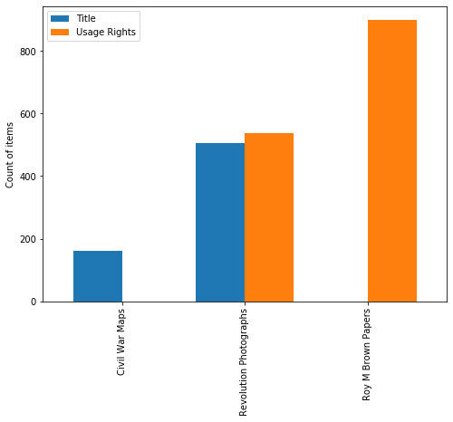
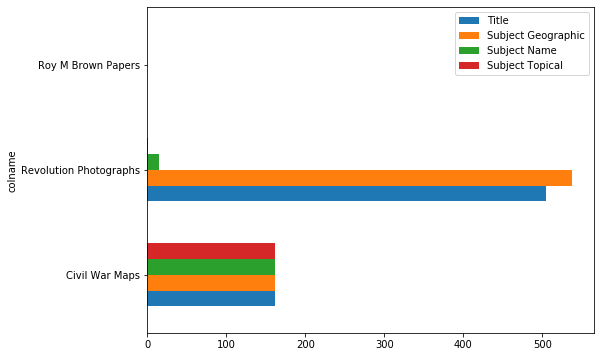
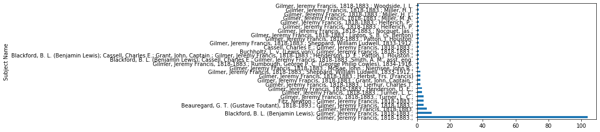
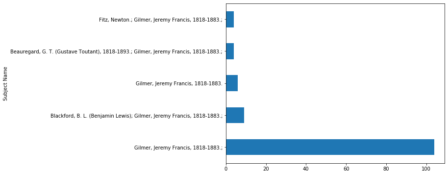
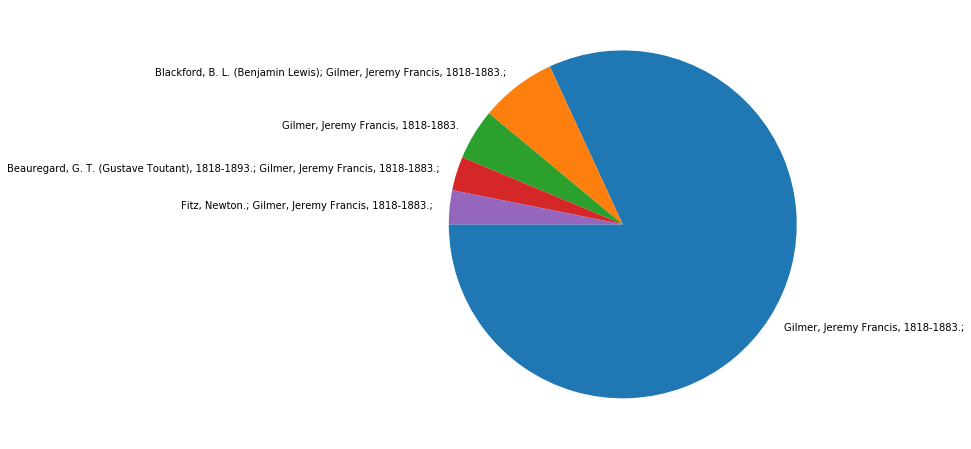
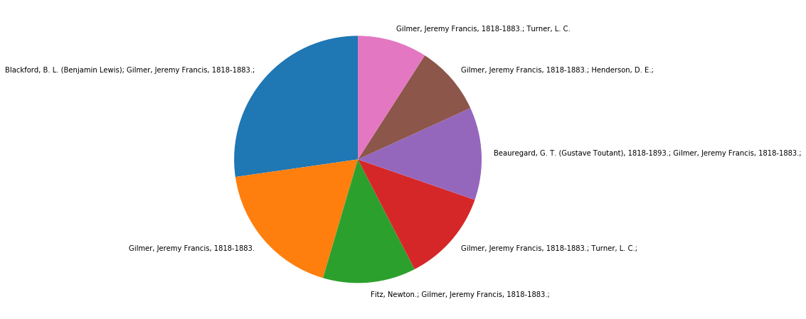
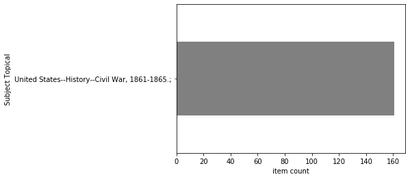

# Practical Python Tools for Metadata Assessment: 55-minute workshop

## Welcome

Welcome to the workshop! This is meant to be a a fun and beginner-friendly introduction to a few useful Python tools, in the context of exploring and manipulating tabular metadata for digital collections.   

In this session, we will focus on some basic functions of Python's pandas data analysis library. We will use pandas for exploring, filtering, reshaping, and merging datasets. 

This notebook provides code that you can execute to see results and generate outputs in the notebook itself, as well as explanations for the examples and exercises we'll be working through together. 

This workshop will be very quick. We will not be able to get through everything. So, this notebook also includes: a couple bonus examples, and a list of recommended resources for further exploration on your own. 


### Table of Contents

* [Workshop Plan](#wplan)
* [Using the Jupyter Notebook](#usingjn)
    * [Exercise 1: Run Code Cells](#ex1)
    * [Exercise 2: Add New Code](#ex2)
    * [More Notebook Exercises](#mjn)
* [Python/pandas Examples with Collections Metadata](#ppe)
    * [Metadata Example 1: Explore a dataset](#md1)
        * [Exercise 3: Troubleshoot a Datatype Issue](#ex3)
    * [Metadata Example 2: Compare a group of metadata files](#md2)
        * [Exercise 4: Evaluate Values in a Subjects field](#ex4)
    * [Metadata Example 3: Merge information from separate files](#md3)
        * [Exercise 5: Other ways to merge](#ex5)
    * [Bonus Example: Working with Dates](#md4)
    * [Bonus Example: Find and remove duplicates](#md5)
* [Resources](#res)


## Workshop Plan <a name="wplan"></a>

We will start with a quick demo in using the jupyter notebook for running code cells and adding code to cells.

Then we will walk through three examples of using Python/pandas with digital collections metadata files.  

After each example there will be an exercise so you can try out working with the collections data.     


----
  
**Intro, & using the jupyter notebook (10 mins)**
    * Exercises 1 & 2: how to run code in notebook, and add new code to cells 
    
**Example 1: Explore a dataset (12 mins)** 
    * Exercise 3: Troubleshoot a Datatype Issue
    
**Example 2: Compare a group of metadata files (12 mins)**
    * Exercise 4: Evaluate Values in a Subject field
    
**Example 3: Merge info from separate files (12 mins)**
    * Exercise 5 : Other Ways to Merge
    
**Wrap-up (5 mins)**
    * Review resources, and info about installing python

----


# Using the Jupyter Notebook <a name="usingjn"></a>

You can edit this notebook directly to run code cells and generate output, and add new code and text. In this section we'll go through basic commands to get familiar with working in the notebook. 

All paths in the notebook refer to locations within this project folder/git repository, so you can access example data and/or save output files within this project. 


### Exercise 1: Run code cells <a name="ex1"></a>

Practice running Python code in the notebook. 

#### Code Cells and Markdown Cells

All content in this notebook is located within individual cells, which you can identify by clicking on them. Clicking on a cell causes its borders to appear. 

Jupyter notebooks have two kinds of cells:   

* **Code cells:** contain code that can be executed within the notebook. Code cells have an `In [ ]:` to the left of the cell. 

* **Markdown cells:** contain text providing explanation and context, usually about the code cells. 


#### example code cell :


```python
## hashtags in a code cell indicate a comment -- informational text for a human to read, not to be executed as code

print("here's an example code cell.")
```

    here's an example code cell.
    

#### Edit Mode and Command Mode 

All cells in the notebook have two functional modes: 
* **Command mode:** used for navigating and moving cells = Blue cell border    
* **Edit mode:** used for adding/editing content in cells = Green cell border

To run a code cell, you need to put the cell into Edit mode by clicking on it.  
(More info on Edit mode provided below. For now, just know that you need Edit mode to run a cell.)

You can tell a cell is in Edit mode because the cell border turns green. 

If a cell has a blue border, it is in Command mode. To see the difference, click on the code cell above this Markdown cell.    
The border should turn green = Edit mode. 

To switch back to Command mode, press the `Esc` key. The cell border will switch back to Blue = Command mode. 

**NOTE:** If you are not able to see Blue and Green, look for a cursor in the cell. If a cell is in Edit mode, you will see your cursor blinking in the cell. If there is no cursor blinking in the cell, it is in Command mode. 

Try switching the code cell below back and forth between Edit mode (green) and Command mode (blue) a few times to get used to how this works. 


#### another example code cell:


```python
# more example code

print("Toggle a code cell between Edit and Command modes using Esc and Enter keys.")
```

    Toggle a code cell between Edit and Command modes using Esc and Enter keys.
    

#### How to Run a Code Cell

To run a code cell, click on it to switch the cell to Edit mode (green border). Then press `CTRL` + `Enter` to run the code. 

While the code runs, you'll see an `*` in the `In [ ]:` to the left of the cell. 

When the code completes, an integer will appear in the `In [ ]:` to the left of the cell.   

If the code produced output, it will appear underneath the code cell.   

#### Try running this code cell:


```python
# more example code

print("Press CTRL + ENTER to run a code cell. If the code produces output, it will appear below the cell.")
```

    Press CTRL + ENTER to run a code cell. If the code produces output, it will appear below the cell.
    

### Exercise 2: Add New Code to Cells <a name="ex2"></a>

For the pandas exercises in this notebook, you'll have the chance to add new code to cells to try out ideas.  
This exercise walks through how to add code to a cell. 


#### Type or paste code into an existing cell

For the exercises in this notebook, there will be empty code cells available to try out solutions. You can paste example code provided, or type your own. 

Look for the `In [ ]:` to the left of the cell, to make sure it's a code cell. 


Try out pasting this line of sample code into the empty code cell below and then running it: 
* Copy the block of text below starting from the ##, and ending with the )
* Click on one of the empty code cells below, make sure the cell turns green for Edit mode, paste the copied block of code. 
* Then press `CTRL` + `ENTER` to run the code you pasted. 

```

## comment 
print("here's an example of new code.")


```

#### Use the code cells below for the exercise


```python

```


```python

```


```python

```

###  More Notebook Exercises: 'command palette', shortcuts, creating new cells <a name="mjn"></a>

Learn more about notebook commands, keyboard shortcuts, and creating new cells for Markdown and code.

#### The 'command palette' has all notebook actions and shortcuts

In the command palette, you can search for any command, and run that action directly from the palette, as well as seeing the shortcut for that action if available. 

1. Press ``CTRL + SHIFT+ P`` to show the command palette. 
    * With the palette open, search for 'edit', to find the shortcut for `enter 'edit' mode`. Click on this action from the list. This cell will then switch into 'edit' mode. 

#### Keyboard Shortcuts for Jupyter Notebook :

* `CTRL` + `SHIFT`+ `P` : show 'command palette'
* `esc` : command mode
* `enter` : edit mode
* `a` : insert cell above
* `b` : insert cell below
*  `SHIFT` + `enter`: run a code cell (or render a markdown cell)
* `d d`: delete a cell


#### Edit the text in a Markdown cell, execute (render) a Markdown cell

* Switch this cell into 'edit mode'. 
* Add a bullet point below these lines of text and type something, for example: ``'DONE'``. (can copy/paste example below if easier!)
* Then use `CTRL` + `Enter` to "run" the cell/render the markdown.  
    * for example: `DONE`   


#### Add new cells to notebook

* With this cell in command mode (blue border), add a cell underneath it, then add some cells above the cells you added. 
    * press `b` to add a cell below an existing cell. 
    * You can keep pressing `b` to add more cells; it doesn't hurt anything to have empty cells in the notebook. 
    * press `a` to add a cell above an existing cell. 

#### Create a new Markdown cell, add some text

create a Markdown cell: 
* click on one of the empty cells you created, or just create another one here. 
* A brand-new cell will be in command mode (blue cell border)  
* if there's an `In [ ]:` to the left of the cell, this means it's a code cell. Any text you type into the cell will be treated as code. 
* To convert the cell to a Markdown cell, press `m` to switch the cell to markdown.  
    * The `In [ ]:` to the left of the cell will disappear, indicating it is now a Markdown cell. Any test you type into the cell will now be treated as markdown. 
* If this did not work, make sure the cell is in command mode. Switch to Command mode by pressing `Esc`. The cell border will turn blue. 

add text in a Markdown cell: 
* Switch the cell to Edit mode by clicking inside it. 
* In the markdown cell, type a header, and then some regular text. For example: 

    ```
    #### here's an example header  
    and some regular paragraph text 
    ```

#### use the markdown cell below for the exercise

(placeholder markdown cell)

#### Execute/render a markdown cell

* As you did for the code cells, press `CTRL` + `Enter` to "run" the markdown cell/render the markdown that you just typed.  
* the text will display as a formatted version, and the cell border will switch from green to blue. 

---
---
----

# Python/pandas examples with collections metadata files  <a name="ppe"></a>

## Metadata Example 1: Explore datasets with pandas<a name="md1"></a>

This example walks through getting oriented with using python/pandas for viewing and analysing descriptive metadata files.

In this scenario we are working with a group of separate metadata files that have varied sets of inconsistently organized fields. We want to assess completeness of specific fields across the group as a whole. 

We will import metadata from csv and tsv files, figure out which fields are relevant for our assessment, and select those from the raw datasheets. 


### Learning objectives in this example:

* read a data file into a dataframe
* create dataframes from differently delimited data
* assess overall size and contents of the dataframe
* view data in the dataframe
* filter out irrelevant data
* select relevant columns to include 
* identify basic datatype information

#### Step 1:  Import libraries for Python

Importing libraries loads them into memory so that Python can use them. 

Libraries provide specific methods for particular kinds of work. 

We are importing: 
* the pandas data analysis library
* `os` for working with files and directories  
* `matplotlib` for generating some basic graphs from data

Setting `%matplotlib inline` allows plots to render within the notebook. 


```python
# import pandas and os libraries 
import pandas as pd
import os
import matplotlib.pyplot as plt
%matplotlib inline
```

#### Next: check that we are in the right place!!

We'll do a couple quick checks to get oriented and make sure that we're in the right directory. 

This is not really necessary, because this notebook is located in/running from within the 'notebook_exercises' subfolder, so we already know that we will be running commands relative to that location, but it's useful to know how to take a look around to see where you are. 


```python
# os.getcwd() outputs the current working directory, similar to pwd in bash

os.getcwd()
```


    'C:\\Users\\morganem\\GitlabRepos\\py-workshop-DLF2019\\notebook_exercises'


```python
# os.listdir() with no parameter returns a list of the files and directories in the current working directory

os.listdir()
```


    ['.ipynb_checkpoints', 'exampleData', 'output', 'py_workshop_notebook.ipynb']


```python
# use os.listdir() plus a parameter to see what's in the exampleData subfolder

os.listdir('./exampleData/')
```


    ['03823_access_images.csv',
     '03823_masters.csv',
     '03823_metadata.txt',
     '03883.txt',
     '60001.txt',
     'coll_dupes_example.csv',
     'maps.csv']


#### Create a dataframe from one of the metadata sheets

A dataframe is a Python object with rows and columns that can be selected for running calculations and manipulating the data in a lot of ways. 

You can read many different data formats into a dataframe, including csv, tsv, and even excel sheets. 

The command below uses the variable name 'maps' for creating a dataframe using the pandas `read_csv` function. 


```python
# create a dataframe named 'maps' from an example metadata file 

maps=pd.read_csv("./exampleData/maps.csv")
```

#### Inspect a dataframe

Next, we'll explore the maps dataframe with pandas attributes and methods, to get a sense of how large this datset is (how many rows and columns), what the column headers are and how many of them are empty, and what the datatypes are in each column. 

* shape
* columns 
* info() 


```python
# the shape attribute displays the number of rows and columns for the dataframe, to get a sense of its overall size

maps.shape
```


    (161, 36)


```python
# columns attribute displays column labels

maps.columns
```


    Index(['Title', 'Alternative Title', 'Creator', 'Contributor', 'Creation Date',
           'Date', 'Search by Decade', 'Description', 'Subject (tgm)',
           'Subject Topical', 'Subject Name', 'Subject Geographic', 'Title Note',
           'DCMI Type', 'Caption', 'Contributor Note', 'Notes', 'Original Form',
           'Resource Type', 'Geographic Location', 'Language Code', 'Language',
           'Physical Description of Original', 'Medium of Original',
           'Collection in Repository', 'Digital Collection', 'N.C. Ed. Standard',
           'URL', 'Local Identifier', 'Creator Identifier', 'filename',
           'Copyright', 'Usage Rights', 'Raw Scan Filename', 'Date created',
           'Date modified'],
          dtype='object')


```python
# the info method displays datatypes and numbers of values per column, and memory information

maps.info()
```

    <class 'pandas.core.frame.DataFrame'>
    RangeIndex: 161 entries, 0 to 160
    Data columns (total 36 columns):
    Title                               161 non-null object
    Alternative Title                   4 non-null object
    Creator                             161 non-null object
    Contributor                         51 non-null object
    Creation Date                       161 non-null object
    Date                                161 non-null object
    Search by Decade                    161 non-null object
    Description                         161 non-null object
    Subject (tgm)                       161 non-null object
    Subject Topical                     161 non-null object
    Subject Name                        161 non-null object
    Subject Geographic                  161 non-null object
    Title Note                          161 non-null object
    DCMI Type                           161 non-null object
    Caption                             7 non-null object
    Contributor Note                    50 non-null object
    Notes                               67 non-null object
    Original Form                       161 non-null object
    Resource Type                       161 non-null object
    Geographic Location                 150 non-null object
    Language Code                       161 non-null object
    Language                            161 non-null object
    Physical Description of Original    160 non-null object
    Medium of Original                  161 non-null object
    Collection in Repository            161 non-null object
    Digital Collection                  161 non-null object
    N.C. Ed. Standard                   0 non-null float64
    URL                                 0 non-null float64
    Local Identifier                    160 non-null object
    Creator Identifier                  154 non-null object
    filename                            161 non-null object
    Copyright                           161 non-null object
    Usage Rights                        0 non-null float64
    Raw Scan Filename                   158 non-null object
    Date created                        161 non-null object
    Date modified                       161 non-null object
    dtypes: float64(3), object(33)
    memory usage: 45.4+ KB
    

#### Datatypes in pandas

the most common types are: 

object -   

float64 -   

int64 -   


```python

```


```python

```

#### Sorting dataframe columns

Since the columns listed above are not ordered in a logical way, it's hard to look for a particular column label in the output. 

However, dataframes can be sorted by rows, columns, or values. 

Below we'll sort the dataframe to display the column labels alphabetically, so that it's easier to check if this collection has fields we're interested in, such as Title, Usage Rights, Date, etc. 


```python
# Sort the dataframe to order the output of column labels from the info() method

maps.sort_index(axis=1).info()
```

    <class 'pandas.core.frame.DataFrame'>
    RangeIndex: 161 entries, 0 to 160
    Data columns (total 36 columns):
    Alternative Title                   4 non-null object
    Caption                             7 non-null object
    Collection in Repository            161 non-null object
    Contributor                         51 non-null object
    Contributor Note                    50 non-null object
    Copyright                           161 non-null object
    Creation Date                       161 non-null object
    Creator                             161 non-null object
    Creator Identifier                  154 non-null object
    DCMI Type                           161 non-null object
    Date                                161 non-null object
    Date created                        161 non-null object
    Date modified                       161 non-null object
    Description                         161 non-null object
    Digital Collection                  161 non-null object
    Geographic Location                 150 non-null object
    Language                            161 non-null object
    Language Code                       161 non-null object
    Local Identifier                    160 non-null object
    Medium of Original                  161 non-null object
    N.C. Ed. Standard                   0 non-null float64
    Notes                               67 non-null object
    Original Form                       161 non-null object
    Physical Description of Original    160 non-null object
    Raw Scan Filename                   158 non-null object
    Resource Type                       161 non-null object
    Search by Decade                    161 non-null object
    Subject (tgm)                       161 non-null object
    Subject Geographic                  161 non-null object
    Subject Name                        161 non-null object
    Subject Topical                     161 non-null object
    Title                               161 non-null object
    Title Note                          161 non-null object
    URL                                 0 non-null float64
    Usage Rights                        0 non-null float64
    filename                            161 non-null object
    dtypes: float64(3), object(33)
    memory usage: 45.4+ KB
    

#### View contents of a dataframe 

The head() and tail() methods in pandas display the first or last n rows of data. 

By default head or tails will display 5 rows; below we specify 3 to see fewer rows. 

Note that the column headers are no longer sorted alphabetically, because we did not apply the sort persistently.


```python
maps.head(3)
```


<div>
<style scoped>
    .dataframe tbody tr th:only-of-type {
        vertical-align: middle;
    }

    .dataframe tbody tr th {
        vertical-align: top;
    }

    .dataframe thead th {
        text-align: right;
    }
</style>
<table border="1" class="dataframe">
  <thead>
    <tr style="text-align: right;">
      <th></th>
      <th>Title</th>
      <th>Alternative Title</th>
      <th>Creator</th>
      <th>Contributor</th>
      <th>Creation Date</th>
      <th>Date</th>
      <th>Search by Decade</th>
      <th>Description</th>
      <th>Subject (tgm)</th>
      <th>Subject Topical</th>
      <th>...</th>
      <th>N.C. Ed. Standard</th>
      <th>URL</th>
      <th>Local Identifier</th>
      <th>Creator Identifier</th>
      <th>filename</th>
      <th>Copyright</th>
      <th>Usage Rights</th>
      <th>Raw Scan Filename</th>
      <th>Date created</th>
      <th>Date modified</th>
    </tr>
  </thead>
  <tbody>
    <tr>
      <th>0</th>
      <td>Redoubt C</td>
      <td>NaN</td>
      <td>Gilmer, Jeremy Francis, 1818-1883.</td>
      <td>Fitz, Newton.</td>
      <td>1861; 1862; 1863; 1864; 1865</td>
      <td>undated</td>
      <td>1860; 1861; 1862; 1863; 1864; 1865; 1866; 1867...</td>
      <td>A map of Redoubt C drawn under the direction o...</td>
      <td>Maps</td>
      <td>United States--History--Civil War, 1861-1865.;</td>
      <td>...</td>
      <td>NaN</td>
      <td>NaN</td>
      <td>276/182</td>
      <td>Gilmer Map Number 7</td>
      <td>276_182_E.tif</td>
      <td>Public Domain</td>
      <td>NaN</td>
      <td>276_182.tif</td>
      <td>2005-11-23</td>
      <td>2015-09-14</td>
    </tr>
    <tr>
      <th>1</th>
      <td>Plan of Battery McIntosh</td>
      <td>NaN</td>
      <td>Gilmer, Jeremy Francis, 1818-1883.</td>
      <td>Fitz, Newton.</td>
      <td>1861; 1862; 1863; 1864; 1865</td>
      <td>undated</td>
      <td>1860; 1861; 1862; 1863; 1864; 1865; 1866; 1867...</td>
      <td>A map of the plan of Battery McIntosh, drawn u...</td>
      <td>Maps</td>
      <td>United States--History--Civil War, 1861-1865.;</td>
      <td>...</td>
      <td>NaN</td>
      <td>NaN</td>
      <td>276/183</td>
      <td>Gilmer Map Number 8</td>
      <td>276_183_E.tif</td>
      <td>Public Domain</td>
      <td>NaN</td>
      <td>276_183.tif</td>
      <td>2005-11-23</td>
      <td>2015-09-14</td>
    </tr>
    <tr>
      <th>2</th>
      <td>Fort DeRussy on Red River, Louisiana</td>
      <td>NaN</td>
      <td>Gilmer, Jeremy Francis, 1818-1883.</td>
      <td>NaN</td>
      <td>1864</td>
      <td>1864</td>
      <td>1860; 1861; 1862; 1863; 1864; 1865; 1866; 1867...</td>
      <td>The plans of Fort DeRussy and obstructions of ...</td>
      <td>Maps</td>
      <td>United States--History--Civil War, 1861-1865.;</td>
      <td>...</td>
      <td>NaN</td>
      <td>NaN</td>
      <td>276/203</td>
      <td>Gilmer Map Number 196</td>
      <td>276_203_E.tif</td>
      <td>Public Domain</td>
      <td>NaN</td>
      <td>276_203.tif</td>
      <td>2005-12-08</td>
      <td>2015-09-14</td>
    </tr>
  </tbody>
</table>
<p>3 rows × 36 columns</p>
</div>


#### Explore another dataset

Now we'll create another dataframe from a different collection. 

Using shape and info() to get a basic sense of the data, we can see that this data sheet has nearly twice as many column labels, and tons of empty fields.  

We filter the dataset by getting rid of the empty columns, and selecting a set of columns to focus on. 

#### Specify delimiter for read_csv

You can also use the read_csv function for other kinds of delimiters, such as tab-delimited for this metadata file. 


```python
# read in another example dataset as a separate dataframe. 

# use sep parameter to specify tab as delimiter

rev=pd.read_csv("./exampleData/60001.txt", sep='\t')
```


```python
# df.shape to output number of rows and columns

rev.shape
```


    (538, 60)


```python
# Sort the dataframe to order the output of column labels from the info() method

rev.sort_index(axis=1).info()
```

    <class 'pandas.core.frame.DataFrame'>
    RangeIndex: 538 entries, 0 to 537
    Data columns (total 60 columns):
    Additional Display                         0 non-null float64
    Alternative Title                          0 non-null float64
    Author Chief Source                        0 non-null float64
    Caption                                    0 non-null float64
    Cataloging Agency                          0 non-null float64
    Collection Number                          538 non-null int64
    Collection in Repository                   538 non-null object
    Condition                                  0 non-null float64
    Container type                             538 non-null object
    Contributor                                0 non-null float64
    Contributor Note                           42 non-null object
    Coordinates                                0 non-null float64
    Copyright Holder                           0 non-null float64
    Creation Date                              538 non-null int64
    Creator                                    538 non-null object
    Creator Identifier                         538 non-null object
    Creator Nationality/Culture                0 non-null float64
    Current Location                           0 non-null float64
    Date                                       538 non-null object
    Date created                               538 non-null object
    Date modified                              538 non-null object
    Description                                504 non-null object
    Digital Collection                         538 non-null object
    Finding Aid                                538 non-null object
    Form                                       526 non-null object
    Has Part Of                                0 non-null float64
    Is Part Of                                 0 non-null float64
    Language                                   0 non-null float64
    Local Identifier                           0 non-null float64
    Location in Collection                     538 non-null object
    Map Details                                0 non-null float64
    Map Type                                   0 non-null float64
    Medium                                     0 non-null float64
    Notes                                      4 non-null object
    Object                                     538 non-null object
    Pagination                                 0 non-null float64
    Physical Description of Analog Original    0 non-null float64
    Place of Publication                       0 non-null float64
    Projection                                 0 non-null float64
    Publisher                                  0 non-null float64
    Related Resource                           0 non-null float64
    Resource Type                              526 non-null object
    Scale                                      0 non-null float64
    Search by Decade                           0 non-null float64
    Sort Me                                    0 non-null float64
    Sponsor                                    0 non-null float64
    StreamingFile                              0 non-null float64
    Style/Period                               0 non-null float64
    Subject (tgm)                              500 non-null object
    Subject Geographic                         538 non-null object
    Subject Name                               15 non-null object
    Subject Topical                            1 non-null object
    Subject Topical Other                      0 non-null float64
    Title                                      505 non-null object
    Title Note                                 0 non-null float64
    Transcription                              159 non-null object
    Usage Rights                               538 non-null object
    Volume/Issue                               0 non-null float64
    filename                                   538 non-null object
    geonamesid                                 0 non-null float64
    dtypes: float64(34), int64(2), object(24)
    memory usage: 252.3+ KB
    

#### Get rid of empty columns

Many of these columns are empty, so we will exclude them. 

The "inplace" attribute will apply this change to the dataframe we are currently working with.


```python
# Drop empty columns. Inplace attribute overwrites the working dataframe. 

rev.dropna(axis = 1, how ='all', inplace = True)

# output updated dataframe

rev.sort_index(axis=1).info()
```

    <class 'pandas.core.frame.DataFrame'>
    RangeIndex: 538 entries, 0 to 537
    Data columns (total 26 columns):
    Collection Number           538 non-null int64
    Collection in Repository    538 non-null object
    Container type              538 non-null object
    Contributor Note            42 non-null object
    Creation Date               538 non-null int64
    Creator                     538 non-null object
    Creator Identifier          538 non-null object
    Date                        538 non-null object
    Date created                538 non-null object
    Date modified               538 non-null object
    Description                 504 non-null object
    Digital Collection          538 non-null object
    Finding Aid                 538 non-null object
    Form                        526 non-null object
    Location in Collection      538 non-null object
    Notes                       4 non-null object
    Object                      538 non-null object
    Resource Type               526 non-null object
    Subject (tgm)               500 non-null object
    Subject Geographic          538 non-null object
    Subject Name                15 non-null object
    Subject Topical             1 non-null object
    Title                       505 non-null object
    Transcription               159 non-null object
    Usage Rights                538 non-null object
    filename                    538 non-null object
    dtypes: int64(2), object(24)
    memory usage: 109.4+ KB
    

#### Applying Methods to Series in a Dataframe

Columns in the dataframe are a python object called a Series. You can use some methods at the level of Series as well as at the dataframe level. 

For example, the head() and tail() methods can also be applied to series as well as the whole dataframe. 

Below we use the head method to look at a list of values in the Title field in our dataframe. 


```python
# View the first n rows of the Title column

rev.Title.head(24)
```


    0                                      Young protesters
    1                                 Yanukovych supporters
    2                                       Young protestor
    3                      Information van on a Kyiv street
    4      Protesters mingling outside the Central Terminal
    5                  Marching towards the Supreme Council
    6                                 Crazy orange hair day
    7                                 Young revolutionaries
    8     Yushchenko supporters rallying on Vokzal'na Sq...
    9                  Shevchenko and the Orange Revolution
    10                           Valenki for the protesters
    11         Orthodox procession in support of Yanukovych
    12                                   Mass Advertisement
    13                                          A call home
    14                          Young man holding up a flag
    15                                      Tent City signs
    16                      The Orange Revolution in action
    17                   Tent City in the Orange Revolution
    18                                   Valenok Caricature
    19    Sticker "war" between Yushchenko and Yanukovyc...
    20                                         Lady Liberty
    21                                     Happy protestors
    22                                 Maidan Entertainment
    23                                      Car decorations
    Name: Title, dtype: object


**Chaining methods**

You can chain methods together to apply another method to an object that has a method applied. 

Here we use the `sort_values` method to sort values in the Title series.  

We use the 'ascending'=False parameter to sort reverse-alphabetically.  

Then we apply the head() method to view the first 12 values of the sorted series. 


```python
# View the first n values in the 'Title' series sorted alphabetically

rev.Title.sort_values(ascending=False).head(24)
```


    421                     [Duplicate: Folder 0007-Fashion]
    444                     [Duplicate: Folder 0007 Fashion]
    426                     [Duplicate- Folder 0007 Fashion]
    319           Zoomed out view of Maĭdan Nezalez︠h︡nosti
    322                             Zbigniew Bujak at Maidan
    295                   Zbigniew Bujak and his colleagues.
    28                                        Zbigniew Bujak
    356                   Yushchenko supporters with trident
    250            Yushchenko supporters showing peace signs
    8      Yushchenko supporters rallying on Vokzal'na Sq...
    506      Yushchenko supporters mingling behind barricade
    511                 Yushchenko supporter in front of bus
    514       Yushchenko supporter buses on nighttime street
    382    Yushchenko banner covered in signatures signif...
    218                                Yushchenko Supporters
    88                     Yuri Shevchuk on Maidan jumbotron
    196                    Yuri Shevchuk on Maidan jumbotron
    187                     Youth at Maĭdan Nezalez︠h︡nosti
    406                     Youth at Maĭdan Nezalez︠h︡nosti
    260                                      Youth at Maidan
    7                                  Young revolutionaries
    373                                     Young protestors
    201                Young protestor smiling at the camera
    445                                      Young protestor
    Name: Title, dtype: object


#### How to Precisely Specify Locations in the Data

The `.loc` method allows for selecting individual or multiple rows and columns.   

Below we'll focus on the ``'Title','Date', 'Usage Rights', and 'filename'`` columns. 

We use a `:` to include all rows of the dataframe. 

We will use the tail() method to view the last few rows from this selection.  


```python
# specify multiple rows and columns by label with loc method 

rev.loc[:,['Title','Date', 'Usage Rights', 'filename']].tail(8)
```


<div>
<style scoped>
    .dataframe tbody tr th:only-of-type {
        vertical-align: middle;
    }

    .dataframe tbody tr th {
        vertical-align: top;
    }

    .dataframe thead th {
        text-align: right;
    }
</style>
<table border="1" class="dataframe">
  <thead>
    <tr style="text-align: right;">
      <th></th>
      <th>Title</th>
      <th>Date</th>
      <th>Usage Rights</th>
      <th>filename</th>
    </tr>
  </thead>
  <tbody>
    <tr>
      <th>530</th>
      <td>NaN</td>
      <td>29 November 2004</td>
      <td>For copyright information or permissions quest...</td>
      <td>60001_df0005_023.tif</td>
    </tr>
    <tr>
      <th>531</th>
      <td>Maidan crowds</td>
      <td>29 November 2004</td>
      <td>For copyright information or permissions quest...</td>
      <td>60001_df0007_023.tif</td>
    </tr>
    <tr>
      <th>532</th>
      <td>Flags over Maidan</td>
      <td>27 November 2004</td>
      <td>For copyright information or permissions quest...</td>
      <td>60001_df0001_012.tif</td>
    </tr>
    <tr>
      <th>533</th>
      <td>NaN</td>
      <td>30 November 2004</td>
      <td>For copyright information or permissions quest...</td>
      <td>60001_df0005_050.tif</td>
    </tr>
    <tr>
      <th>534</th>
      <td>Women in the Orange Revolution</td>
      <td>29 November 2004</td>
      <td>For copyright information or permissions quest...</td>
      <td>60001_df0009_11.tif</td>
    </tr>
    <tr>
      <th>535</th>
      <td>Young protesters</td>
      <td>27 November 2004</td>
      <td>For copyright information or permissions quest...</td>
      <td>60001_df0003_021.tif</td>
    </tr>
    <tr>
      <th>536</th>
      <td>Protestor Vehicles</td>
      <td>10 December 2004</td>
      <td>For copyright information or permissions quest...</td>
      <td>60001_df0007_092.tif</td>
    </tr>
    <tr>
      <th>537</th>
      <td>NaN</td>
      <td>10 December 2004</td>
      <td>For copyright information or permissions quest...</td>
      <td>60001_df0009_33.tif</td>
    </tr>
  </tbody>
</table>
</div>


**Apply the same columns to the maps dataframe**

Meanwhile, our maps dataframe is still available in working memory. 

Because the same column labels exist in the maps dataset, we can select out these columns from maps using .loc, the same way as we did with the rev dataframe above.  


```python
# examine the same columns in the 'maps' dataframe
# tail method displays the last n rows

maps.loc[:,['Title','Date', 'Usage Rights', 'filename']].tail(8)
```


<div>
<style scoped>
    .dataframe tbody tr th:only-of-type {
        vertical-align: middle;
    }

    .dataframe tbody tr th {
        vertical-align: top;
    }

    .dataframe thead th {
        text-align: right;
    }
</style>
<table border="1" class="dataframe">
  <thead>
    <tr style="text-align: right;">
      <th></th>
      <th>Title</th>
      <th>Date</th>
      <th>Usage Rights</th>
      <th>filename</th>
    </tr>
  </thead>
  <tbody>
    <tr>
      <th>153</th>
      <td>Part of Spotslyvania county</td>
      <td>undated</td>
      <td>NaN</td>
      <td>276_271_E.tif</td>
    </tr>
    <tr>
      <th>154</th>
      <td>Area around Culpepper courthouse, bounded sout...</td>
      <td>undated</td>
      <td>NaN</td>
      <td>276_272_E.tif</td>
    </tr>
    <tr>
      <th>155</th>
      <td>Area around Falmouth east to Potomac river</td>
      <td>undated</td>
      <td>NaN</td>
      <td>276_273_E.tif</td>
    </tr>
    <tr>
      <th>156</th>
      <td>Map of parts of Orange, Spotsylvania, Caroline...</td>
      <td>undated</td>
      <td>NaN</td>
      <td>276_274_E.tif</td>
    </tr>
    <tr>
      <th>157</th>
      <td>Military map of the country in the occupation ...</td>
      <td>undated</td>
      <td>NaN</td>
      <td>276_275_E.tif</td>
    </tr>
    <tr>
      <th>158</th>
      <td>Map of the Rappahannock River from Fredericksb...</td>
      <td>undated</td>
      <td>NaN</td>
      <td>276_276_E.tif</td>
    </tr>
    <tr>
      <th>159</th>
      <td>Incomplete and unidentified sketch of area in ...</td>
      <td>undated</td>
      <td>NaN</td>
      <td>276_330_E.tif</td>
    </tr>
    <tr>
      <th>160</th>
      <td>Pleasant Hill</td>
      <td>1864</td>
      <td>NaN</td>
      <td>276_207_E.tif</td>
    </tr>
  </tbody>
</table>
</div>


### Recap of Metadata Example 1

In this example, we got familiar with our collections metadata, and identified fields to assess.  

In the next example, we will select out the relevant fields from a group of files, compile separate dataframes into a single dataframe, and compare fields across collections. 


**Summary of example:** 

* reading CSV and tab-delimited metadata sheets into dataframes
* exploring a dataframe as a whole, series within a dataframe, values in rows and columns
* filtering datasets by removing empty and irrelevant columns
* selecting columns to include
* working with multiple dataframes at once


### Exercise 3: Troubleshoot a Datatype Issue <a name="ex3"></a>


One of the three collections in this example is Collection Number 03883. The metadata filename is 03883.txt. 


Create a dataframe 


```python
df=pd.read_csv('./exampleData/03883.txt', sep='\t')
```


```python
df.shape
```


    (899, 64)


```python
df.info()
```

    <class 'pandas.core.frame.DataFrame'>
    RangeIndex: 899 entries, 0 to 898
    Data columns (total 64 columns):
    Collection in Repository                   899 non-null object
    Collection Number                          899 non-null int64
    Location in Collection                     899 non-null object
    Object                                     899 non-null object
    Container Type                             899 non-null object
    filename                                   899 non-null object
    Title                                      0 non-null float64
    Alternative Title                          0 non-null float64
    Creator                                    0 non-null float64
    Contributor                                0 non-null float64
    Creation Date                              0 non-null float64
    Date                                       0 non-null float64
    Description                                0 non-null float64
    Subject (tgm)                              0 non-null float64
    Subject Name                               0 non-null float64
    Subject Topical                            0 non-null float64
    Subject Geographic                         0 non-null float64
    Subject Topical Other                      0 non-null float64
    Coordinates                                0 non-null float64
    geonamesid                                 0 non-null float64
    Digital Collection                         0 non-null float64
    Repository                                 0 non-null float64
    Host                                       0 non-null float64
    Usage Rights                               899 non-null object
    Copyright Holder                           0 non-null float64
    Additional Display                         0 non-null float64
    Transcription                              0 non-null float64
    Caption                                    0 non-null float64
    Notes                                      0 non-null float64
    Title Note                                 0 non-null float64
    Contributor Note                           0 non-null float64
    Sponsor                                    0 non-null float64
    Related Resource                           0 non-null float64
    Author Chief Source                        0 non-null float64
    Publisher                                  0 non-null float64
    Place of Publication                       0 non-null float64
    Cataloging Agency                          0 non-null float64
    Is Part Of                                 0 non-null float64
    Has Part Of                                0 non-null float64
    Form                                       0 non-null float64
    Resource Type                              0 non-null float64
    Medium                                     0 non-null float64
    Condition                                  0 non-null float64
    Language                                   0 non-null float64
    Physical Description of Analog Original    0 non-null float64
    Creator Nationality/Culture                0 non-null float64
    Style/Period                               0 non-null float64
    Volume/Issue                               0 non-null float64
    Scale                                      0 non-null float64
    Projection                                 0 non-null float64
    Map Type                                   0 non-null float64
    Map Details                                0 non-null float64
    Current Location                           0 non-null float64
    path                                       0 non-null float64
    Local Identifier                           0 non-null float64
    Creator Identifier                         0 non-null float64
    Search by Decade                           0 non-null float64
    Pagination                                 0 non-null float64
    Sort Me                                    0 non-null float64
    StreamingFile                              0 non-null float64
    duracloudSpace                             0 non-null float64
    OCLC number                                0 non-null float64
    Date created                               899 non-null object
    Date modified                              899 non-null object
    dtypes: float64(55), int64(1), object(8)
    memory usage: 449.6+ KB
    


```python
df.dropna(axis = 1, how ='all', inplace = True)

df.info()
```

    <class 'pandas.core.frame.DataFrame'>
    RangeIndex: 899 entries, 0 to 898
    Data columns (total 9 columns):
    Collection in Repository    899 non-null object
    Collection Number           899 non-null int64
    Location in Collection      899 non-null object
    Object                      899 non-null object
    Container Type              899 non-null object
    filename                    899 non-null object
    Usage Rights                899 non-null object
    Date created                899 non-null object
    Date modified               899 non-null object
    dtypes: int64(1), object(8)
    memory usage: 63.3+ KB
    


```python
df['Collection Number'].head()

```


    0    3883
    1    3883
    2    3883
    3    3883
    4    3883
    Name: Collection Number, dtype: int64


```python
df=pd.read_csv('./exampleData/03883.txt',sep='\t', dtype={'Collection Number':object})

df['Collection Number'].head()
```


    0    03883
    1    03883
    2    03883
    3    03883
    4    03883
    Name: Collection Number, dtype: object


```python

```


```python

```

###  Solution to Exercise 3: Troubleshoot a Datatype Issue


```python

```

## Metadata Example 2: Compare a group of metadata files <a name="md2"></a>

In Example 1, we identified fields we want to analyze in our group of collections: Title, Date, Usage Rights, and a few Subject fields. 

In this example, we will select out the relevant fields from a group of datasheets by creating a variable to store the set of columns we're interested in.  

Then we will concatenate metadata from the separate collections into a single dataframe that makes it easier to compare completeness of metadata across the group as a whole. 

We will generate basic graphs to show comparisons between the collections. 


### Learning Objectives in this example:   

* Use a variable for storing a list
* Select columns on import with `usecols` parameter
* Create a new column
* Use `.groupby` to organize data
* Generate plots for visual comparisons


#### Use a variable to store the column names we want

We create a variable 'collabels' to hold the list of the Column labels that we will then select out from each datasheet. 


```python
# create a variable for column labels

collabels=['Title','Date','Usage Rights', 'Subject Geographic', 'Subject Name' , 'Subject Topical']
```

#### Select relevant columns and create a new column with Collection Names

Now we can create a dataframe from each metadata sheet, including only the relevant Columns. 

We also create a new column in each dataframe that contains a simple collection name. We'll use these collection names when we group the metadata together into a single dataframe. 


```python
# read in the same datasheets from the last example

# create a new column in each dataframe that contain a short Collection Name value

maps=pd.read_csv("./exampleData/maps.csv", usecols=collabels)
maps['colname'] ='Civil War Maps'

rev=pd.read_csv("./exampleData/60001.txt", usecols=collabels, sep='\t')
rev['colname'] ='Revolution Photographs'

rmb=pd.read_csv("./exampleData/03883.txt", sep='\t', usecols=collabels)
rmb['colname'] ='Roy M Brown Papers'
```

#### Check our new dataframes 

Again use info() to see the value counts and datatypes in each Column. 


```python
# show info for updated dataframes 

maps.sort_index(axis=1).info()
print('\n')

rev.sort_index(axis=1).info()
print('\n')

rmb.sort_index(axis=1).info()
```

    <class 'pandas.core.frame.DataFrame'>
    RangeIndex: 161 entries, 0 to 160
    Data columns (total 7 columns):
    Date                  161 non-null object
    Subject Geographic    161 non-null object
    Subject Name          161 non-null object
    Subject Topical       161 non-null object
    Title                 161 non-null object
    Usage Rights          0 non-null float64
    colname               161 non-null object
    dtypes: float64(1), object(6)
    memory usage: 8.9+ KB
    
    
    <class 'pandas.core.frame.DataFrame'>
    RangeIndex: 538 entries, 0 to 537
    Data columns (total 7 columns):
    Date                  538 non-null object
    Subject Geographic    538 non-null object
    Subject Name          15 non-null object
    Subject Topical       1 non-null object
    Title                 505 non-null object
    Usage Rights          538 non-null object
    colname               538 non-null object
    dtypes: object(7)
    memory usage: 29.5+ KB
    
    
    <class 'pandas.core.frame.DataFrame'>
    RangeIndex: 899 entries, 0 to 898
    Data columns (total 7 columns):
    Date                  0 non-null float64
    Subject Geographic    0 non-null float64
    Subject Name          0 non-null float64
    Subject Topical       0 non-null float64
    Title                 0 non-null float64
    Usage Rights          899 non-null object
    colname               899 non-null object
    dtypes: float64(5), object(2)
    memory usage: 49.2+ KB
    

#### Concatenate into single dataframe

We create a new dataframe 'collstack', by concatenating the maps, rmb, and rev dataframes. 

Then we'll check that everything looks ok by looking at shape and info() for collstack. 


```python
# concatenate dataframes into a single dataframe

collstack = pd.concat([maps, rmb, rev], axis=0, sort=True)
```


```python
collstack.shape
```


    (1598, 7)


```python
collstack.info()
```

    <class 'pandas.core.frame.DataFrame'>
    Int64Index: 1598 entries, 0 to 537
    Data columns (total 7 columns):
    Date                  699 non-null object
    Subject Geographic    699 non-null object
    Subject Name          176 non-null object
    Subject Topical       162 non-null object
    Title                 666 non-null object
    Usage Rights          1437 non-null object
    colname               1598 non-null object
    dtypes: object(7)
    memory usage: 99.9+ KB
    

#### Group the data by the Collection Names we created

Now we can group the data by the Collection Names, and select fields to compare across the collections. 

The count() method counts the values in the Title and Usage Rights field for each collection. 


```python
#group by collection name, counting values in Title and Usage Rights columns

collstack.groupby('colname')['Title', 'Usage Rights'].count()
```


<div>
<style scoped>
    .dataframe tbody tr th:only-of-type {
        vertical-align: middle;
    }

    .dataframe tbody tr th {
        vertical-align: top;
    }

    .dataframe thead th {
        text-align: right;
    }
</style>
<table border="1" class="dataframe">
  <thead>
    <tr style="text-align: right;">
      <th></th>
      <th>Title</th>
      <th>Usage Rights</th>
    </tr>
    <tr>
      <th>colname</th>
      <th></th>
      <th></th>
    </tr>
  </thead>
  <tbody>
    <tr>
      <th>Civil War Maps</th>
      <td>161</td>
      <td>0</td>
    </tr>
    <tr>
      <th>Revolution Photographs</th>
      <td>505</td>
      <td>538</td>
    </tr>
    <tr>
      <th>Roy M Brown Papers</th>
      <td>0</td>
      <td>899</td>
    </tr>
  </tbody>
</table>
</div>


#### Generate Plots to Represent Comparisons Visually

Next we'll generate some very basic plots to demonstrate working with pandas and matplotlib. 

Visualization is obviously a huge area in itself! These are not in any way impressive visualizations, but are just meant to give a little sense of pandas' flexible graphing capabilities. 

For example, by just adding `.plot(kind='bar')` to the code from the previous cell, we generate a bar graph of the data. 


```python
# create a bar graph for the Title/Usage Rights comparison

collstack.groupby('colname')['Title', 'Usage Rights'].count().plot(kind='bar', figsize=(8,6),width=0.8, )
plt.ylabel('Count of items')
plt.xlabel('')
```


    Text(0.5, 0, '')





#### Investigate Subjects fields across the collections 

We can include different column labels to focus on the subject fields instead, and plot the result. 


```python
collstack.groupby('colname')['Title', 'Subject Geographic', 'Subject Name', 'Subject Topical'].count()
```


<div>
<style scoped>
    .dataframe tbody tr th:only-of-type {
        vertical-align: middle;
    }

    .dataframe tbody tr th {
        vertical-align: top;
    }

    .dataframe thead th {
        text-align: right;
    }
</style>
<table border="1" class="dataframe">
  <thead>
    <tr style="text-align: right;">
      <th></th>
      <th>Title</th>
      <th>Subject Geographic</th>
      <th>Subject Name</th>
      <th>Subject Topical</th>
    </tr>
    <tr>
      <th>colname</th>
      <th></th>
      <th></th>
      <th></th>
      <th></th>
    </tr>
  </thead>
  <tbody>
    <tr>
      <th>Civil War Maps</th>
      <td>161</td>
      <td>161</td>
      <td>161</td>
      <td>161</td>
    </tr>
    <tr>
      <th>Revolution Photographs</th>
      <td>505</td>
      <td>538</td>
      <td>15</td>
      <td>1</td>
    </tr>
    <tr>
      <th>Roy M Brown Papers</th>
      <td>0</td>
      <td>0</td>
      <td>0</td>
      <td>0</td>
    </tr>
  </tbody>
</table>
</div>


```python
# create a horizontal bar graph for the Subjects comparison

collstack.groupby('colname')['Title', 'Subject Geographic', 'Subject Name', 'Subject Topical'].count().plot(kind='barh', figsize=(8,6), width=0.6)
```


    <matplotlib.axes._subplots.AxesSubplot at 0x2454f4e0978>





#### Experimenting with plot types and subsets of data

By changing the value of the `kind=` parameter for `.plot`, we can experiment with different plot types to see which is best suited to a comparison. 

We can also use pandas methods to select a particular range of data to focus on in a plot. 

In this example, we focus on the people represented in the maps collection. We can sort the value counts in ascending order to produce a legible curve. 

If we want to focus on a smaller set within the group, we can use head() to focus on the most-represented names.  


```python
# create a horizontal bar graph for the Subjects Name counts in maps collection 

maps.groupby(['Subject Name']).Title.count().sort_values(ascending=False).plot(kind='barh')
```


    <matplotlib.axes._subplots.AxesSubplot at 0x2454f580860>





```python
# limit the barh graph to top 5 values

maps.groupby(['Subject Name']).Title.count().sort_values(ascending=False).head().plot(kind='barh', figsize=(8,6))
```


    <matplotlib.axes._subplots.AxesSubplot at 0x2454f225518>





#### Represent the same data as a pie plot

Again changing the `kind=` parameter for `.plot` generates a different view of the same selection from the data. 


```python
# create a pie plot for the Subjects Name counts in maps collection 

maps.groupby(['Subject Name']).Title.count().sort_values(ascending=False).head().plot(kind='pie', figsize=(8,8),startangle=180)
plt.ylabel('')
#plt.title("Most Common Subject Names in Maps Collection")
```


    Text(0, 0.5, '')





#### Other ways to reframe a selection

Unsurprisingly, Jeremy Francis Gilmer is the most common name in the Gilmer maps collection. 

If we wanted to create a plot that excludes this obvious result, we could create a variable to select value counts that focus on a given range that we're more interested in. 


```python
# group maps by Subject Name, counting Titles, view top n

maps.groupby(['Subject Name']).Title.count().sort_values(ascending=False).head(10)
```


    Subject Name
    Gilmer, Jeremy Francis, 1818-1883.;                                                     104
    Blackford, B. L. (Benjamin Lewis); Gilmer, Jeremy Francis, 1818-1883.;                    9
    Gilmer, Jeremy Francis, 1818-1883.                                                        6
    Beauregard, G. T. (Gustave Toutant), 1818-1893.; Gilmer, Jeremy Francis, 1818-1883.;      4
    Fitz, Newton.; Gilmer, Jeremy Francis, 1818-1883.;                                        4
    Gilmer, Jeremy Francis, 1818-1883.; Turner, L. C.;                                        4
    Gilmer, Jeremy Francis, 1818-1883.; Turner, L. C.                                         3
    Gilmer, Jeremy Francis, 1818-1883.; Henderson, D. E.;                                     3
    Gilmer, Jeremy Francis, 1818-1883.; Liernur, Charles T.                                   2
    Gilmer, Jeremy Francis, 1818-1883.; Grant, John, Captain.;                                2
    Name: Title, dtype: int64


```python
# create a variable that specifies a range to examine
# exclude the most-common heading to focus on the next seven values
# create a pie plot from result

subcounts=maps['Subject Name'].value_counts()

totals=subcounts[(subcounts <= 103) & (subcounts>2)]

totals.sort_values(ascending=False).plot(kind='pie', figsize=(8,8),startangle=90)
plt.ylabel('')
```


    Text(0, 0.5, '')





### Recap of Example 2 

In this example, we selected relevant fields from across separate datasheets and combined the data for comparison, using simple plots to assess collections visually. 

**summary of this example:**

* use a variable to select a set of columns from multiple datasets 
* create a new column and add data
* concatenate separate data into a single dataframe
* organize datasets for comparison with groupby 
* compare datasets visually using basic graphs
* explore different graph formats according to data attributes


### Exercise 4: Evaluate values in a subject field in the maps collection<a name="ex4"></a>


In this exercise, we will take a closer look at values in the 'Subject Topical' field in the Maps collection. 

Based on the output below from maps.info(), it looks like the Subject Topical field is fairly complete in this collection. 

```
maps.info()
```

```
RangeIndex: 161 entries, 0 to 160
Data columns (total 7 columns):
Title                 161 non-null object
Date                  161 non-null object
Subject Topical       161 non-null object
Subject Name          161 non-null object
Subject Geographic    161 non-null object
Usage Rights          0 non-null float64
colname               161 non-null object
```
Try using the describe() method to get more details about the values represented within the 'Subject Topical' field. 

Would plotting the maps titles according to 'Subject Topical' fields assigned to them make an interesting graph? 

**To answer this question, add and run code into the empty code cells below to:**  

* check the output from describe() for the maps dataframe
* and to generate a plot for numbers of maps titles grouped by Subject Topical. 

---

Here is code that you can paste into the empty code cells, (or feel free to type in the code!)

1. check the output from describe() for the maps dataframe

```

# use describe() to evaluate the contents of the 'Subject Topical' field
maps['Subject Topical'].describe()

```


2. generate a plot for numbers of maps titles grouped by Subject Topical. 

```

# generate a plot for the distribution of Subject Topical field across titles
maps.groupby(['Subject Topical']).Title.count().plot(kind='barh',color=['grey'])
plt.xlabel('item count')


```

For reference, the solution is also demonstrated in the next set of cells below. 


### Use these empty code cells for the exercise: 


```python

```


```python

```


```python

```


```python

```

### Solution to Exercise 4: Evaluate Subjects data in a collection

The output from `describe()` shows that although every item in this collection has a Subject Topical field, it is all the same value. 

So, plotting the Title counts for the Subject Topical field does not make a very interesting plot. 


```python
# use describe() to evaluate the contents of the 'Subject Topical' field

maps['Subject Topical'].describe()
```


    count                                                161
    unique                                                 1
    top       United States--History--Civil War, 1861-1865.;
    freq                                                 161
    Name: Subject Topical, dtype: object


```python
# generate a plot for the distribution of Subject Topical field across titles

maps.groupby(['Subject Topical']).Title.count().plot(kind='barh',color=['grey'])
plt.xlabel('item count')
```


    Text(0.5, 0, 'item count')





```python

```

## Metadata Example 3: Merge information from separate files <a name="md3"></a>

Another useful feature of pandas is that it allows you to do SQL-like joins with datasheets.  

In this exercise, we will create a merged dataframe from descriptive metadata and file sizes information in separate datasets. 

We will rename columns in the descriptive metadata dataframe to merge based on columns in our filesizes datasheets.  
(It's also possible to specify the columns to merge separately for the left and right dataframes if they are not named the same!)  


### Learning objectives in this example:  

* Review of removing empty columns
* Review of datatypes and potential errors, specifying datatypes for columns
* Rename columns 
* Merge dataframes 
* Write a dataframe to a csv output file or other format 


```python
# uncomment the import statement below and run this cell if your notebook was reset and you need the libraries again

#import pandas as pd
```

### Overview of collections metadata in this example

In this example, we have three separate datasheets about various files from a single collection. We are going to combine them into one dataframe by merging on filenames. 

* descriptive metadata about the items
* technical metadata about the access files
* technical metadata about the 'master' files


#### Create dataframe for descriptive metadata

As in previous examples, we will create a dataframe and check out its overall size, columns, and value counts.

Then we'll drop the empty columns. 


```python
# read in collections metadata file as 'metadata' dataframe
metadata=pd.read_csv("./exampleData/03823_metadata.txt", sep='\t')
```


```python
# use shape attribute to summarize rows and columns.

print(metadata.shape)
```

    (5777, 60)
    


```python
# use the info method to see column names and item counts in each column

metadata.info()
```

    <class 'pandas.core.frame.DataFrame'>
    RangeIndex: 5777 entries, 0 to 5776
    Data columns (total 60 columns):
    Collection in Repository                   5777 non-null object
    Collection Number                          5777 non-null int64
    Location in Collection                     5777 non-null object
    Object                                     5777 non-null object
    Container Type                             5777 non-null object
    filename                                   5777 non-null object
    Title                                      0 non-null float64
    Alternative Title                          0 non-null float64
    Creator                                    0 non-null float64
    Contributor                                0 non-null float64
    Creation Date                              0 non-null float64
    Date                                       0 non-null float64
    Description                                0 non-null float64
    Subject (tgm)                              0 non-null float64
    Subject - Name                             0 non-null float64
    Subject - Topical                          0 non-null float64
    Subject - Geographic                       0 non-null float64
    Subject Topical Other                      0 non-null float64
    Coordinates                                0 non-null float64
    geonamesid                                 0 non-null float64
    Digital Collection                         0 non-null float64
    Repository                                 0 non-null float64
    Host                                       0 non-null float64
    Usage Rights                               5777 non-null object
    Copyright Holder                           0 non-null float64
    Additional Display                         0 non-null float64
    Transcription                              0 non-null float64
    Caption                                    0 non-null float64
    Notes                                      0 non-null float64
    Title Note                                 0 non-null float64
    Contributor Note                           0 non-null float64
    Sponsor                                    0 non-null float64
    Related Resource                           0 non-null float64
    Author Chief Source                        0 non-null float64
    Publisher                                  0 non-null float64
    Place of Publication                       0 non-null float64
    Cataloging Agency                          0 non-null float64
    Is Part Of                                 0 non-null float64
    Has Part Of                                0 non-null float64
    Form                                       0 non-null float64
    Resource Type                              0 non-null float64
    Medium                                     0 non-null float64
    Condition                                  0 non-null float64
    Language                                   0 non-null float64
    Physical Description of Analog Original    0 non-null float64
    Creator Nationality/Culture                0 non-null float64
    Style/Period                               0 non-null float64
    Volume/Issue                               0 non-null float64
    Scale                                      0 non-null float64
    Projection                                 0 non-null float64
    Map Type                                   0 non-null float64
    Map Details                                0 non-null float64
    Current Location                           0 non-null float64
    path                                       0 non-null float64
    Local Identifier                           0 non-null float64
    Creator Identifier                         0 non-null float64
    Date created                               5777 non-null object
    Date modified                              5777 non-null object
    Object number                              5777 non-null int64
    Object file name                           5777 non-null object
    dtypes: float64(49), int64(2), object(9)
    memory usage: 2.6+ MB
    

#### Fix datatype for collection number 

As in our exercise above, 'Collection Number' is getting cast as an `int64` datatype. 

We can fix this by re-creating our dataframe, specifying `object` datatype for this column. 


```python
metadata['Collection Number'].head(8)
```


    0    3823
    1    3823
    2    3823
    3    3823
    4    3823
    5    3823
    6    3823
    7    3823
    Name: Collection Number, dtype: int64


```python
metadata=pd.read_csv("./exampleData/03823_metadata.txt", sep='\t', dtype={'Collection Number':object})

metadata['Collection Number'].head(8)
```


    0    03823
    1    03823
    2    03823
    3    03823
    4    03823
    5    03823
    6    03823
    7    03823
    Name: Collection Number, dtype: object


```python
#Remove the empty columns using dropna

# and re-check the column names and item counts by re-running the info method on the reshaped dataset.

metadata.dropna(axis = 1, how ='all', inplace = True)

metadata.info()
```

    <class 'pandas.core.frame.DataFrame'>
    RangeIndex: 5777 entries, 0 to 5776
    Data columns (total 11 columns):
    Collection in Repository    5777 non-null object
    Collection Number           5777 non-null object
    Location in Collection      5777 non-null object
    Object                      5777 non-null object
    Container Type              5777 non-null object
    filename                    5777 non-null object
    Usage Rights                5777 non-null object
    Date created                5777 non-null object
    Date modified               5777 non-null object
    Object number               5777 non-null int64
    Object file name            5777 non-null object
    dtypes: int64(1), object(10)
    memory usage: 496.5+ KB
    

#### Identify which field to merge with Access Files

We will take a look at a few rows to see which field has the filenames we are matching to access files. 


```python
#Use the head method to see the first n rows

metadata.head()
```


<div>
<style scoped>
    .dataframe tbody tr th:only-of-type {
        vertical-align: middle;
    }

    .dataframe tbody tr th {
        vertical-align: top;
    }

    .dataframe thead th {
        text-align: right;
    }
</style>
<table border="1" class="dataframe">
  <thead>
    <tr style="text-align: right;">
      <th></th>
      <th>Collection in Repository</th>
      <th>Collection Number</th>
      <th>Location in Collection</th>
      <th>Object</th>
      <th>Container Type</th>
      <th>filename</th>
      <th>Usage Rights</th>
      <th>Date created</th>
      <th>Date modified</th>
      <th>Object number</th>
      <th>Object file name</th>
    </tr>
  </thead>
  <tbody>
    <tr>
      <th>0</th>
      <td>North Carolina Commission on Interracial Coope...</td>
      <td>03823</td>
      <td>Series 1. Correspondence, 1922-1949. / Subseri...</td>
      <td>Folder 20: Correspondence, 1947-1948: Scan 9</td>
      <td>folder</td>
      <td>03823_0020_0009.tif</td>
      <td>For copyright information or permissions quest...</td>
      <td>2012-01-26</td>
      <td>2012-01-26</td>
      <td>0</td>
      <td>231.jp2</td>
    </tr>
    <tr>
      <th>1</th>
      <td>North Carolina Commission on Interracial Coope...</td>
      <td>03823</td>
      <td>Series 1. Correspondence, 1922-1949. / Subseri...</td>
      <td>Folder 21: Correspondence, 1947-1948: Scan 17</td>
      <td>folder</td>
      <td>03823_0021_0017.tif</td>
      <td>For copyright information or permissions quest...</td>
      <td>2012-01-26</td>
      <td>2012-01-26</td>
      <td>1</td>
      <td>430.jp2</td>
    </tr>
    <tr>
      <th>2</th>
      <td>North Carolina Commission on Interracial Coope...</td>
      <td>03823</td>
      <td>Series 1. Correspondence, 1922-1949. / Subseri...</td>
      <td>Folder 9: Correspondence, 1943: Scan 1</td>
      <td>folder</td>
      <td>03823_0009_0001.tif</td>
      <td>For copyright information or permissions quest...</td>
      <td>2012-01-26</td>
      <td>2012-01-26</td>
      <td>2</td>
      <td>909.jp2</td>
    </tr>
    <tr>
      <th>3</th>
      <td>North Carolina Commission on Interracial Coope...</td>
      <td>03823</td>
      <td>Series 1. Correspondence, 1922-1949. / Subseri...</td>
      <td>Folder 17: Correspondence, 1947-1948: Scan 16</td>
      <td>folder</td>
      <td>03823_0017_0016.tif</td>
      <td>For copyright information or permissions quest...</td>
      <td>2012-01-26</td>
      <td>2012-01-26</td>
      <td>3</td>
      <td>59.jp2</td>
    </tr>
    <tr>
      <th>4</th>
      <td>North Carolina Commission on Interracial Coope...</td>
      <td>03823</td>
      <td>Series 1. Correspondence, 1922-1949. / Subseri...</td>
      <td>Folder 12: Correspondence, 1944-May 1946: Scan 44</td>
      <td>folder</td>
      <td>03823_0012_0044.tif</td>
      <td>For copyright information or permissions quest...</td>
      <td>2012-01-26</td>
      <td>2012-01-26</td>
      <td>4</td>
      <td>152.jp2</td>
    </tr>
  </tbody>
</table>
</div>


markdown


```python
#Create the second dataframe with the access files datasheet

accfiles=pd.read_csv("./exampleData/03823_access_images.csv")
```


```python
accfiles.info()
```

    <class 'pandas.core.frame.DataFrame'>
    RangeIndex: 11554 entries, 0 to 11553
    Data columns (total 6 columns):
    Name                    11554 non-null object
    Full Path               11554 non-null object
    Size                    11554 non-null object
    Files                   11554 non-null int64
    Dir Level (Relative)    11554 non-null int64
    Extension               11554 non-null object
    dtypes: int64(2), object(4)
    memory usage: 541.7+ KB
    


```python
#Create the second dataframe with the access files datasheet

accfiles=pd.read_csv("./exampleData/03823_access_images.csv", usecols=['Name','Full Path', 'Size'])

accfiles.rename(columns={'Name':'AccessName', 'Full Path':'AccessFilePath', 'Size' : 'AccessFileSize'}, inplace=True)
```

markdown


```python
# Use shape and info to take a look at the accfiles dataframe.
print(accfiles.shape) 

accfiles.info()
```

    (11554, 3)
    <class 'pandas.core.frame.DataFrame'>
    RangeIndex: 11554 entries, 0 to 11553
    Data columns (total 3 columns):
    AccessName        11554 non-null object
    AccessFilePath    11554 non-null object
    AccessFileSize    11554 non-null object
    dtypes: object(3)
    memory usage: 270.9+ KB
    

markdown


```python
#Use the head method to see the first n rows of a column

accfiles.head()
```


<div>
<style scoped>
    .dataframe tbody tr th:only-of-type {
        vertical-align: middle;
    }

    .dataframe tbody tr th {
        vertical-align: top;
    }

    .dataframe thead th {
        text-align: right;
    }
</style>
<table border="1" class="dataframe">
  <thead>
    <tr style="text-align: right;">
      <th></th>
      <th>AccessName</th>
      <th>AccessFilePath</th>
      <th>AccessFileSize</th>
    </tr>
  </thead>
  <tbody>
    <tr>
      <th>0</th>
      <td>1.jp2</td>
      <td>Content/03823/image/1.jp2</td>
      <td>7207888 Bytes</td>
    </tr>
    <tr>
      <th>1</th>
      <td>2.jp2</td>
      <td>Content/03823/image/2.jp2</td>
      <td>5707680 Bytes</td>
    </tr>
    <tr>
      <th>2</th>
      <td>3.jp2</td>
      <td>Content/03823/image/3.jp2</td>
      <td>1364563 Bytes</td>
    </tr>
    <tr>
      <th>3</th>
      <td>4.jp2</td>
      <td>Content/03823/image/4.jp2</td>
      <td>9339767 Bytes</td>
    </tr>
    <tr>
      <th>4</th>
      <td>5.jp2</td>
      <td>Content/03823/image/5.jp2</td>
      <td>9021190 Bytes</td>
    </tr>
  </tbody>
</table>
</div>


markdown

markdown


```python
# Rename a column 

metadata.rename(columns={'Object file name':'AccessName'}, inplace=True)
metadata.columns
```


    Index(['Collection in Repository', 'Collection Number',
           'Location in Collection', 'Object', 'Container Type', 'filename',
           'Usage Rights', 'Date created', 'Date modified', 'Object number',
           'AccessName'],
          dtype='object')


markdown


```python
# Join access files data onto the metadata dataframe
# and view info for the new, merged dataframe

combined = pd.merge(metadata, accfiles,on='AccessName', how='left')

combined.info()
```

    <class 'pandas.core.frame.DataFrame'>
    Int64Index: 5777 entries, 0 to 5776
    Data columns (total 13 columns):
    Collection in Repository    5777 non-null object
    Collection Number           5777 non-null object
    Location in Collection      5777 non-null object
    Object                      5777 non-null object
    Container Type              5777 non-null object
    filename                    5777 non-null object
    Usage Rights                5777 non-null object
    Date created                5777 non-null object
    Date modified               5777 non-null object
    Object number               5777 non-null int64
    AccessName                  5777 non-null object
    AccessFilePath              5777 non-null object
    AccessFileSize              5777 non-null object
    dtypes: int64(1), object(12)
    memory usage: 631.9+ KB
    


```python
combined.AccessFileSize.head(8)

```


    0     8524803 Bytes
    1    10099338 Bytes
    2     5920711 Bytes
    3     5291542 Bytes
    4     1746399 Bytes
    5     7633196 Bytes
    6     4772963 Bytes
    7    10301523 Bytes
    Name: AccessFileSize, dtype: object


```python
combined['AccessSizeNum'] = combined.AccessFileSize.apply(lambda x: x.replace(' Bytes',''))

combined=combined.astype({'AccessSizeNum':'int64'})

combined.info()
```

    <class 'pandas.core.frame.DataFrame'>
    Int64Index: 5777 entries, 0 to 5776
    Data columns (total 14 columns):
    Collection in Repository    5777 non-null object
    Collection Number           5777 non-null object
    Location in Collection      5777 non-null object
    Object                      5777 non-null object
    Container Type              5777 non-null object
    filename                    5777 non-null object
    Usage Rights                5777 non-null object
    Date created                5777 non-null object
    Date modified               5777 non-null object
    Object number               5777 non-null int64
    AccessName                  5777 non-null object
    AccessFilePath              5777 non-null object
    AccessFileSize              5777 non-null object
    AccessSizeNum               5777 non-null int64
    dtypes: int64(2), object(12)
    memory usage: 677.0+ KB
    


```python

```

markdown


```python
# Write the merged dataframe to a new csv

combined.to_csv('./output/accessfilesizes_metadata_03823.csv', index=False,encoding='utf-8-sig')
```

markdown


```python
#Create a third dataframe with the masters files datasheet

masters=pd.read_csv("./exampleData/03823_masters.csv", usecols=['Name','Full Path', 'Size'])

masters.rename(columns={'Name':'MastersName', 'Full Path':'MasterFilePath', 'Size' : 'MasterFileSize'}, inplace=True)

masters['MasterSizeNum'] = masters.MasterFileSize.apply(lambda x: x.replace(' Bytes',''))

masters=masters.astype({'MasterSizeNum':'int64'})
```


```python
masters.info()

```

    <class 'pandas.core.frame.DataFrame'>
    RangeIndex: 6044 entries, 0 to 6043
    Data columns (total 4 columns):
    MastersName       6044 non-null object
    MasterFilePath    6044 non-null object
    MasterFileSize    6044 non-null object
    MasterSizeNum     6044 non-null int64
    dtypes: int64(1), object(3)
    memory usage: 189.0+ KB
    


```python
masters.tail()
```


<div>
<style scoped>
    .dataframe tbody tr th:only-of-type {
        vertical-align: middle;
    }

    .dataframe tbody tr th {
        vertical-align: top;
    }

    .dataframe thead th {
        text-align: right;
    }
</style>
<table border="1" class="dataframe">
  <thead>
    <tr style="text-align: right;">
      <th></th>
      <th>MastersName</th>
      <th>MasterFilePath</th>
      <th>MasterFileSize</th>
      <th>MasterSizeNum</th>
    </tr>
  </thead>
  <tbody>
    <tr>
      <th>6039</th>
      <td>03823_0046_0005.tif</td>
      <td>bucket\03823_nccic\03823_0046\03823_0046_0005.tif</td>
      <td>10136638 Bytes</td>
      <td>10136638</td>
    </tr>
    <tr>
      <th>6040</th>
      <td>03823_0046_0006.tif</td>
      <td>bucket\03823_nccic\03823_0046\03823_0046_0006.tif</td>
      <td>9620175 Bytes</td>
      <td>9620175</td>
    </tr>
    <tr>
      <th>6041</th>
      <td>03823_0046_0007.tif</td>
      <td>bucket\03823_nccic\03823_0046\03823_0046_0007.tif</td>
      <td>9280681 Bytes</td>
      <td>9280681</td>
    </tr>
    <tr>
      <th>6042</th>
      <td>03823_0046_0008.tif</td>
      <td>bucket\03823_nccic\03823_0046\03823_0046_0008.tif</td>
      <td>8937930 Bytes</td>
      <td>8937930</td>
    </tr>
    <tr>
      <th>6043</th>
      <td>03823_0046_0009.tif</td>
      <td>bucket\03823_nccic\03823_0046\03823_0046_0009.tif</td>
      <td>8409261 Bytes</td>
      <td>8409261</td>
    </tr>
  </tbody>
</table>
</div>


```python
combined.head()
```


<div>
<style scoped>
    .dataframe tbody tr th:only-of-type {
        vertical-align: middle;
    }

    .dataframe tbody tr th {
        vertical-align: top;
    }

    .dataframe thead th {
        text-align: right;
    }
</style>
<table border="1" class="dataframe">
  <thead>
    <tr style="text-align: right;">
      <th></th>
      <th>Collection in Repository</th>
      <th>Collection Number</th>
      <th>Location in Collection</th>
      <th>Object</th>
      <th>Container Type</th>
      <th>filename</th>
      <th>Usage Rights</th>
      <th>Date created</th>
      <th>Date modified</th>
      <th>Object number</th>
      <th>AccessName</th>
      <th>AccessFilePath</th>
      <th>AccessFileSize</th>
      <th>AccessSizeNum</th>
    </tr>
  </thead>
  <tbody>
    <tr>
      <th>0</th>
      <td>North Carolina Commission on Interracial Coope...</td>
      <td>03823</td>
      <td>Series 1. Correspondence, 1922-1949. / Subseri...</td>
      <td>Folder 20: Correspondence, 1947-1948: Scan 9</td>
      <td>folder</td>
      <td>03823_0020_0009.tif</td>
      <td>For copyright information or permissions quest...</td>
      <td>2012-01-26</td>
      <td>2012-01-26</td>
      <td>0</td>
      <td>231.jp2</td>
      <td>Content/03823/image/231.jp2</td>
      <td>8524803 Bytes</td>
      <td>8524803</td>
    </tr>
    <tr>
      <th>1</th>
      <td>North Carolina Commission on Interracial Coope...</td>
      <td>03823</td>
      <td>Series 1. Correspondence, 1922-1949. / Subseri...</td>
      <td>Folder 21: Correspondence, 1947-1948: Scan 17</td>
      <td>folder</td>
      <td>03823_0021_0017.tif</td>
      <td>For copyright information or permissions quest...</td>
      <td>2012-01-26</td>
      <td>2012-01-26</td>
      <td>1</td>
      <td>430.jp2</td>
      <td>Content/03823/image/430.jp2</td>
      <td>10099338 Bytes</td>
      <td>10099338</td>
    </tr>
    <tr>
      <th>2</th>
      <td>North Carolina Commission on Interracial Coope...</td>
      <td>03823</td>
      <td>Series 1. Correspondence, 1922-1949. / Subseri...</td>
      <td>Folder 9: Correspondence, 1943: Scan 1</td>
      <td>folder</td>
      <td>03823_0009_0001.tif</td>
      <td>For copyright information or permissions quest...</td>
      <td>2012-01-26</td>
      <td>2012-01-26</td>
      <td>2</td>
      <td>909.jp2</td>
      <td>Content/03823/image/909.jp2</td>
      <td>5920711 Bytes</td>
      <td>5920711</td>
    </tr>
    <tr>
      <th>3</th>
      <td>North Carolina Commission on Interracial Coope...</td>
      <td>03823</td>
      <td>Series 1. Correspondence, 1922-1949. / Subseri...</td>
      <td>Folder 17: Correspondence, 1947-1948: Scan 16</td>
      <td>folder</td>
      <td>03823_0017_0016.tif</td>
      <td>For copyright information or permissions quest...</td>
      <td>2012-01-26</td>
      <td>2012-01-26</td>
      <td>3</td>
      <td>59.jp2</td>
      <td>Content/03823/image/59.jp2</td>
      <td>5291542 Bytes</td>
      <td>5291542</td>
    </tr>
    <tr>
      <th>4</th>
      <td>North Carolina Commission on Interracial Coope...</td>
      <td>03823</td>
      <td>Series 1. Correspondence, 1922-1949. / Subseri...</td>
      <td>Folder 12: Correspondence, 1944-May 1946: Scan 44</td>
      <td>folder</td>
      <td>03823_0012_0044.tif</td>
      <td>For copyright information or permissions quest...</td>
      <td>2012-01-26</td>
      <td>2012-01-26</td>
      <td>4</td>
      <td>152.jp2</td>
      <td>Content/03823/image/152.jp2</td>
      <td>1746399 Bytes</td>
      <td>1746399</td>
    </tr>
  </tbody>
</table>
</div>


```python
combined.rename(columns={'filename':'MastersName'}, inplace=True)

combined.info()
```

    <class 'pandas.core.frame.DataFrame'>
    Int64Index: 5777 entries, 0 to 5776
    Data columns (total 14 columns):
    Collection in Repository    5777 non-null object
    Collection Number           5777 non-null object
    Location in Collection      5777 non-null object
    Object                      5777 non-null object
    Container Type              5777 non-null object
    MastersName                 5777 non-null object
    Usage Rights                5777 non-null object
    Date created                5777 non-null object
    Date modified               5777 non-null object
    Object number               5777 non-null int64
    AccessName                  5777 non-null object
    AccessFilePath              5777 non-null object
    AccessFileSize              5777 non-null object
    AccessSizeNum               5777 non-null int64
    dtypes: int64(2), object(12)
    memory usage: 677.0+ KB
    


```python
all3 = pd.merge(combined, masters,on='MastersName', how='left')

all3.info()
```

    <class 'pandas.core.frame.DataFrame'>
    Int64Index: 5777 entries, 0 to 5776
    Data columns (total 17 columns):
    Collection in Repository    5777 non-null object
    Collection Number           5777 non-null object
    Location in Collection      5777 non-null object
    Object                      5777 non-null object
    Container Type              5777 non-null object
    MastersName                 5777 non-null object
    Usage Rights                5777 non-null object
    Date created                5777 non-null object
    Date modified               5777 non-null object
    Object number               5777 non-null int64
    AccessName                  5777 non-null object
    AccessFilePath              5777 non-null object
    AccessFileSize              5777 non-null object
    AccessSizeNum               5777 non-null int64
    MasterFilePath              5777 non-null object
    MasterFileSize              5777 non-null object
    MasterSizeNum               5777 non-null int64
    dtypes: int64(3), object(14)
    memory usage: 812.4+ KB
    


```python
all3.loc[:,['Collection Number','Object', 'MastersName', 'AccessName', 'AccessSizeNum','MasterSizeNum']].head(12)

```


<div>
<style scoped>
    .dataframe tbody tr th:only-of-type {
        vertical-align: middle;
    }

    .dataframe tbody tr th {
        vertical-align: top;
    }

    .dataframe thead th {
        text-align: right;
    }
</style>
<table border="1" class="dataframe">
  <thead>
    <tr style="text-align: right;">
      <th></th>
      <th>Collection Number</th>
      <th>Object</th>
      <th>MastersName</th>
      <th>AccessName</th>
      <th>AccessSizeNum</th>
      <th>MasterSizeNum</th>
    </tr>
  </thead>
  <tbody>
    <tr>
      <th>0</th>
      <td>03823</td>
      <td>Folder 20: Correspondence, 1947-1948: Scan 9</td>
      <td>03823_0020_0009.tif</td>
      <td>231.jp2</td>
      <td>8524803</td>
      <td>23654901</td>
    </tr>
    <tr>
      <th>1</th>
      <td>03823</td>
      <td>Folder 21: Correspondence, 1947-1948: Scan 17</td>
      <td>03823_0021_0017.tif</td>
      <td>430.jp2</td>
      <td>10099338</td>
      <td>20547567</td>
    </tr>
    <tr>
      <th>2</th>
      <td>03823</td>
      <td>Folder 9: Correspondence, 1943: Scan 1</td>
      <td>03823_0009_0001.tif</td>
      <td>909.jp2</td>
      <td>5920711</td>
      <td>20210038</td>
    </tr>
    <tr>
      <th>3</th>
      <td>03823</td>
      <td>Folder 17: Correspondence, 1947-1948: Scan 16</td>
      <td>03823_0017_0016.tif</td>
      <td>59.jp2</td>
      <td>5291542</td>
      <td>19359544</td>
    </tr>
    <tr>
      <th>4</th>
      <td>03823</td>
      <td>Folder 12: Correspondence, 1944-May 1946: Scan 44</td>
      <td>03823_0012_0044.tif</td>
      <td>152.jp2</td>
      <td>1746399</td>
      <td>4526254</td>
    </tr>
    <tr>
      <th>5</th>
      <td>03823</td>
      <td>Folder 16: Correspondence, 1947-1948: Scan 15</td>
      <td>03823_0016_0015.tif</td>
      <td>360.jp2</td>
      <td>7633196</td>
      <td>22851671</td>
    </tr>
    <tr>
      <th>6</th>
      <td>03823</td>
      <td>Folder 9: Correspondence, 1943: Scan 15</td>
      <td>03823_0009_0015.tif</td>
      <td>503.jp2</td>
      <td>4772963</td>
      <td>18935044</td>
    </tr>
    <tr>
      <th>7</th>
      <td>03823</td>
      <td>Folder 19: Correspondence, 1947-1948: Scan 12</td>
      <td>03823_0019_0012.tif</td>
      <td>222.jp2</td>
      <td>10301523</td>
      <td>25278344</td>
    </tr>
    <tr>
      <th>8</th>
      <td>03823</td>
      <td>Folder 13: Correspondence, August-December 194...</td>
      <td>03823_0013_0006.tif</td>
      <td>408.jp2</td>
      <td>4544632</td>
      <td>18302170</td>
    </tr>
    <tr>
      <th>9</th>
      <td>03823</td>
      <td>Folder 7: Correspondence, 1942: Scan 34</td>
      <td>03823_0007_0034.tif</td>
      <td>411.jp2</td>
      <td>5646702</td>
      <td>19838143</td>
    </tr>
    <tr>
      <th>10</th>
      <td>03823</td>
      <td>Folder 7: Correspondence, 1942: Scan 32</td>
      <td>03823_0007_0032.tif</td>
      <td>543.jp2</td>
      <td>6539003</td>
      <td>20964250</td>
    </tr>
    <tr>
      <th>11</th>
      <td>03823</td>
      <td>Folder 18: Correspondence, 1947-1948: Scan 37</td>
      <td>03823_0018_0037.tif</td>
      <td>49.jp2</td>
      <td>4533313</td>
      <td>18280062</td>
    </tr>
  </tbody>
</table>
</div>


###  Exercise 5: Other ways to merge <a name="ex5"></a>


```python

```


```python
# Use the tail method to see the last n rows of a column
accfiles.tail()
```


<div>
<style scoped>
    .dataframe tbody tr th:only-of-type {
        vertical-align: middle;
    }

    .dataframe tbody tr th {
        vertical-align: top;
    }

    .dataframe thead th {
        text-align: right;
    }
</style>
<table border="1" class="dataframe">
  <thead>
    <tr style="text-align: right;">
      <th></th>
      <th>AccessName</th>
      <th>AccessFilePath</th>
      <th>AccessFileSize</th>
    </tr>
  </thead>
  <tbody>
    <tr>
      <th>11549</th>
      <td>icon5773.jpg</td>
      <td>Content/03823/image/icon5773.jpg</td>
      <td>2217 Bytes</td>
    </tr>
    <tr>
      <th>11550</th>
      <td>icon5774.jpg</td>
      <td>Content/03823/image/icon5774.jpg</td>
      <td>2706 Bytes</td>
    </tr>
    <tr>
      <th>11551</th>
      <td>icon5775.jpg</td>
      <td>Content/03823/image/icon5775.jpg</td>
      <td>2648 Bytes</td>
    </tr>
    <tr>
      <th>11552</th>
      <td>icon5776.jpg</td>
      <td>Content/03823/image/icon5776.jpg</td>
      <td>2895 Bytes</td>
    </tr>
    <tr>
      <th>11553</th>
      <td>icon5777.jpg</td>
      <td>Content/03823/image/icon5777.jpg</td>
      <td>3057 Bytes</td>
    </tr>
  </tbody>
</table>
</div>


```python
# Use python string method to count instances of 'icon'

accfiles['AccessName'].str.count("icon").sum()
```


    5777


```python

```

###  Solution to Exercise 5: Other ways to merge


```python

```

## Bonus Example: Datatypes and Working with Dates<a name="md4"></a>

#### Use 'to_datetime' to convert datatype in Dates column

In this example, we will go back to our rev dataframe and examine the datatype for the Dates field.  

Notice the format of the values in the 'Date' column. We can also see in the info() output that the datatype for 'Date' is currently 'object'. Right now python is viewing these dates as just strings, which limits what we can do with them. 

We can create a new column in the dataframe, using the `to_datetime` method to convert the 'Date' values to datatype 'datetime', which then has a lot of capabilities available to it. 


```python
rev.Date.head()
```


    0    27 November 2004
    1    27 November 2004
    2    10 December 2004
    3     5 December 2004
    4    27 November 2004
    Name: Date, dtype: object


```python
rev.info()
```

    <class 'pandas.core.frame.DataFrame'>
    RangeIndex: 538 entries, 0 to 537
    Data columns (total 7 columns):
    Title                 505 non-null object
    Subject Name          15 non-null object
    Subject Geographic    538 non-null object
    Subject Topical       1 non-null object
    Date                  538 non-null object
    Usage Rights          538 non-null object
    colname               538 non-null object
    dtypes: object(7)
    memory usage: 29.5+ KB
    


```python
# check the current datatype and values information for the `Date` column in the rev dataframe

rev.Date.describe()
```


    count                  538
    unique                  13
    top       10 December 2004
    freq                   196
    Name: Date, dtype: object


```python
# Create a new column 'datesformat', with the values from the Date column 
# Use to_datetime to convert the 'Date' values to the datetime datatype

rev['datesformat']=pd.to_datetime(rev['Date'])

rev.datesformat.head()
```


    0   2004-11-27
    1   2004-11-27
    2   2004-12-10
    3   2004-12-05
    4   2004-11-27
    Name: datesformat, dtype: datetime64[ns]


```python
# check the current datatype and values information for the new `datesformat` column in the rev dataframe

rev.datesformat.describe()

```


    count                     538
    unique                     13
    top       2004-12-10 00:00:00
    freq                      196
    first     2004-11-27 00:00:00
    last      2004-12-11 00:00:00
    Name: datesformat, dtype: object


#### Inspect the dataframe with new column added

Note that the new column will be added at the end of the dataframe. 


```python
# check the columns and dtypes in the rev dataframe

rev.info()
```

    <class 'pandas.core.frame.DataFrame'>
    RangeIndex: 538 entries, 0 to 537
    Data columns (total 8 columns):
    Title                 505 non-null object
    Subject Name          15 non-null object
    Subject Geographic    538 non-null object
    Subject Topical       1 non-null object
    Date                  538 non-null object
    Usage Rights          538 non-null object
    colname               538 non-null object
    datesformat           538 non-null datetime64[ns]
    dtypes: datetime64[ns](1), object(7)
    memory usage: 33.7+ KB
    

## Bonus Example: Find and remove duplicates <a name="md5"></a>


markdown


```python
coll=pd.read_csv('./exampleData/coll_dupes_example.csv')
```

markdown


```python
coll.info()
```

    <class 'pandas.core.frame.DataFrame'>
    RangeIndex: 39156 entries, 0 to 39155
    Data columns (total 17 columns):
    Collection Number         33851 non-null object
    Location in Collection    33837 non-null object
    Object                    39156 non-null object
    Container type            33845 non-null object
    filename                  33764 non-null object
    Alternative Title         0 non-null float64
    Creator                   1042 non-null object
    Contributor               0 non-null float64
    Creation Date             0 non-null float64
    Date                      7217 non-null object
    Description               319 non-null object
    Subject Name              20 non-null object
    Subject Geographic        8198 non-null object
    Subject Topical Other     200 non-null object
    Resource Type             6333 non-null object
    Date created              39156 non-null object
    Date modified             39156 non-null object
    dtypes: float64(3), object(14)
    memory usage: 5.1+ MB
    


```python
coll=pd.read_csv('./exampleData/coll_dupes_example.csv', usecols=['Collection Number','Object', 'filename', 'Date created', 'Date modified'])
```

markdown


```python
coll.info()
```

    <class 'pandas.core.frame.DataFrame'>
    RangeIndex: 39156 entries, 0 to 39155
    Data columns (total 5 columns):
    Collection Number    33851 non-null object
    Object               39156 non-null object
    filename             33764 non-null object
    Date created         39156 non-null object
    Date modified        39156 non-null object
    dtypes: object(5)
    memory usage: 1.5+ MB
    


```python

```


```python
coll.shape
```


    (39156, 5)


```python
coll.Object.duplicated().sum()
```


    31


```python
# remove duplicates with drop_duplicates method

deduped= coll.drop_duplicates(subset= 'Object', keep='first')
```


```python
deduped.shape

```


    (39125, 5)


```python
31+39125
```


    39156


```python
dupes_all=coll.loc[coll.Object.duplicated(keep=False), :]
```


```python

dupes_all.shape

```


    (40, 5)


```python
dupes_all.sort_values(['Collection Number','Object'])
```


<div>
<style scoped>
    .dataframe tbody tr th:only-of-type {
        vertical-align: middle;
    }

    .dataframe tbody tr th {
        vertical-align: top;
    }

    .dataframe thead th {
        text-align: right;
    }
</style>
<table border="1" class="dataframe">
  <thead>
    <tr style="text-align: right;">
      <th></th>
      <th>Collection Number</th>
      <th>Object</th>
      <th>filename</th>
      <th>Date created</th>
      <th>Date modified</th>
    </tr>
  </thead>
  <tbody>
    <tr>
      <th>29280</th>
      <td>P0032</td>
      <td>Color 35mm Slide 2_0098: Steam engine 4501, Mi...</td>
      <td>P0032_2_0098_0001.tif</td>
      <td>2011-02-08</td>
      <td>2011-04-19</td>
    </tr>
    <tr>
      <th>29281</th>
      <td>P0032</td>
      <td>Color 35mm Slide 2_0098: Steam engine 4501, Mi...</td>
      <td>P0032_2_0098_0001.tif</td>
      <td>2011-05-12</td>
      <td>2011-05-12</td>
    </tr>
    <tr>
      <th>29303</th>
      <td>P0032</td>
      <td>Color 35mm Slide 2_0123: Mikado type steam eng...</td>
      <td>P0032_2_0123_0001.tif</td>
      <td>2011-02-08</td>
      <td>2011-04-19</td>
    </tr>
    <tr>
      <th>29304</th>
      <td>P0032</td>
      <td>Color 35mm Slide 2_0123: Mikado type steam eng...</td>
      <td>P0032_2_0123_0001.tif</td>
      <td>2011-05-12</td>
      <td>2011-05-12</td>
    </tr>
    <tr>
      <th>29315</th>
      <td>P0032</td>
      <td>Color 35mm Slide 2_0134: Green and gold-trimme...</td>
      <td>P0032_2_0134_0001.tif</td>
      <td>2011-02-08</td>
      <td>2011-04-19</td>
    </tr>
    <tr>
      <th>29316</th>
      <td>P0032</td>
      <td>Color 35mm Slide 2_0134: Green and gold-trimme...</td>
      <td>P0032_2_0134_0001.tif</td>
      <td>2011-05-12</td>
      <td>2011-05-12</td>
    </tr>
    <tr>
      <th>29385</th>
      <td>P0032</td>
      <td>Color 35mm Slide 2_0207: A collection of pictu...</td>
      <td>P0032_2_0207_0001.tif</td>
      <td>2011-05-12</td>
      <td>2011-05-12</td>
    </tr>
    <tr>
      <th>29386</th>
      <td>P0032</td>
      <td>Color 35mm Slide 2_0207: A collection of pictu...</td>
      <td>P0032_2_0213_0001.tif</td>
      <td>2011-05-12</td>
      <td>2011-05-12</td>
    </tr>
    <tr>
      <th>29387</th>
      <td>P0032</td>
      <td>Color 35mm Slide 2_0207: A collection of pictu...</td>
      <td>P0032_2_0218_0001.tif</td>
      <td>2011-05-12</td>
      <td>2011-05-12</td>
    </tr>
    <tr>
      <th>29388</th>
      <td>P0032</td>
      <td>Color 35mm Slide 2_0207: A collection of pictu...</td>
      <td>P0032_2_0223_0001.tif</td>
      <td>2011-05-12</td>
      <td>2011-05-12</td>
    </tr>
    <tr>
      <th>29389</th>
      <td>P0032</td>
      <td>Color 35mm Slide 2_0207: A collection of pictu...</td>
      <td>P0032_2_0217_0001.tif</td>
      <td>2011-05-12</td>
      <td>2011-05-12</td>
    </tr>
    <tr>
      <th>29390</th>
      <td>P0032</td>
      <td>Color 35mm Slide 2_0207: A collection of pictu...</td>
      <td>P0032_2_0225_0001.tif</td>
      <td>2011-05-12</td>
      <td>2011-05-12</td>
    </tr>
    <tr>
      <th>29391</th>
      <td>P0032</td>
      <td>Color 35mm Slide 2_0207: A collection of pictu...</td>
      <td>P0032_2_0229_0001.tif</td>
      <td>2011-05-12</td>
      <td>2011-05-12</td>
    </tr>
    <tr>
      <th>29392</th>
      <td>P0032</td>
      <td>Color 35mm Slide 2_0207: A collection of pictu...</td>
      <td>P0032_2_0219_0001.tif</td>
      <td>2011-05-12</td>
      <td>2011-05-12</td>
    </tr>
    <tr>
      <th>29393</th>
      <td>P0032</td>
      <td>Color 35mm Slide 2_0207: A collection of pictu...</td>
      <td>P0032_2_0227_0001.tif</td>
      <td>2011-05-12</td>
      <td>2011-05-12</td>
    </tr>
    <tr>
      <th>29394</th>
      <td>P0032</td>
      <td>Color 35mm Slide 2_0207: A collection of pictu...</td>
      <td>P0032_2_0210_0001.tif</td>
      <td>2011-05-12</td>
      <td>2011-05-12</td>
    </tr>
    <tr>
      <th>29395</th>
      <td>P0032</td>
      <td>Color 35mm Slide 2_0207: A collection of pictu...</td>
      <td>P0032_2_0221_0001.tif</td>
      <td>2011-05-12</td>
      <td>2011-05-12</td>
    </tr>
    <tr>
      <th>29396</th>
      <td>P0032</td>
      <td>Color 35mm Slide 2_0207: A collection of pictu...</td>
      <td>P0032_2_0224_0001.tif</td>
      <td>2011-05-12</td>
      <td>2011-05-12</td>
    </tr>
    <tr>
      <th>29397</th>
      <td>P0032</td>
      <td>Color 35mm Slide 2_0207: A collection of pictu...</td>
      <td>P0032_2_0226_0001.tif</td>
      <td>2011-05-12</td>
      <td>2011-05-12</td>
    </tr>
    <tr>
      <th>29398</th>
      <td>P0032</td>
      <td>Color 35mm Slide 2_0207: A collection of pictu...</td>
      <td>P0032_2_0216_0001.tif</td>
      <td>2011-05-12</td>
      <td>2011-05-12</td>
    </tr>
    <tr>
      <th>29399</th>
      <td>P0032</td>
      <td>Color 35mm Slide 2_0207: A collection of pictu...</td>
      <td>P0032_2_0211_0001.tif</td>
      <td>2011-05-12</td>
      <td>2011-05-12</td>
    </tr>
    <tr>
      <th>29400</th>
      <td>P0032</td>
      <td>Color 35mm Slide 2_0207: A collection of pictu...</td>
      <td>P0032_2_0212_0001.tif</td>
      <td>2011-05-12</td>
      <td>2011-05-12</td>
    </tr>
    <tr>
      <th>29401</th>
      <td>P0032</td>
      <td>Color 35mm Slide 2_0207: A collection of pictu...</td>
      <td>P0032_2_0230_0001.tif</td>
      <td>2011-05-12</td>
      <td>2011-05-12</td>
    </tr>
    <tr>
      <th>29402</th>
      <td>P0032</td>
      <td>Color 35mm Slide 2_0207: A collection of pictu...</td>
      <td>P0032_2_0222_0001.tif</td>
      <td>2011-05-12</td>
      <td>2011-05-12</td>
    </tr>
    <tr>
      <th>29403</th>
      <td>P0032</td>
      <td>Color 35mm Slide 2_0207: A collection of pictu...</td>
      <td>P0032_2_0215_0001.tif</td>
      <td>2011-05-12</td>
      <td>2011-05-12</td>
    </tr>
    <tr>
      <th>29404</th>
      <td>P0032</td>
      <td>Color 35mm Slide 2_0207: A collection of pictu...</td>
      <td>P0032_2_0214_0001.tif</td>
      <td>2011-05-12</td>
      <td>2011-05-12</td>
    </tr>
    <tr>
      <th>29405</th>
      <td>P0032</td>
      <td>Color 35mm Slide 2_0207: A collection of pictu...</td>
      <td>P0032_2_0220_0001.tif</td>
      <td>2011-05-12</td>
      <td>2011-05-12</td>
    </tr>
    <tr>
      <th>29406</th>
      <td>P0032</td>
      <td>Color 35mm Slide 2_0207: A collection of pictu...</td>
      <td>P0032_2_0209_0001.tif</td>
      <td>2011-05-12</td>
      <td>2011-05-12</td>
    </tr>
    <tr>
      <th>29407</th>
      <td>P0032</td>
      <td>Color 35mm Slide 2_0207: A collection of pictu...</td>
      <td>P0032_2_0208_0001.tif</td>
      <td>2011-05-12</td>
      <td>2011-05-12</td>
    </tr>
    <tr>
      <th>29408</th>
      <td>P0032</td>
      <td>Color 35mm Slide 2_0207: A collection of pictu...</td>
      <td>P0032_2_0228_0001.tif</td>
      <td>2011-05-12</td>
      <td>2011-05-12</td>
    </tr>
    <tr>
      <th>29990</th>
      <td>P0044</td>
      <td>Folder 0044: A Connoisseur (Unidentified man),...</td>
      <td>P0044_0044_0001.tif</td>
      <td>2014-07-14</td>
      <td>2014-07-14</td>
    </tr>
    <tr>
      <th>29991</th>
      <td>P0044</td>
      <td>Folder 0044: A Connoisseur (Unidentified man),...</td>
      <td>P0044_0044_0001.tif</td>
      <td>2016-03-08</td>
      <td>2016-03-08</td>
    </tr>
    <tr>
      <th>29992</th>
      <td>P0044</td>
      <td>Folder 0044: A Connoisseur (Unidentified man),...</td>
      <td>P0044_0044_0002.tif</td>
      <td>2014-07-14</td>
      <td>2014-07-14</td>
    </tr>
    <tr>
      <th>29993</th>
      <td>P0044</td>
      <td>Folder 0044: A Connoisseur (Unidentified man),...</td>
      <td>P0044_0044_0002.tif</td>
      <td>2016-03-08</td>
      <td>2016-03-08</td>
    </tr>
    <tr>
      <th>30050</th>
      <td>P0044</td>
      <td>Folder 0088: Innocence (Unidentified girl), 1906</td>
      <td>P0044_0088_0001.tif</td>
      <td>2013-03-28</td>
      <td>2013-03-28</td>
    </tr>
    <tr>
      <th>30051</th>
      <td>P0044</td>
      <td>Folder 0088: Innocence (Unidentified girl), 1906</td>
      <td>P0044_0088_0002.tif</td>
      <td>2013-03-28</td>
      <td>2013-03-28</td>
    </tr>
    <tr>
      <th>30139</th>
      <td>P0044</td>
      <td>Folder 0151: Virginia</td>
      <td>P0044_0151_A.tif</td>
      <td>2013-03-28</td>
      <td>2013-03-28</td>
    </tr>
    <tr>
      <th>30140</th>
      <td>P0044</td>
      <td>Folder 0151: Virginia</td>
      <td>P0044_0151_B.tif</td>
      <td>2013-03-28</td>
      <td>2013-03-28</td>
    </tr>
    <tr>
      <th>30340</th>
      <td>P0044</td>
      <td>Folder 0259: Return of the Sheep, circa 1899</td>
      <td>P0044_0259_Large.tif</td>
      <td>2013-03-28</td>
      <td>2013-03-28</td>
    </tr>
    <tr>
      <th>30341</th>
      <td>P0044</td>
      <td>Folder 0259: Return of the Sheep, circa 1899</td>
      <td>P0044_0259_Small.tif</td>
      <td>2013-03-28</td>
      <td>2013-03-28</td>
    </tr>
  </tbody>
</table>
</div>


```python
# write duplicates dataframe to a csv, sorted by Collection number then by Object field

dupes_all.sort_values(['Collection Number','Object']).to_csv('./output/coll_dupes_all_sorted.csv', index=False, encoding='utf-8')
```


```python
# can look at new datasheet as a dataframe, or open it in an external spreadsheet program

da=pd.read_csv('./output/coll_dupes_all_sorted.csv')
```


```python
da
```


<div>
<style scoped>
    .dataframe tbody tr th:only-of-type {
        vertical-align: middle;
    }

    .dataframe tbody tr th {
        vertical-align: top;
    }

    .dataframe thead th {
        text-align: right;
    }
</style>
<table border="1" class="dataframe">
  <thead>
    <tr style="text-align: right;">
      <th></th>
      <th>Collection Number</th>
      <th>Object</th>
      <th>filename</th>
      <th>Date created</th>
      <th>Date modified</th>
    </tr>
  </thead>
  <tbody>
    <tr>
      <th>0</th>
      <td>P0032</td>
      <td>Color 35mm Slide 2_0098: Steam engine 4501, Mi...</td>
      <td>P0032_2_0098_0001.tif</td>
      <td>2011-02-08</td>
      <td>2011-04-19</td>
    </tr>
    <tr>
      <th>1</th>
      <td>P0032</td>
      <td>Color 35mm Slide 2_0098: Steam engine 4501, Mi...</td>
      <td>P0032_2_0098_0001.tif</td>
      <td>2011-05-12</td>
      <td>2011-05-12</td>
    </tr>
    <tr>
      <th>2</th>
      <td>P0032</td>
      <td>Color 35mm Slide 2_0123: Mikado type steam eng...</td>
      <td>P0032_2_0123_0001.tif</td>
      <td>2011-02-08</td>
      <td>2011-04-19</td>
    </tr>
    <tr>
      <th>3</th>
      <td>P0032</td>
      <td>Color 35mm Slide 2_0123: Mikado type steam eng...</td>
      <td>P0032_2_0123_0001.tif</td>
      <td>2011-05-12</td>
      <td>2011-05-12</td>
    </tr>
    <tr>
      <th>4</th>
      <td>P0032</td>
      <td>Color 35mm Slide 2_0134: Green and gold-trimme...</td>
      <td>P0032_2_0134_0001.tif</td>
      <td>2011-02-08</td>
      <td>2011-04-19</td>
    </tr>
    <tr>
      <th>5</th>
      <td>P0032</td>
      <td>Color 35mm Slide 2_0134: Green and gold-trimme...</td>
      <td>P0032_2_0134_0001.tif</td>
      <td>2011-05-12</td>
      <td>2011-05-12</td>
    </tr>
    <tr>
      <th>6</th>
      <td>P0032</td>
      <td>Color 35mm Slide 2_0207: A collection of pictu...</td>
      <td>P0032_2_0207_0001.tif</td>
      <td>2011-05-12</td>
      <td>2011-05-12</td>
    </tr>
    <tr>
      <th>7</th>
      <td>P0032</td>
      <td>Color 35mm Slide 2_0207: A collection of pictu...</td>
      <td>P0032_2_0213_0001.tif</td>
      <td>2011-05-12</td>
      <td>2011-05-12</td>
    </tr>
    <tr>
      <th>8</th>
      <td>P0032</td>
      <td>Color 35mm Slide 2_0207: A collection of pictu...</td>
      <td>P0032_2_0218_0001.tif</td>
      <td>2011-05-12</td>
      <td>2011-05-12</td>
    </tr>
    <tr>
      <th>9</th>
      <td>P0032</td>
      <td>Color 35mm Slide 2_0207: A collection of pictu...</td>
      <td>P0032_2_0223_0001.tif</td>
      <td>2011-05-12</td>
      <td>2011-05-12</td>
    </tr>
    <tr>
      <th>10</th>
      <td>P0032</td>
      <td>Color 35mm Slide 2_0207: A collection of pictu...</td>
      <td>P0032_2_0217_0001.tif</td>
      <td>2011-05-12</td>
      <td>2011-05-12</td>
    </tr>
    <tr>
      <th>11</th>
      <td>P0032</td>
      <td>Color 35mm Slide 2_0207: A collection of pictu...</td>
      <td>P0032_2_0225_0001.tif</td>
      <td>2011-05-12</td>
      <td>2011-05-12</td>
    </tr>
    <tr>
      <th>12</th>
      <td>P0032</td>
      <td>Color 35mm Slide 2_0207: A collection of pictu...</td>
      <td>P0032_2_0229_0001.tif</td>
      <td>2011-05-12</td>
      <td>2011-05-12</td>
    </tr>
    <tr>
      <th>13</th>
      <td>P0032</td>
      <td>Color 35mm Slide 2_0207: A collection of pictu...</td>
      <td>P0032_2_0219_0001.tif</td>
      <td>2011-05-12</td>
      <td>2011-05-12</td>
    </tr>
    <tr>
      <th>14</th>
      <td>P0032</td>
      <td>Color 35mm Slide 2_0207: A collection of pictu...</td>
      <td>P0032_2_0227_0001.tif</td>
      <td>2011-05-12</td>
      <td>2011-05-12</td>
    </tr>
    <tr>
      <th>15</th>
      <td>P0032</td>
      <td>Color 35mm Slide 2_0207: A collection of pictu...</td>
      <td>P0032_2_0210_0001.tif</td>
      <td>2011-05-12</td>
      <td>2011-05-12</td>
    </tr>
    <tr>
      <th>16</th>
      <td>P0032</td>
      <td>Color 35mm Slide 2_0207: A collection of pictu...</td>
      <td>P0032_2_0221_0001.tif</td>
      <td>2011-05-12</td>
      <td>2011-05-12</td>
    </tr>
    <tr>
      <th>17</th>
      <td>P0032</td>
      <td>Color 35mm Slide 2_0207: A collection of pictu...</td>
      <td>P0032_2_0224_0001.tif</td>
      <td>2011-05-12</td>
      <td>2011-05-12</td>
    </tr>
    <tr>
      <th>18</th>
      <td>P0032</td>
      <td>Color 35mm Slide 2_0207: A collection of pictu...</td>
      <td>P0032_2_0226_0001.tif</td>
      <td>2011-05-12</td>
      <td>2011-05-12</td>
    </tr>
    <tr>
      <th>19</th>
      <td>P0032</td>
      <td>Color 35mm Slide 2_0207: A collection of pictu...</td>
      <td>P0032_2_0216_0001.tif</td>
      <td>2011-05-12</td>
      <td>2011-05-12</td>
    </tr>
    <tr>
      <th>20</th>
      <td>P0032</td>
      <td>Color 35mm Slide 2_0207: A collection of pictu...</td>
      <td>P0032_2_0211_0001.tif</td>
      <td>2011-05-12</td>
      <td>2011-05-12</td>
    </tr>
    <tr>
      <th>21</th>
      <td>P0032</td>
      <td>Color 35mm Slide 2_0207: A collection of pictu...</td>
      <td>P0032_2_0212_0001.tif</td>
      <td>2011-05-12</td>
      <td>2011-05-12</td>
    </tr>
    <tr>
      <th>22</th>
      <td>P0032</td>
      <td>Color 35mm Slide 2_0207: A collection of pictu...</td>
      <td>P0032_2_0230_0001.tif</td>
      <td>2011-05-12</td>
      <td>2011-05-12</td>
    </tr>
    <tr>
      <th>23</th>
      <td>P0032</td>
      <td>Color 35mm Slide 2_0207: A collection of pictu...</td>
      <td>P0032_2_0222_0001.tif</td>
      <td>2011-05-12</td>
      <td>2011-05-12</td>
    </tr>
    <tr>
      <th>24</th>
      <td>P0032</td>
      <td>Color 35mm Slide 2_0207: A collection of pictu...</td>
      <td>P0032_2_0215_0001.tif</td>
      <td>2011-05-12</td>
      <td>2011-05-12</td>
    </tr>
    <tr>
      <th>25</th>
      <td>P0032</td>
      <td>Color 35mm Slide 2_0207: A collection of pictu...</td>
      <td>P0032_2_0214_0001.tif</td>
      <td>2011-05-12</td>
      <td>2011-05-12</td>
    </tr>
    <tr>
      <th>26</th>
      <td>P0032</td>
      <td>Color 35mm Slide 2_0207: A collection of pictu...</td>
      <td>P0032_2_0220_0001.tif</td>
      <td>2011-05-12</td>
      <td>2011-05-12</td>
    </tr>
    <tr>
      <th>27</th>
      <td>P0032</td>
      <td>Color 35mm Slide 2_0207: A collection of pictu...</td>
      <td>P0032_2_0209_0001.tif</td>
      <td>2011-05-12</td>
      <td>2011-05-12</td>
    </tr>
    <tr>
      <th>28</th>
      <td>P0032</td>
      <td>Color 35mm Slide 2_0207: A collection of pictu...</td>
      <td>P0032_2_0208_0001.tif</td>
      <td>2011-05-12</td>
      <td>2011-05-12</td>
    </tr>
    <tr>
      <th>29</th>
      <td>P0032</td>
      <td>Color 35mm Slide 2_0207: A collection of pictu...</td>
      <td>P0032_2_0228_0001.tif</td>
      <td>2011-05-12</td>
      <td>2011-05-12</td>
    </tr>
    <tr>
      <th>30</th>
      <td>P0044</td>
      <td>Folder 0044: A Connoisseur (Unidentified man),...</td>
      <td>P0044_0044_0001.tif</td>
      <td>2014-07-14</td>
      <td>2014-07-14</td>
    </tr>
    <tr>
      <th>31</th>
      <td>P0044</td>
      <td>Folder 0044: A Connoisseur (Unidentified man),...</td>
      <td>P0044_0044_0001.tif</td>
      <td>2016-03-08</td>
      <td>2016-03-08</td>
    </tr>
    <tr>
      <th>32</th>
      <td>P0044</td>
      <td>Folder 0044: A Connoisseur (Unidentified man),...</td>
      <td>P0044_0044_0002.tif</td>
      <td>2014-07-14</td>
      <td>2014-07-14</td>
    </tr>
    <tr>
      <th>33</th>
      <td>P0044</td>
      <td>Folder 0044: A Connoisseur (Unidentified man),...</td>
      <td>P0044_0044_0002.tif</td>
      <td>2016-03-08</td>
      <td>2016-03-08</td>
    </tr>
    <tr>
      <th>34</th>
      <td>P0044</td>
      <td>Folder 0088: Innocence (Unidentified girl), 1906</td>
      <td>P0044_0088_0001.tif</td>
      <td>2013-03-28</td>
      <td>2013-03-28</td>
    </tr>
    <tr>
      <th>35</th>
      <td>P0044</td>
      <td>Folder 0088: Innocence (Unidentified girl), 1906</td>
      <td>P0044_0088_0002.tif</td>
      <td>2013-03-28</td>
      <td>2013-03-28</td>
    </tr>
    <tr>
      <th>36</th>
      <td>P0044</td>
      <td>Folder 0151: Virginia</td>
      <td>P0044_0151_A.tif</td>
      <td>2013-03-28</td>
      <td>2013-03-28</td>
    </tr>
    <tr>
      <th>37</th>
      <td>P0044</td>
      <td>Folder 0151: Virginia</td>
      <td>P0044_0151_B.tif</td>
      <td>2013-03-28</td>
      <td>2013-03-28</td>
    </tr>
    <tr>
      <th>38</th>
      <td>P0044</td>
      <td>Folder 0259: Return of the Sheep, circa 1899</td>
      <td>P0044_0259_Large.tif</td>
      <td>2013-03-28</td>
      <td>2013-03-28</td>
    </tr>
    <tr>
      <th>39</th>
      <td>P0044</td>
      <td>Folder 0259: Return of the Sheep, circa 1899</td>
      <td>P0044_0259_Small.tif</td>
      <td>2013-03-28</td>
      <td>2013-03-28</td>
    </tr>
  </tbody>
</table>
</div>


## Resources <a name="res"></a>


